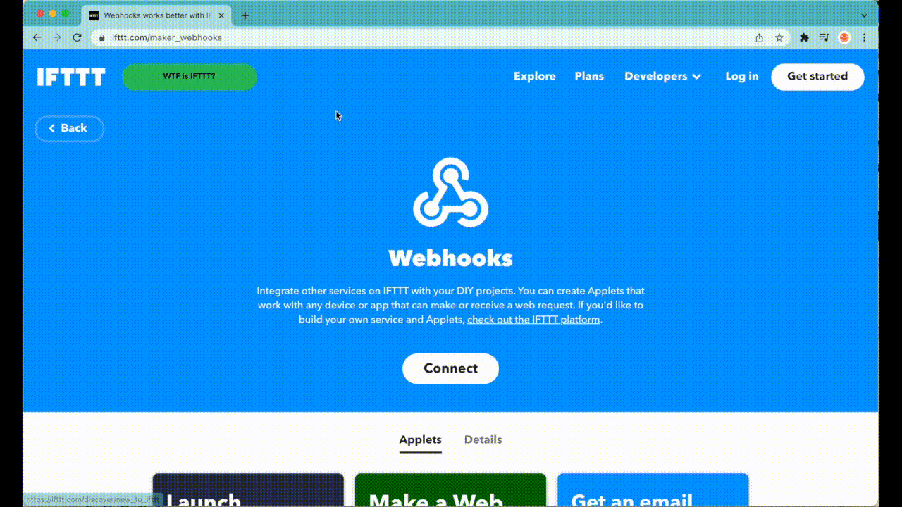

## Introduction

Webhooks allow you to send and receive automated messages to and from other services. For example, you can use webhooks to receive a notification when a property of your Thing changes. To do this, there are third party platforms that link the properties from your Arduino Cloud projects to the desired trigger action.

## Goals

- Learn how to set up webhooks in the Arduino Cloud.
- Provide an overview of available platforms where webhooks may be used.
- Demonstrate an example that uses a webhook to send data from the Arduino Cloud to Google Sheets, via the IFTTT platform.

## Hardware & Software Requirements

- The [Arduino Create Agent](https://github.com/arduino/arduino-create-agent)
- An [Arduino account](http://create.arduino.cc/iot).

You will also need a cloud compatible board:

***Read more about compatible board [here](/arduino-cloud/guides/overview#compatible-boards)***

## Webhook Setup

A webhook can be set for any **Thing** on the Arduino Cloud, allowing us to send data from the Arduino Cloud to various third party platforms. For example, you can use webhooks to receive an email when any of you devices is disconnected, or send and save live sensor values collected from your device in a Google Spreadsheet.

There are many available platforms that support the use of Webhooks, for this tutorial we will try the **IFTTT** platform. IFTTT allows you to integrate services with your DIY projects. With IFTTT you can create Applets that work with any device or app that can make or receive a web request.

Let's try it out by creating an Applet that uses a webhook to receive String Values sent via the **Message Widget** on the Arduino Cloud, and save them into a Google Sheets.

### IFTTT Configuration

The first step is to create an Applet on the IFTTT platform using the following steps:



**1.** Go to [IFTTT website](https://maker.ifttt.com) and sign in.

**2.** Click **Create** in the top right, then select **If This**.

**3.** In the search field, type **"Webhooks"** and select that service.

**4.** Select Receive a web request.

**5.** In the Event Name field, type "message", and click the Create trigger button.

**6.** Now, click on **Then That**, type **"Google Sheets"** and select that service.

**7.** Choose the **"Add row to spreadsheet"** option.

**8.** You can keep the default settings, scroll down and click on **"Create action"**.

Both the trigger and action have now been configured. Click **Continue**. Optionally, change the applet title, and click **Finish** to create the applet.

The final step is finding the webhook link that you will need to set to your Thing on the Arduino Cloud. You can find the link under **Profile picture in the top right > My Services > Webhooks > Documentation.**


### Setting a Webhook to a Thing

Linking a webhook to a Thing is a quite simple process, follow the steps below to set a webhook to your Thing:

**1.** [Sign in to your Arduino account](https://create.arduino.cc/iot), and open the [Arduino Cloud](https://create.arduino.cc/iot).

**2.** Navigate to [**Things** -> **Create Thing**](https://app.arduino.cc/things).

**3.** Create your Variables. In our case, we will create a **"message"** Variable and set its type to **"Character String"**.


**4.** Add your **Device**, and configure your **Network** from the right side menu.

**5.** Click on "**Set Webhook**", one the bottom left corner.


**6.** Enter the webhook link provided from the platform you are using.


**7.** Finally, navigate to the **Sketch** tab, and upload the automatically generated code to your board.

The Arduino Cloud will share **five sets of values** through the assigned webhook:

- `"event_id": "EVENT_UUID"`
- `"webhook_id": "WEBHOOK_ID"`
- `"device_id": "DEVICE_UUID"`
- `"thing_id": "THING_UUID"`

The fifth value contains an array of objects, each representing a Variable in your Thing, as the following:

- `"values":`
   
  ```js
      [
      {
        "id": "VARIABLE_01_ID",
        "name": "NAME_OF_VARIABLE_01",
        "value": "VARIABLE_01_VALUE",
        "persist": true/false,
        "updated_at": "DATE",
        "created_by": "USERID"
      },1
      {
        "id": "VARIABLE_02_ID",
        "name": "NAME_OF_VARIABLE_02",
        "value": "VARIABLE_02_VALUE",
        "persist": true/false,
        "updated_at": "DATE",
        "created_by": "USERID"
      }
    ]
  ```

### Testing the Webhook

To test the webhook, we need to create a *Messenger widget*. We can do that by:

**1.** Navigating to [*Dashboards*](https://app.arduino.cc/dashboards) -> *Edit* -> *Add* -> stay on the *Widgets tab* -> select "Messenger".


**2.** Press on *Link Variable*, select the Thing we created, then the **"message"** Variable.


In the "messenger widget", we are modifying the value of the "message" Variable. Whenever we send a message, the "message" Variable is updated and using the webhook we set, the updates are sent to the spreadsheet file created by IFTTT.

To try it out, all you need to do is to navigate to your **Dashboards** on the Arduino Cloud and send messages using the **Messenger Widget**. The messages, along with the exact date and time will be found in the Google Sheets file created by IFTTT, on our Google account. To access this file, you need to navigate to your [Google Sheets](https://docs.google.com/spreadsheets) -> find and open the file names **"IFTTT_Maker_Webhooks_Events"**.


## Available Platforms

In addition to IFTTT, here are examples of platforms that you can use webhooks with:

### Zapier

[Zapier](https://zapier.com/) works similarly to IFTTT. In addition to connecting your APIs quickly using **Zaps**, you can use Zapier's visual builder, which allows you to build an integration and preview data in real time.

### Google Services

- [**Google Cloud APIs**](https://cloud.google.com/apis/docs/overview): with Google APIs you can develop application programming interfaces (APIs) to communicate with Google services such as Search, Gmail, Translate or Google Maps apps or other applications like Arduino Cloud.

- [**Google Script**](https://developers.google.com/apps-script): allows you to interact with all your Google G-Suite files such as Google Sheets, Docs and more.
