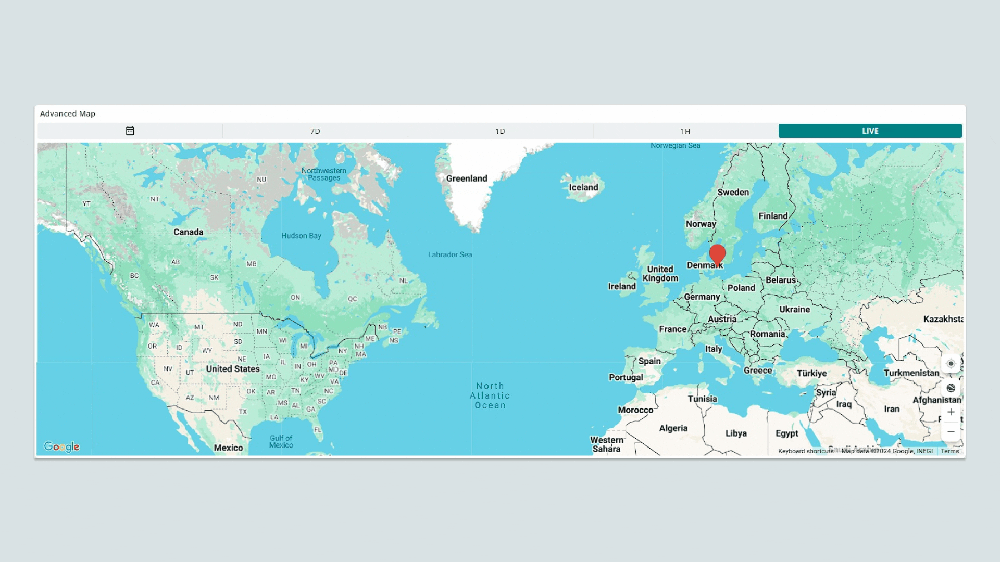
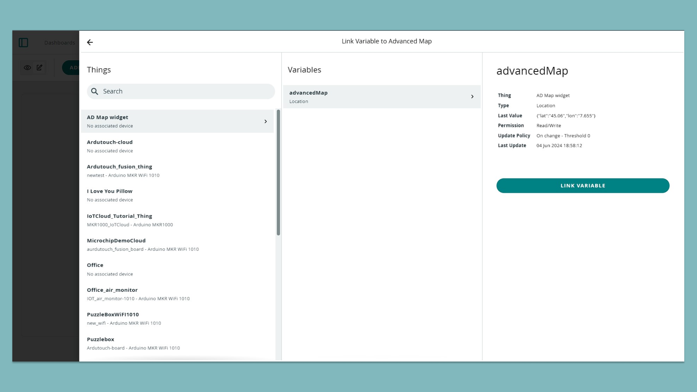
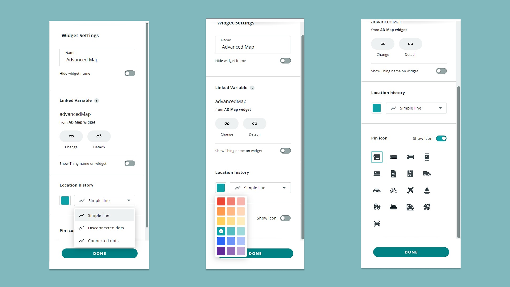
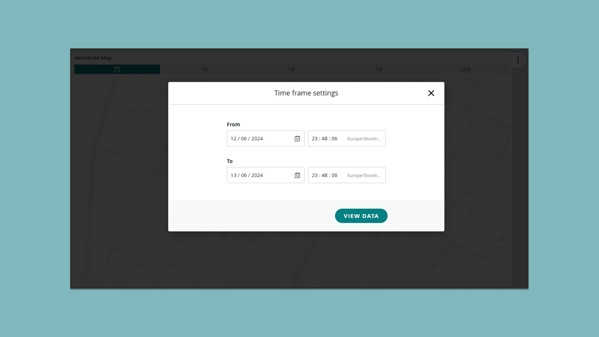

The **advanced map widget** is used to track the location of a cloud Thing and draw a path between the different logged points. You can track GPS locations in real time or chose a specific time frame for location tracking. The look of the tracks between points and map pin can also be customized.



This widget can be added onto existing projects (if you are already tracking location), and is particularly interesting to use in projects such as:
- Weather stations,
- Environmental data stations,
- Monitoring fleets,
- Any project requiring localization of devices,
- Various science projects where location tracking is needed.

## Hardware & Software Needed

- [Arduino Cloud](https://app.arduino.cc/).
- Cloud compatible boards, [see full list](https://docs.arduino.cc/arduino-cloud/guides/overview#compatible-hardware).

***In this tutorial, we use the [MKR WiFi 1010](/hardware/mkr-wifi-1010) and [MKR GPS Shield](/hardware/mkr-gps-shield) for tracking latitude and longitude. This is not a requirement, you can use any board for this tutorial.***

## Setup & Configuration

To use the advanced map widget, you will need to set up a Thing and a variable that you want to track. This needs to be a `Location` type variable, it will be declared as a `CloudLocation` variable.

***If you are unfamiliar with how to set up a Thing and variables, head on over to the [Getting Started with the Arduino Cloud](/arduino-cloud/guides/overview) article.***

**1.** Head on over to the **"Dashboards"** in the Arduino Cloud, and create a new dashboard (or use an existing dashboard).

**2.** Add a new **"Advanced Map Widget"**, selecting it from the list of available widgets. 

**3.** Link the location variable you want to track.



**4.** After selection, your variables will appear in the right panel, with a number of configuration options. You can for example choose how the track between logged locations will be represented (line, spline, spline area, line area and bar). You can also change the icon of the pin on the map.



**5.** Click on **"Done"** when finished selecting the variable. If your board is connected and is sending data to the Cloud, you will see the widget's location data update frequently.

## Example Code

The sketch of your project does not require much complexity. In your automatically generated code, simply add the location tracking code inside of the loop. We are using the [Arduino_MKRGPS](https://www.arduino.cc/reference/en/libraries/arduino_mkrgps/) library. We only needed to add these following lines to the loop to track the things location and send it to the advanced map widget:

```arduino
if (GPS.available()) {
    // read GPS values
    float latitude   = GPS.latitude();
    float longitude  = GPS.longitude();
    advancedMap = Location(latitude, longitude);
}
```

The full sketch used is found below:

```arduino
#include <Arduino_MKRGPS.h>
#include "thingProperties.h"

void setup() {
  Serial.begin(9600);
  delay(1500); 

  initProperties();

  ArduinoCloud.begin(ArduinoIoTPreferredConnection);
  
  setDebugMessageLevel(2);
  ArduinoCloud.printDebugInfo();
}

void loop() {
  ArduinoCloud.update();
  if (GPS.available()) {
    // read GPS values
    float latitude   = GPS.latitude();
    float longitude  = GPS.longitude();
    advancedMap = Location(latitude, longitude);
  }
}
```

## Usage

With the widget set up, let's explore some of its features. 

### Location Tracking

When tracking the location with the "Live" setting the current location of the device will be marked with a pin, then a track will be drawn between its previous location and its current location.


Picking one of the other time frame options will show the locations of the device during that specific time frame.

### Specific Time Period

To see a specific time period, click on the calendar icon, where you can select the starting & end time & date.



## Limitations

- The advanced map widget only supports the use of the `CloudLocation` variable.

## Summary

The advanced map widget can be used for **any** project that includes location tracking. It is perfect for scientific projects when monitoring the location of the cloud Thing over time is needed.