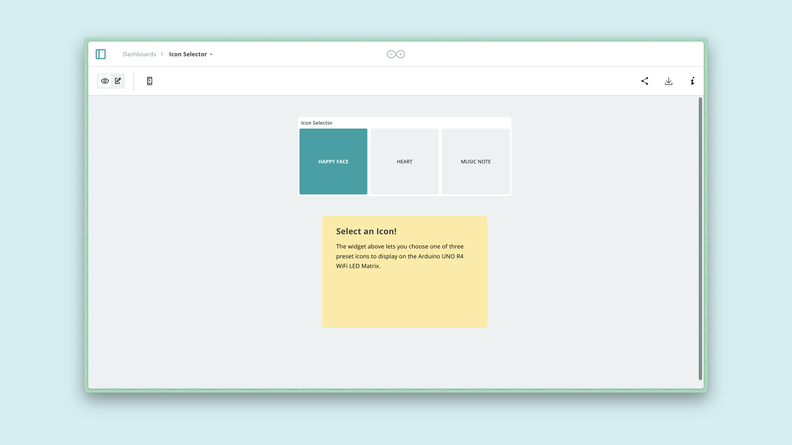
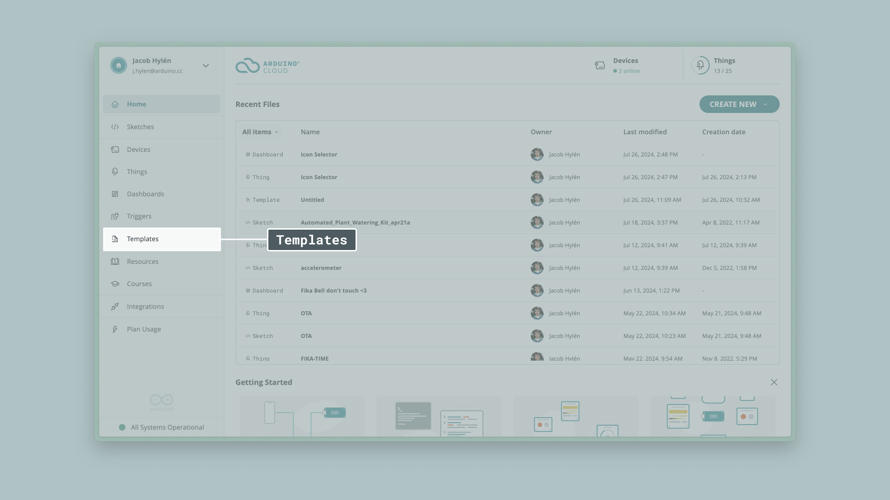
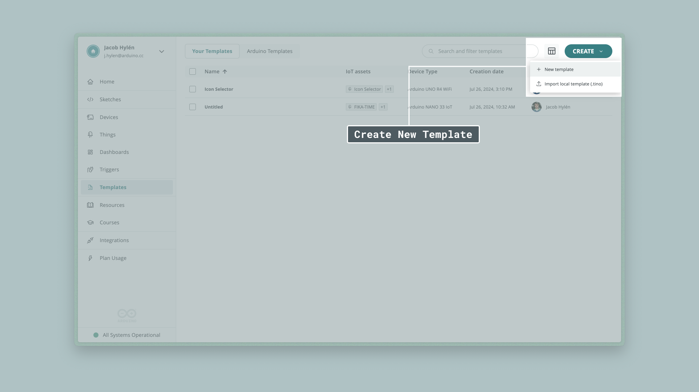
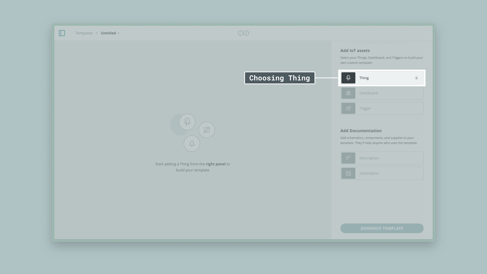
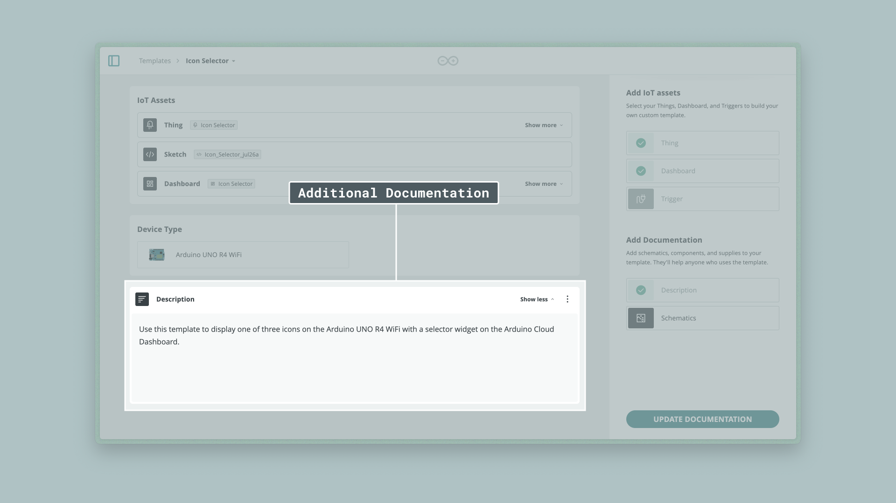

The **Custom Templates** feature is a part of the [Arduino Cloud](https://app.arduino.cc/) that allows you to create your own custom cloud templates, letting you configure a project complete with a [Thing](https://docs.arduino.cc/arduino-cloud/cloud-interface/things/), [Dashboard](https://docs.arduino.cc/arduino-cloud/cloud-interface/dashboard-widgets/), and [Triggers](https://docs.arduino.cc/arduino-cloud/cloud-interface/triggers/) with a step by step wizard guiding you through the process. 

With the Custom Templates feature, you can choose any of your existing cloud projects and walk through the process of turning it into a template within a few minutes. You can save it for you to use yourself, or export it as a `.tino` file to be shared with other people however you want. 

## Hardware & Software Needed
To follow this guide, you will need:
- An Arduino Cloud compatible board
- An Arduino Cloud Project to turn into a template

## Create Your Project
First - we need our starting point. You may already have used the [Arduino Cloud](https://app.arduino.cc/) to create a project, if so you can go ahead with what you have already made. 

For the purposes of this guide, we'll use an example project that displays one of a few icons on the LED Matrix of an Arduino UNO R4 WiFi that you can choose from a selector widget. 

## Creating the Template
Now that we have a project that we want to turn into a template, let's get started. 

Go to the landing page of [Arduino Cloud](app.arduino.cc). In the sidebar to the left, find the button that says **Templates**. 

Click into this page, and you should see that at the top there are two tabs, labelled "**Your Templates**" and "**Arduino Templates**", make sure you are in the one labelled "**Your Templates**". This is the tab that contains all the custom templates you've either made before or imported from a `.tino` file. 

Click Create in the top right, then Choose "New Template". 

***Exiting the template creation process mid-way without saving by clicking "Generate Template" will cause any progress to be lost.***
 
### Selecting a Thing
Now you should be taken to a new screen, where you add your IoT assets. Let's start with the Thing.

Click "Thing" on the right side of the screen. 

Then search for a Thing (already created) that you want to add to your template. "Icon Selector" in the case of this guide. Click your Thing, then "Add to Template".

### Selecting a Dashboard
Now do the same for the Dashboard. 

You may see a small prompt suggesting you to add a dashboard that was already associated with the Thing you're creating the template around, you can use this as a shortcut if you want to. Otherwise follow the same flow as for selecting your Thing.

### Additional Documentation
Now you may want to add a little bit more documentation for your project, such as a short description or images of schematics, wiring diagrams, and such. For the Icon Selector project there is no external circuit built around the board, so we're just going to write a small description, as such:

Once you've completed your template, click "Generate Template" and you're fininshed! It will now show up in the tab of "Your Templates" we saw at the beginning of this guide. 

## Exporting Your Template
Once you're back on the Templates page, you can export the `.tino` file to be used by others by clicking the three dots on the side, and clicking "download (.tino)". This will start downloading the file that you can share with the community to let others recreate your project.

## Conclusion
In this article we've gone over how to use the **Custom Templates** feature of the Arduino Cloud to generate our own Cloud Templates that we and others can use to quickly recreate several instances of the same project. 
