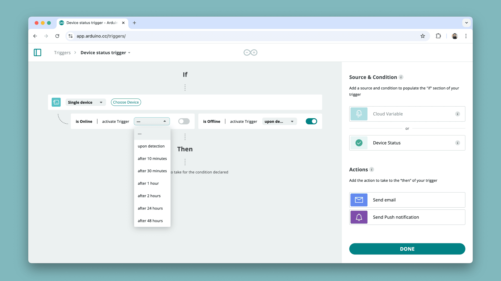

Keeping track of your devices is important, and using by using [triggers](https://docs.arduino.cc/arduino-cloud/cloud-interface/triggers/), you can automate push notifications regarding your device status.

You can have triggers for:
- When a device goes online
- When a device goes offline

You can modify the trigger to:
- Trigger immediately when the device status changes
- Trigger after an X amount of minutes/hours after the device status has changed

## Requirements

- [Arduino Cloud account](https://app.arduino.cc/)
- Thing / Device set up.

## Setup

1. Navigate to the [Arduino Cloud - Triggers](https://app.arduino.cc/triggers)
2. Create a trigger by clicking the **"+ Trigger"** button in the top right corner.
3. Select **"Device Status"** as a trigger.
4. Choose the device you want to track.
5. Select whether you want to get a notification if it is online/offline (or both).
6. Select the time for notification (immediately or specific time e.g. 1 hour).
7. Choose the action (email of push notification on phone).

## Usage

Depending on the setup, your notifications will trigger when the device status change, either sending you an email or a push notification\*.

***\*Read the article about [push notifications](/arduino-cloud/iot-remote-app/push-notifications/) for more information.***