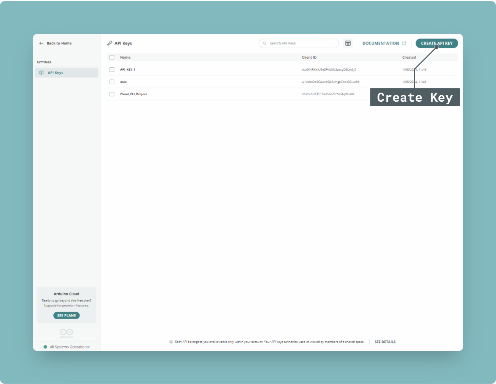
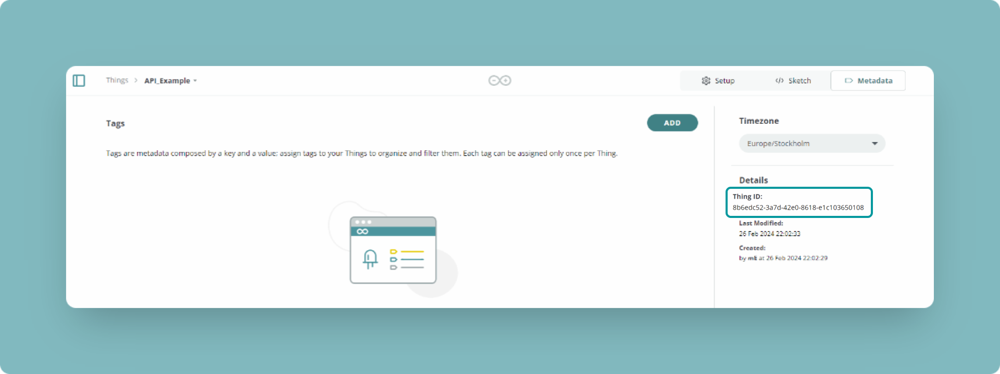
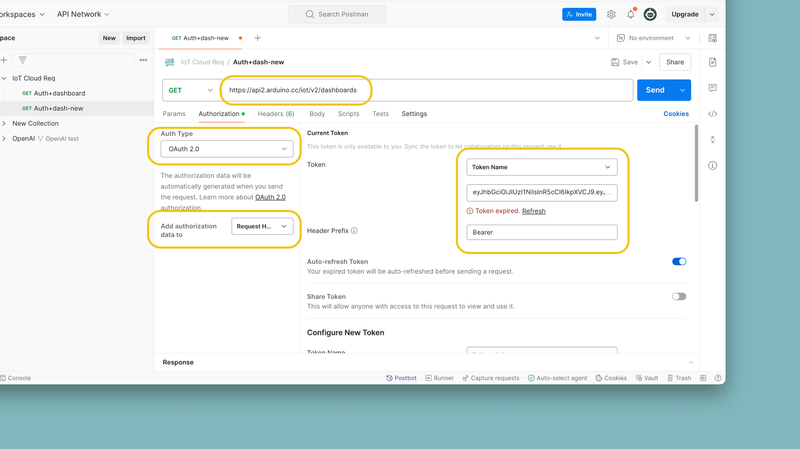
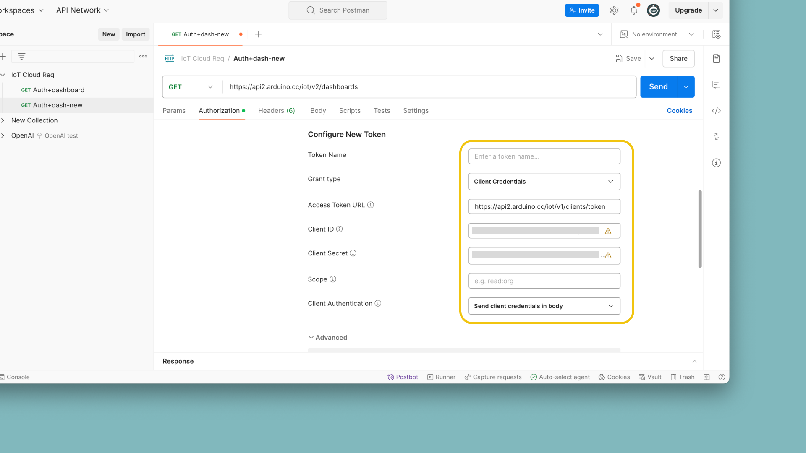

The [Arduino IoT Cloud REST API](https://www.arduino.cc/reference/en/iot/api/) can be accessed through a set of endpoints to manage **Devices, Things, Properties** and more. It can be accessed via any HTTP client, and is supported by JavaScript, Python® and Golang clients.

In this article you will find some useful examples to get started with the Arduino IoT Cloud API, and an understanding of what the API offers.

To see the full API, follow the link below:
- [Arduino IoT Cloud API](https://www.arduino.cc/reference/en/iot/api/)

***To authenticate with the Arduino IoT Cloud API, you will need to set up an [Arduino Account](https://cloud.arduino.cc/home/). How to generate API credentials will be explained in this article.***

## Requirements

To connect with the Arduino Cloud API, we will need one of the following clients:

- [Javascript NPM package](https://www.npmjs.com/package/@arduino/arduino-iot-client)
- [Python® PYPI Package](https://pypi.org/project/arduino-iot-client/)
- [Golang Module](https://github.com/arduino/iot-client-go)

***You can also use services such as [Postman](https://www.postman.com/) to create HTTP requests.***

## Usage

With the Arduino Cloud API, you are able to interface with the Arduino Cloud service through JavaScript, Python® and Golang.

You can for example write custom scripts that can: 

- Fetch latest data from a specific selection of properties.
- Switch a large number of booleans at the same time. 
- Automatically notify you if a Thing has stopped updating values.

Mainly, it can be used to **integrate an existing software project** with the Arduino Cloud service. You can for example display real time data from your Arduino on your website, or create automatic email triggers whenever a threshold value is met. 

## API Keys & Authentication

To authenticate, you will need to generate a `clientId` and `clientSecret`. This is generated in the Arduino Cloud UI. Follow the steps below to generate your credentials:

**1.** Log in to your [Arduino account](https://cloud.arduino.cc/home/).

**2.** Navigate to the [Arduino Cloud home page](https://cloud.arduino.cc/home/).

**3.** Click **"API keys"** at the bottom left corner, and then click **"CREATE API KEY"**. Name it, and save it as a PDF. You will **not** be able to see `clientSecret` again.



## Obtaining IDs

All main components of the Arduino IoT Cloud have an `id` associated. You can access your **device, Thing & variable** `id` from the web interface.

For example, your Thing ID is stored in the **"Metadata"** tab of your Thing.



You can also make a request that will return a list of the component and all information about it:
- `https://api2.arduino.cc/iot/v2/things` - lists all Things and associated properties/variables.
- `https://api2.arduino.cc/iot/v2/device` - lists all devices.
- `https://api2.arduino.cc/iot/v2/dashboards` - lists all dashboard and associated widgets.

You can make more specific requests to obtain only the information on a specific Thing, or a specific variable.

***Note that you will need to pass the authentication token in the body when making any request to the Arduino Cloud REST API. The examples in this guide includes the generation of such token. For testing the API, you can follow the Postman setup just below.***

## Postman

[Postman](https://www.postman.com/) is a service that allows you to construct and make HTTP requests. In the panel, you can create a **workspace**, and a new **HTTP request**.

Before we can make requests to the API, we will need to generate an **access token**. To do so, you will need to configure the **"Authorization"** tab, according to the images shown below:



Now, click on the **"Advanced Options"** tab, and add `https://api2.arduino.cc/iot` to the **"Audience"** field.



Finally, click on the **"Get New Access Token"**.


You now have an access token that has an expiry of `300` seconds, and we can make requests to the API.

You can for example try 
- **GET** | `https://api2.arduino.cc/iot/v2/dashboards` 

Which should look like this in the Postman UI:


***Note that your access token expires after `300` seconds. After that, you will need to re-generate it by clicking the button again.***

## JavaScript (node.js)

**Requirements:**

- [node.js](https://nodejs.org/en/)
- [@arduino/arduino-iot-client](https://www.npmjs.com/package/@arduino/arduino-iot-client)

To install the `arduino-iot-client`, run the following command:

```
npm install @arduino/arduino-iot-client
```

After it is installed, you can create a `.js` file, e.g. `main.js` that you can write your script in. 

First, we need to authenticate with the Arduino Cloud API:

```js
var IotApi = require('@arduino/arduino-iot-client');
var rp = require('request-promise');

async function getToken() {
    var options = {
        method: 'POST',
        url: 'https://api2.arduino.cc/iot/v1/clients/token',
        headers: { 'content-type': 'application/x-www-form-urlencoded' },
        json: true,
        form: {
            grant_type: 'client_credentials',
            client_id: 'YOUR_CLIENT_ID',
            client_secret: 'YOUR_CLIENT_SECRET',
            audience: 'https://api2.arduino.cc/iot'
        }
    };

    try {
        const response = await rp(options);
        return response['access_token'];
    }
    catch (error) {
        console.error("Failed getting an access token: " + error)
    }
}
```

Then, we make a call to the Arduino Cloud API. In the example below will just list out the **Properties** attached to a specific **Thing**.

```js
async function listProperties() {
    var client = IotApi.ApiClient.instance;
    // Configure OAuth2 access token for authorization: oauth2
    var oauth2 = client.authentications['oauth2'];
    oauth2.accessToken = await getToken();

    var api = new IotApi.PropertiesV2Api(client)
    var id = "XXX"; // {String} The id of the thing

    var opts = {
      'showDeleted': true // {Boolean} If true, shows the soft deleted properties
    };
    api.propertiesV2List(id, opts).then(function(data) {
      console.log(data); 
    });
}

listProperties();
```

And to run the script, you can simply use:

```
node main.js
```

In your terminal, you will now receive a response akin to:

```
[
  ArduinoProperty {
    href: '/iot/v1/things/<thingid>/properties/<propertyid>',
    id: '<propertyid>',
    name: 'Prop_1',
    permission: 'READ_WRITE',
    thing_id: '<thingid>',
    type: 'INT',
    update_strategy: 'ON_CHANGE',
    created_at: 2022-09-07T12:42:22.593Z,
    last_value: 'N/A',
    persist: true,
    tag: 2,
    thing_name: 'Arduino_Thing',
    updated_at: 2022-09-07T12:42:22.593Z,
    variable_name: 'Prop_1'
  }
]
```

As this is a `json` object, we can access it by changing the following line from the example above to access the different values. We can for example retrieve the `last_value` from the first property like this:

```js
console.log(data[0].last_value); 
```

This is one of many examples of how to interact with the API. Now that you are setup, you can go on to explore the rest of the [Arduino IoT Cloud API](https://www.arduino.cc/reference/en/iot/api/).

## Python®

**Requirements:**

- [Python® 3.7+](https://www.python.org/downloads/)
- [arduino-iot-client](https://pypi.org/project/arduino-iot-client/) (Python®)

To install, use the following command:

```
pip install arduino-iot-client
```

To authenticate, you will need to have the `requests-oauthlib` installed:

```
pip install requests-oauthlib
```

To generate an **access token** use the following script:

```py
from oauthlib.oauth2 import BackendApplicationClient
from requests_oauthlib import OAuth2Session

from os import access
import iot_api_client as iot
from iot_api_client.rest import ApiException
from iot_api_client.configuration import Configuration

# Get your token 

oauth_client = BackendApplicationClient(client_id="YOUR_CLIENT_ID")
token_url = "https://api2.arduino.cc/iot/v1/clients/token"

oauth = OAuth2Session(client=oauth_client)
token = oauth.fetch_token(
    token_url=token_url,
    client_id="YOUR_CLIENT_ID",
    client_secret="YOUR_CLIENT_SECRET",
    include_client_id=True,
    audience="https://api2.arduino.cc/iot",
)

# store access token in access_token variable
access_token = token.get("access_token")
```

Then, to authenticate with the generated token, use:

```py
client_config = Configuration(host="https://api2.arduino.cc/iot")
client_config.access_token = access_token
client = iot.ApiClient(client_config)
```

And to for example, list out properties attached to a Thing:

```py
thing_id = "YOUR_THING_ID"

# as an example, interact with the properties API
api = iot.PropertiesV2Api(client)

try:
    resp = api.properties_v2_list(thing_id)
    print(resp)
except ApiException as e:
    print("Got an exception: {}".format(e))
```

As this is a `json` object, we can access it by changing the following line from the example above to access the different values. We can for example retrieve the `last_value` from the first property like this:

```
print(resp[0].last_value)
```

The following script lists out **Properties** attached to your **Thing**. Simply replace `YOUR_CLIENT_ID`, `YOUR_CLIENT_SECRET` and `YOUR_THING_ID` with your credentials and this script will work out of the box. 

```py
from oauthlib.oauth2 import BackendApplicationClient
from requests_oauthlib import OAuth2Session

from os import access
import iot_api_client as iot
from iot_api_client.rest import ApiException
from iot_api_client.configuration import Configuration

# Get your token 

oauth_client = BackendApplicationClient(client_id="YOUR_CLIENT_ID")
token_url = "https://api2.arduino.cc/iot/v1/clients/token"

oauth = OAuth2Session(client=oauth_client)
token = oauth.fetch_token(
    token_url=token_url,
    client_id="YOUR_CLIENT_ID",
    client_secret="YOUR_CLIENT_SECRET",
    include_client_id=True,
    audience="https://api2.arduino.cc/iot",
)

# store access token in access_token variable
access_token = token.get("access_token")

# configure and instance the API client with our access_token

client_config = Configuration(host="https://api2.arduino.cc/iot")
client_config.access_token = access_token
client = iot.ApiClient(client_config)
thing_id = "YOUR_THING_ID"

# as an example, interact with the properties API
api = iot.PropertiesV2Api(client)

try:
    resp = api.properties_v2_list(thing_id)
    print(resp)
except ApiException as e:
    print("Got an exception: {}".format(e))
```

## Golang

To access the Arduino Cloud API via the Go client, you can refer to the [arduino/iot-client-go](https://github.com/arduino/iot-client-go) client on GitHub. 

Below is an example that will authenticate with the API and list out all your devices. 

```go
package main

import (
	"context"
	"log"
	"net/url"

	iot "github.com/arduino/iot-client-go"
	cc "golang.org/x/oauth2/clientcredentials"
)

var (
	clientID     = "your_client_id"
	clientSecret = "your_client_secret"
)

func main() {
	// We need to pass the additional "audience" var to request an access token
	additionalValues := url.Values{}
	additionalValues.Add("audience", "https://api2.arduino.cc/iot")
	// Set up OAuth2 configuration
	config := cc.Config{
		ClientID:       clientID,
		ClientSecret:   clientSecret,
		TokenURL:       "https://api2.arduino.cc/iot/v1/clients/token",
		EndpointParams: additionalValues,
	}
	// Get the access token in exchange of client_id and client_secret
	tok, err := config.Token(context.Background())
	if err != nil {
		log.Fatalf("Error retrieving access token, %v", err)
	}
	// Confirm we got the token and print expiration time
	log.Printf("Got an access token, will expire on %s", tok.Expiry)

	// We use the token to create a context that will be passed to any API call
	ctx := context.WithValue(context.Background(), iot.ContextAccessToken, tok.AccessToken)

	// Create an instance of the iot-api Go client, we pass an empty config
	// because defaults are ok
	client := iot.NewAPIClient(iot.NewConfiguration())

	// Get the list of devices for the current user
	devices, _, err := client.DevicesV2Api.DevicesV2List(ctx, nil)
	if err != nil {
		log.Fatalf("Error getting devices, %v", err)
	}

	// Print a meaningful message if the api call succeeded
	if len(devices) == 0 {
		log.Printf("No device found")
	} else {
		for _, d := range devices {
			log.Printf("Device found: %s", d.Name)
		}
	}
}
```

See the full example on [GitHub](https://github.com/arduino/iot-client-go/tree/master/example).

## Summary

This document covers the overall usage of the [Arduino IoT Cloud API](https://www.arduino.cc/reference/en/iot/api/), and how to use it with different clients (JavaScript, Python®, Golang).

