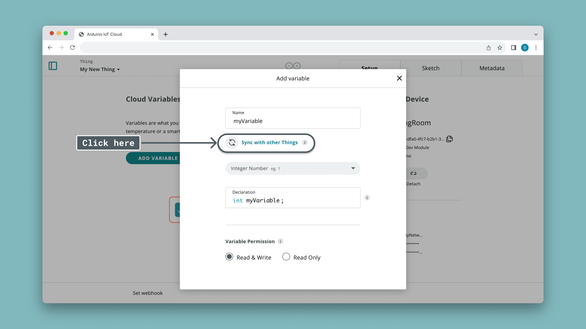

The Python Client for connecting to the Arduino Cloud is known as the [Arduino IoT Cloud Python Client](https://github.com/arduino/arduino-iot-cloud-py) library. This library is implemented to support MicroPython, CircuitPython as well as regular Python running on your personal computer / Linux machine (like Raspberry Pi).

Connection via this client is achieved by registering a [manual device](), i.e. a virtual device that is not associated with an Arduino hardware board. This virtual device can connect through a simple username/password (Device ID, Secret Key) which is generated in the Arduino Cloud when configuring a device.

## GitHub

To view the source code and report issues, follow the links below to the GitHub repository:
- [Arduino IoT Cloud Python Client](https://github.com/arduino/arduino-iot-cloud-py)

## Installation

You can install this client either directly on your board running MicroPython

### MicroPython

To install the client on a board running MicroPython, you can check out the [MicroPython Installation Guide](). Options to directly download the library to the board via Wi-Fi® or via USB is available, using [mip](https://docs.micropython.org/en/latest/reference/packages.html). 

### Python

You can install the client via `pip` by running the following command:

```
pip install arduino-iot-cloud
```

Project description, release history and more information about this package can be found [here](https://pypi.org/project/arduino-iot-cloud/).

***Need help setting up? Check out the [Python Installation Guide](), which has ready made examples that will help you get started.***

## Variable Synchronisation

Variable synchronisation is a feature of the Arduino Cloud that allows you to synchronize any variables across any devices. This is done in the Arduino Cloud web interface when creating/editing variables. 



With this feature, you can very easily integrate your existing Python, MicroPython or JavaScript projects with your Arduino projects. 

***Read more in the [Variable Synchronisation]() section.***