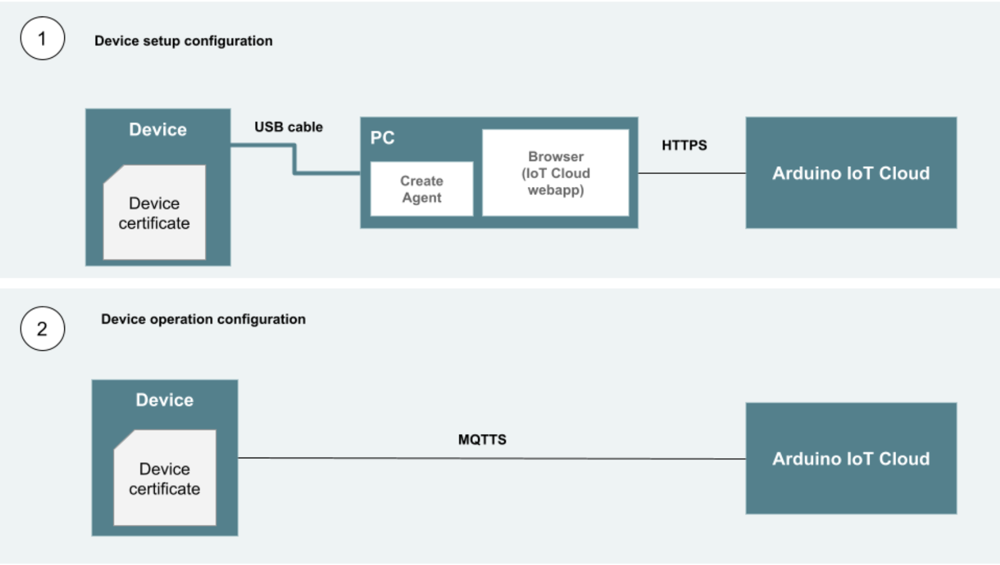

***For any questions regarding security, contact the [Arduino Security Team](mailto:security@arduino.cc).***  

## Arduino Approach to Security

In order to provide secure digital services to customers, we at Arduino are committed to regularly monitor and update our services, applications, and infrastructure. 
In general, the approach  to Security is aligned with Cybersecurity standards such as ISO27001.
To ensure the highest level of confidentiality, integrity and availability, Arduino operates under a shared security responsibility model. The shared security responsibility model identifies the distinct security responsibilities of the customer and Arduino. In this model:
* **Arduino** is responsible for the security of the cloud infrastructure services provided to customers and the confidentiality of sensitive data. We provide such security via a number of best practices that all employee in Arduino follow and that are described in the following sections of this document; for example, but not limited to the following:
   * We limit as much as possible the level of access that Arduino employees have on customers data.
   * Security and privacy training are conducted regularly to ensure the highest possible level of awareness to Arduino employees.
   * Regular penetration and vulnerability security tests are performed to our infrastructure and services to assess that security practices in place are working as intended. 
* **Customers** are responsible for the security of their account, personal access credentials, and for the information they decide to store in the cloud. Arduino recommends to pay particular attention to the following best practices:
   * **Strong authentication:** taking advantage of strong authentication can significantly help to improve the security of your Arduino account. Options offered by Arduino Cloud are:
     * **Two-step verification:** a second step to verify your identity during login adds an extra layer of protection to your account. Once enabled, you will be asked to provide your regular password and a digit code when logging in. It will be your responsibility to make sure that all relevant data to enter your account when two-step verification is enabled are properly backed up.
     * **Social login:** managing multiple accounts with multiple passwords might become problematic, which is why you can choose to login to your Arduino account using a social login that you already own. Via social login you can authenticate to your Arduino account by using your favorite social account without sharing any sensitive login information with Arduino.
   * **Confidentiality:** customers should make sure to not incidentally disclose personal information as part of the content they upload (for example when sharing a project or a sketch). While Arduino can protect confidentiality of information that is recognized as such, it can’t protect against information accidentally disclosed by customers inside customer-created content. 

## Security and Data Protection Strategy

Arduino leverages the security level provided by infrastructure based on Cloud providers (Amazon Web Services and Google Compute Platform) and third party services also hosted in Cloud. 
For a complete list of providers in use, see https://www.arduino.cc/en/Main/PrivacyPolicy.

The *Authentication* phase plays a major role in security protection. Arduino takes advantage of a third party Authentication service that provides:
* Web protection against several common threats to web applications such as XSS (Cross-Site Scripting), Clickjacking and Cross-Site Request Forgery.
* Anomaly Detection such as Brute-Force Protection: provides protection against suspicious failed login attempts.
* Universal Login Support which increases security so that users have the ability to use their social logins without the need of sharing their credentials with us.

Another fundamental component of our security strategy from infrastructure standpoint is our Content Delivery Network, that provides: 
* DDoS protection: mitigation of denial-of-service attacks to ensure that services are not affected by a high number of malicious requests.
* Firewalling: protection against the most common web applications attacks.
Arduino data protection strategy starts by identifying sensitive data that requires special handling:
* Personally Identifiable Information (PII) of users - username, password, name, surname, email address, user profile picture and home address (for shipment and billing).
* Data shared from boards to the Cloud.
Security measures are applied to ensure confidentiality and integrity of data:
* **Protection at rest**: 
   * PII are stored in databases and the whole database is encrypted using the industry standard AES-256 encryption algorithm.
   * Users’ credentials are hashed using state of the art hashing algorithms.
* **Protection in transit**: 
   * Any Browser-based or API-based communication uses HTTPS protocol secured with TLS.
   * IoT devices are sending data to our cloud using MQTT protocol secured with TLS.

### Secure Software Development Practices

Arduino follows the **Secure by Design** principle in every stage of the software development. The following list describes the **Security Principles** that are followed during the secure development lifecycle.
* **Apply Defense in Depth**
   * Layered security mechanisms are in place to increase security as a whole.
* **Use a Positive Security Model**
   * A ‘positive’ security model defines what is allowed and rejects everything else.
* **Fail Securely**
   * It is important that failures are handled so that exceptions do not enable unwanted behavior.
* **Run with Least Privileges**
   * The principle of least privilege is required to perform every business process.
* **Avoid Security through Obscurity**
   * Security through obscurity alone is a weak security mechanism, however when combined with all principles it can be used as an additional layer of security.
* **Keep Security Simple** 
   * Keeping the application’s security simple is a better option than having complex designs.
* **Assuming compromise**
   * The assuming compromise principle is useful to improve the detection and response capabilities in order to predict and remediate the security events before they evolve into security incidents.
* **Keep people away from data**
   * Usage of mechanisms, patterns and tools to reduce or eliminate the need for direct data access or manual processing data with the aim of reducing the risk of mishandling or modification and human error when handling sensitive data. 

In particular the following pillars are taken into consideration as part of the Arduino Secure Software Development Lifecycle
* **Education and Guidance**: in order to ensure that developers have specific know-how and receive training on secure architectural and coding standards.
* **Secure Data Management**: in order to ensure that environments, sensitive data, PII are managed properly and in accordance with legislation, adopting and implementing in a correct way, the necessary security standards.
* **Secure Repository Management**: with the purpose of guaranteeing that the Least of privilege and Separation of duties principles are in place to protect the software repositories.
* **Secure Environment**: in order to ensure the adequate segregation of the services and data contained into Development / Staging / Production environments
* **Secure Development**: with the purpose of guaranteeing that security risks, security requirements and best practices are taken into consideration in all the steps of the development lifecycle for Hardware, Software and Infrastructure artifacts and reducing the residual risk associated with security flaws and bugs managed through the internal Vulnerability Management Program.
* **Security Testing**: in order to ensure that all required security activities such as, but not limited to: Design Review, Threat and Risk Analysis, Code Review, Penetration Test, Vulnerability Assessment and all fixing activities related to the Vulnerability Management Program are performed by the security team, with the help of the developers, along all stages of the development lifecycle.

### Logical Access Control

Logical access control is governed by the principle of **least privilege**. Specific users are granted the minimum access needed to perform their job functions.
In general, Arduino internal staff members do not have direct access to PII or Arduino’s services users, with the following exceptions:
* Our customer support team has administrator-level access to assist users with technical issues.
* Only specific members of technical staff can access the databases directly, by remotely connecting to servers via the VPN. VPN access is only granted to those members who need it to perform their job functions, and is limited to specific network segments based on role. Multi-factor authentication is used during the VPN authentication process. The access control list is reviewed periodically to determine whether access is still needed. Accounts are modified or disabled based upon changes in job responsibilities.
* Non-development staff will be granted privileges on an as-needed basis. Access requirements must be documented and approved by management before access is granted.

All Arduino’s employees (including contractors and vendors with access to Arduino systems) are responsible for taking appropriate steps to select and secure their passwords. Arduino provides a Password Management service that employees are using for the secure storing and the generation of secure passwords. On-boarding and periodic security awareness training and policies outlines current “best practices” recommendations for managing passwords.

### System Monitoring and Testing

Arduino continuously monitors its systems for unauthorized activity that may result in the exposure of sensitive data. 

Monitoring tools in use are capable of collecting and concentrating application and infrastructure logs for analysis. Automated anomaly detection systems are also in place to identify common malicious activities such as brute force attacks.  

Arduino’s Security Team is regularly conducting:
* Penetration Testing;
* Perimeter Analysis;
* Source Code Review;
* Vulnerability Assessment;
* Review of new implemented features prior to production release.

Results are shared with Software Engineers and reviewed together with the Security Team so that any issues are remediated in a timely manner to reduce the potential for exploit of system vulnerabilities from the outside.

### Breach Notification Requirements

Should Arduino become aware of any unauthorized release of user data, in violation of applicable privacy laws and/or binding contractual obligations relating to data privacy and security, we will notify the  designated privacy Authority in the most expedient way possible and without unreasonable delay.

Should an Arduino user or customer suspect a vulnerability or security issue, they are invited to report it as described in our Coordinated Vulnerability Disclosure policy available at https://www.arduino.cc/en/security 

If there is valid reason to suspect a breach (e.g., clients report fraudulent activity on their accounts, or we see signs that someone has gained unauthorized remote or physical access to the data center), Arduino incident response team will check for common indicators of compromise to determine whether or not a breach has actually occurred.
* Notify the Chief Information Security Officer, security team, and application owners of findings.
* Conduct additional research as necessary to determine the extent of impact.

If it is determined that a breach has occurred, system(s) or system component(s) may need to be taken offline until they can be locked down with additional security measures (change passwords and certificates, update firewall settings, etc.). An official statement will be issued, summarizing our findings and providing an estimated time frame for service restoration.

### Data Retention and Disposal

PII data will only be stored as long as Arduino legitimately needs it and in accordance with Arduino’s Privacy Policy.

## Arduino Cloud Applications and Tools

### Arduino Web Editor

The Arduino Web Editor allows customers to create sketches they can subsequently deploy on boards. Each customer has a separate area where their sketches are stored so that no other customer has access to them. Sketches can be made publicly available to everyone, in which case access is granted by whomever possesses the link to access them.

The Arduino Web Editor also provides a secret tab that can be used to securely store sensitive information needed by the device (e.g. Wi-Fi® credentials, API credentials). Secrets in this tab are encrypted with the AES-256 algorithm to safely store them in the Cloud.
In order to communicate with the Arduino Web Editor, web browsers should be able to communicate over the internet to port 80, 443 and 8080 towards Arduino’s subdomains \*.arduino.cc.

### Arduino Cloud

The Arduino Cloud collects MQTT events through a data pipeline which is accessible only by the owner of the data and access authorization is enforced via our backend API.

### Arduino Cloud CLI

The Arduino Cloud CLI provides a way for interacting with the Arduino Cloud via the command line. The communication is carried out via an HTTPS connection and authentication is performed via API key credentials stored on the local machine.

### Arduino Create Agent

The Arduino Create Agent fills the gap between your browser and your boards and allows users to deploy their sketches on their board using the Arduino Web Editor. The Arduino Create Agent runs a web server bound to localhost that receives requests from the Arduino Web Editor to operate on the boards. The security of such communication is ensured by cryptographic signature of the commands that are sent to the Arduino Create Agent. Whenever the Arduino Web Editor wants to send a command to the Arduino Create Agent, it cryptographically signs the command and appends the signature to the request sent to the agent. The agent verifies the signature and, if it is correct, accepts and executes the command.

For usage with certain browsers, specifically with Safari on macOS, the Arduino Create Agent needs to run the web server using a TLS connection. A local Certificate Authority (CA) is generated and used to sign a certificate for the localhost domain. The private key of the CA is erased once the certificate for localhost is signed, while the public certificate of the CA is installed in the local system. The web server of the Arduino Create Agent will then run with a TLS connection. This is done to obey the mixed content specification implemented in Safari which is enforced also for resources loaded from localhost.

## Security Considerations for Arduino Boards

### Device Identity and Secure Communication

Devices onboarding and communication with the Arduino Cloud is ensured to protect the confidentiality of the data exchanged between Arduino devices and the Cloud. The following image shows the Device setup phase and the Device operation phase.

> **Note**: this communication process is available only on devices equipped with a secure element chip.

**Device setup phase**: 
* The setup phase is initiated by the web browser with a secure connection to the Arduino Cloud over HTTPS requesting to create a new device.
* The IoT Cloud provides a special sketch that is run on the device to generate:
   * a private and public keys;
   * a Certificate Signing Request (CSR).
* The private and public keys are stored in the secure element on the device;
* The CSR is sent from the Device to the browser via the create agent;
* The browser sends the CSR to the IoTCloud for signing;
* The Certification Authority of the IoTCloud signs the certificate and return the public certificate to the browser;
* The browser uploads the public certificate to the device via the Arduino Create Agent.

The device establishes a mutual-TLS authenticated connection with the IoTCloud MQTT server. The mutual-TLS connection is established so that:
* The MQTT server can establish the identity of the device connecting to it;
* The device can establish the identity of the MQTT server it is attempting to connect to;
To establish such secure connections, devices must be able to connect to *.arduino.cc on port 8884 and 8883.

### Secrets Management

In order to provide confidentiality and integrity of secrets stored within Arduino boards, a secure element chip is available on a selection of boards that provides hardware level encryption and tamperproofing protection. Integration with the Arduino Cloud leverages such a secure element to store the board certificate used to perform the mutual authentication with the MQTT server. Customers may also leverage the secure element chip to store sensitive information required by the board to operate based on the specific use cases.

