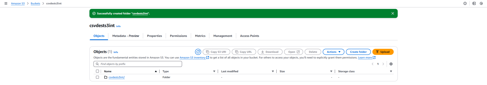
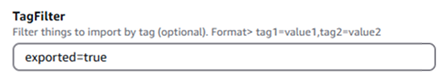
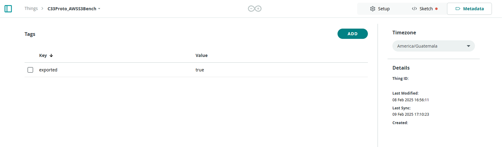

## Overview

The Arduino AWS S3 CSV Exporter is designed to extract time series data from Arduino Cloud and publish it in CSV format to an AWS S3 bucket.

A scheduled AWS Lambda function runs the data extraction process at configurable intervals. The extraction frequency, sampling resolution and filters can be customized to refine the data stored in S3.


At the end of this tutorial, the stack will be configured to extract data from Arduino Cloud every hour, aggregate samples at a five-minute resolution, and store structured CSV files in AWS S3. The setup will also allow filtering by tags to include only specific data, providing a scalable and structured approach to managing cloud-connected device data and ensuring easy retrieval and long-term storage.

## Goals

* Set up the required AWS S3 bucket and deploy resources using CloudFormation.  
* Understand the functionality of the Arduino AWS S3 CSV Exporter.  
* Configure and deploy the Lambda function for automated data extraction using the Arduino AWS S3 CSV Exporter’s pre-defined template.  
* Apply filters and resolution settings to optimize data aggregation.  
* Use CloudFormation templates to simplify deployment and configuration.  
* Learn how Lambda, CloudWatch and EventBridge help monitor the deployed CloudFormation stack.  

## Required Software

* [Arduino Cloud](https://cloud.arduino.cc/). If you do not have an account, you can create one for free in [cloud.arduino.cc](https://cloud.arduino.cc/home/?get-started=true).
* [AWS Account](https://docs.aws.amazon.com/iot/latest/developerguide/setting-up.html#sign-up-for-aws). If you do not have an AWS account yet, please refer to the [online AWS documentation](https://docs.aws.amazon.com/iot/latest/developerguide/setting-up.html) to create one. Once your account is set up, you'll need to ensure it has the appropriate IAM permissions to deploy Lambda functions and other resources, as detailed in the [AWS Account & CloudFormation Template](#aws-account--cloudformation-template) section below.
* [Go Programming Language](https://go.dev/) (version 1.22 or higher) (Optional)
* [Official Arduino AWS S3 CSV Exporter Repository](https://github.com/arduino/aws-s3-integration)

## How It Works

The **Arduino AWS S3 CSV Exporter** extracts time series data from **Arduino Cloud** and publishes it to an **AWS S3** bucket. Data extraction is handled by an AWS Lambda function written in **GO**, which runs at scheduled intervals using **AWS EventBridge**.

Each function execution retrieves data from the selected **Arduino Things** and generates a CSV file. The file is then uploaded to **S3** for structured storage and accessibility.

Data is extracted every hour by default, with samples aggregated at a 5-minute resolution. Both the extraction period and the aggregation rate are configurable. Aggregation is performed by calculating the average over the aggregation period, while non-numeric values, such as strings, are sampled at the specified resolution.

Time-series data is exported in **UTC** by default. All Arduino Things in the account are included in the export unless filtered using [**tags**](#tag-filtering). 

This setup provides a structured and scalable approach for managing time series data from connected devices, providing configurable parameters such as sampling intervals and data filtering.

## AWS Account & CloudFormation Template

An active AWS account is required to deploy the **Arduino AWS S3 CSV Exporter**. If an account is unavailable, refer to the [online AWS documentation](https://docs.aws.amazon.com/iot/latest/developerguide/setting-up.html) for account setup. The following steps can help you get started:

- [Sign up for an AWS account](https://docs.aws.amazon.com/iot/latest/developerguide/setting-up.html#sign-up-for-aws)
- [Create an administrative user](https://docs.aws.amazon.com/iot/latest/developerguide/setting-up.html#create-an-admin)

The exporter setup involves deploying resources using a [**CloudFormation template**](https://github.com/arduino/aws-s3-integration/blob/0.3.0/deployment/cloud-formation-template/deployment.yaml). This template provisions and configures the necessary AWS resources automatically.

AWS CloudFormation requires specific [**IAM permissions**](https://docs.aws.amazon.com/IAM/latest/UserGuide/introduction.html) to automatically provision and manage AWS resources during this deployment. **AWS Identity and Access Management (IAM)** is a web service that helps you securely control access to AWS resources by managing permissions and determining which resources users can access.

* CloudFormation stack creation (policy: `AWSCloudFormationFullAccess`)
* S3 bucket management (policy: `AmazonS3FullAccess`)
* IAM role creation (policy: `IAMFullAccess`)
* Lambda function deployment (policy: `AWSLambda_FullAccess`)
* EventBridge rule configuration (policy: `AmazonEventBridgeFullAccess`)
* Parameter management in SSM (policy: `AmazonSSMFullAccess`)

These permissions allow CloudFormation to create and manage the required resources automatically. The stack will deploy an AWS Lambda function, configure an EventBridge rule to trigger executions and set up S3 buckets for data storage.

## S3 Buckets (Pre-Requisite)

Before continuing with the CloudFormation stack deployment, two **S3** buckets need to be created:

- **Temporary bucket**: Stores the Lambda binaries and the **CloudFormation template (CFT)** required for deployment.  
- **CSV destination bucket**: This is the storage location for all generated CSV files. This bucket must be created in the same AWS region where the CloudFormation stack will be deployed.


### Creating S3 Bucket

To create the **temporary bucket** and the **CSV destination bucket**, navigate to **Amazon S3** or search for **S3** in the AWS Management Console. Click on **Create bucket** to begin the setup.

During an S3 bucket creation, several configuration options will be presented:

- General configuration
- Object ownership
- Block public access for this bucket
- Bucket versioning
- Tags (Optional)
- Default encryption
- Advanced settings

Each configuration option is briefly explained within the S3 bucket creation process.


For this integration, the key configuration is the bucket name, and the bucket type is set to **General purpose** under the **General configuration** section.

Other settings can remain at their **default values** unless specific customizations are needed.

After defining the required settings, proceed to **Submit** the bucket creation. Once successfully created, the bucket will be listed under **General purpose buckets**.

This process creates the **temporary bucket** to store the **Lambda binaries** and the **CloudFormation template (CFT)**. The assigned bucket name is **lambdas3binaries** in this example.


#### Temporary Bucket

The **lambdas3binaries** bucket is used to store the required deployment files. The following files must be uploaded to this bucket:

- [Lambda binaries](https://github.com/arduino/aws-s3-integration/releases) (`.zip` file)
- [CloudFormation template (CFT)](https://github.com/arduino/aws-s3-integration/releases) (`.yaml` file)

To upload the files, navigate to **Amazon S3** and open the **`lambdas3binaries`** bucket. The available options for managing the bucket will be displayed:


Select the **Upload** option within the **Objects** panel.

Manually upload the required files by either using the file browser to select the `.zip` and `.yaml` files or dragging and dropping them into the designated upload area. Once the files are recognized, the screen should resemble the following image:


Click the **Upload** button to begin the upload. Once the upload is complete, a confirmation screen will be displayed:


After a successful upload, the files will be listed under the **Objects** tab within the **`lambdas3binaries`** bucket:


#### CSV Destination Bucket

A second bucket must be created following the same process as the [Temporary bucket](#temporary-bucket). This bucket will be the **CSV destination bucket**, where all generated CSV files will be stored. Ensuring this bucket is created in the same AWS region where the CloudFormation stack will be deployed is important.

Navigate to the **Amazon S3** service and select **Create bucket**. In the bucket creation window, specify the bucket name and check that the same AWS region is selected.

For security best practices, you can use the default **Object Ownership** and **Block Public Access** settings, which keep the bucket private and secure.


After the bucket has been successfully created, it will be listed among the available S3 buckets. If necessary, you can select the newly created **CSV destination bucket** to proceed with additional configurations.


***While you can organize files by creating directories within the CSV destination bucket, this is _optional_ for the exporter to function properly. The exporter will automatically create the necessary structure for storing CSV files.***

Inside the **CSV destination bucket**, navigate to the **Objects** tab. If necessary, you can organize files by creating directories.

Click on the **Create folder** button and specify a name for the directory where the exported CSV files will be stored.


During folder creation, options for **server-side encryption** are displayed for data protection. By default, encryption settings derive from the bucket's global configuration.

A **custom encryption key** can be specified before finishing the folder creation.



Once the folder is created, it will be displayed under the **Objects** tab of the **CSV destination bucket**. This ensures that all exported CSV files are well-organized within the dedicated bucket.


## CloudFormation Stack

### Preparing CloudFormation Stack

The CloudFormation stack is deployed using a [predefined template](https://github.com/arduino/aws-s3-integration/releases). This process involves specifying the required parameters and selecting the appropriate template source.

Navigate to the **AWS CloudFormation** service and select **Create stack**.


Select **Choose an existing template** and enter the Amazon S3 URL where the CloudFormation template is stored.


An example of the **Object URL** format for stack creation is as follows:

```bash
https://arduino-s3-data-exporter-deployment.s3.amazonaws.com/deployment.yaml
```

This **Object URL** needs to be provided in the **Amazon S3 URL** field when creating the stack.

Follow the steps to proceed with the stack creation. The configuration requires specifying parameters, including the Arduino API key and secret, the S3 bucket for code storage, and the CSV destination bucket.

Configure the following required parameters before proceeding with stack creation:

* Arduino API key
* Arduino API secret
* S3 bucket for code storage
* CSV destination bucket

***For more information about Arduino Cloud API, please refer to the [APIs Overview](https://docs.arduino.cc/arduino-cloud/api/api-overview/) or [Arduino Cloud API from Getting started with Arduino Cloud for Business](https://docs.arduino.cc/arduino-cloud/business/arduino-cloud-for-business/#arduino-cloud-api).***

You can also configure optional parameters such as **tag filters**, **organization ID (Space ID for Arduino Cloud)**, and **data resolution settings**.


Before proceeding with stack creation, review the configuration to ensure all details are correct.


### Stack Parameters

In the **Specify stack details** step, provide a stack name and enter the necessary parameters.

The **`csvdests3int`** bucket is the designated location where the CSV files will be stored.

The **`LambdaCodeS3Bucket`** refers to the bucket containing the Lambda function ZIP file.

Specify the corresponding API key and secret in the `IotApiKey` and `IotApiSecret` fields.

***For more information about Arduino Cloud API, please refer to the [APIs Overview](https://docs.arduino.cc/arduino-cloud/api/api-overview/) or [Arduino Cloud API from Getting started with Arduino Cloud for Business](https://docs.arduino.cc/arduino-cloud/business/arduino-cloud-for-business/#arduino-cloud-api).***


The parameters required for creating the stack are categorized as follows:
  
- **Mandatory:** Arduino API key and secret, the S3 bucket for code and the destination S3 bucket.
- **Optional:** Tag filter, organization ID, and data resolution settings.


Additional parameters include scheduling execution frequency, resolution settings and optional filters. These settings define how often data is exported and the aggregation method applied to collected data.

Once all parameters are filled in, proceed to the review stage. This allows you to verify the stack configuration before finishing the deployment.


The following animation shows the final review stage, which summarizes all stack parameters before starting the deployment process. The review screen confirms the selected CloudFormation template, stack name and all defined configuration parameters.


#### Supported Configurable Parameters

Below are the supported configuration parameters editable in the AWS Parameter Store. These parameters are pre-filled during stack creation but can be modified later:

| **Parameter**                                                  | **Description**                           |
|----------------------------------------------------------------|-------------------------------------------|
| `/arduino/s3-exporter/{stack-name}/iot/api-key`                | IoT API key                               |
| `/arduino/s3-exporter/{stack-name}/iot/api-secret`             | IoT API secret                            |
| `/arduino/s3-exporter/{stack-name}/iot/org-id`                 | Organization ID (Optional)                |
| `/arduino/s3-exporter/{stack-name}/iot/filter/tags`            | Tag filter (e.g., `tag=value`) (Optional) |
| `/arduino/s3-exporter/{stack-name}/iot/samples-resolution`     | Aggregation resolution (Optional)         |
| `/arduino/s3-exporter/{stack-name}/iot/scheduling`             | Execution schedule                        |
| `/arduino/s3-exporter/{stack-name}/iot/align_with_time_window` | Align data extraction with time windows   |
| `/arduino/s3-exporter/{stack-name}/destination-bucket`         | S3 destination bucket                     |
| `/arduino/s3-exporter/{stack-name}/enable_compression`         | Enable gzip compression for CSV uploads   |

#### Tag Filtering

To export specific Arduino Things from the Arduino Cloud, **tag filtering** is applied.

**Tags** can be added in the Arduino Cloud under each device's **Metadata** section, referred to as **Things**.


Click on **ADD** to define a tag by specifying a **key** and its **value**.


During CloudFormation stack creation, tag filters are configured using:

```bash
/arduino/s3-exporter/{stack-name}/iot/filter/tags
```



#### Time Alignment

The data extraction is aligned with the function's execution time.

If required, the extraction can be configured to align with specific time windows by adjusting the following parameter:

```bash
/arduino/s3-exporter/{stack-name}/iot/align_with_time_window
```

### Stack Build

After confirming the stack creation, AWS CloudFormation will begin deploying the required resources.

The **Stacks** section displays the newly created stack and its status. At this stage, the status appears as **`CREATE_IN_PROGRESS`**, indicating that AWS is actively provisioning resources.


The **Events - updated** tab logs real-time updates for each resource creation. The status **`CREATE_IN_PROGRESS`** is shown alongside timestamps and event details, allowing visibility of the deployment process.


Once all resources are successfully deployed, the **stack status** updates to **`CREATE_COMPLETE`**, confirming that the deployment is finished without errors.


The **Stack info** tab provides an overview of the stack, including its Stack ID, description, creation time and other metadata.


Now, the stack is ready for operation with AWS S3, which is integrated with the Arduino Cloud and automated CSV data export functionality. 

## AWS S3 CSV Exporter Result

Once the CloudFormation stack is successfully deployed, the AWS S3 CSV Exporter will function based on the configured execution schedule. Based on the configuration, the [**Lambda function**](#lambda) is triggered every hour, retrieving data from relevant Arduino Cloud Things tagged with the appropriate metadata key.



This process allows only the selected Arduino Cloud Things to export data to the generated CSV files, which are then stored in an AWS S3 bucket for further processing, retrieval or integration with other services.

### CSV File Storage and Organization

The generated CSV files are stored in the `csvdests3int` S3 bucket. This bucket's files are structured in a date-based hierarchy for organized storage and easy access. Each folder corresponds to a specific date and within those folders, CSV files are named according to their respective timestamps.

The top-level structure of the `csvdests3int` bucket appears as follows:


CSV files are stored inside date-specific folders within the `csvdests3int` S3 bucket. These folders are named according to the extraction date, and CSV files are organized by timestamp. This structure provides a chronological view of the exported data.

It also helps with data retrieval, processing, and analysis, mainly when exporting multiple data sets over extended periods:


To view a specific CSV file, navigate to its **object details page** within the S3 bucket. You can access metadata such as file size, storage class, last modified timestamp and the AWS S3 URI for automated access here:


The CSV files can be downloaded directly from the object view or by selecting them from the list of objects within the bucket. This provides methods to analyze data locally, integrate it into external workflows or visualize trends.

### CSV File Format and Data Structure

The exported CSV files follow a standardized column-based structure, ensuring consistency across all data sets. Each row represents a data sample from a specific Arduino Cloud Thing, including timestamp, thing ID, property values and aggregation type:

```csv
timestamp,thing_id,thing_name,property_id,property_name,property_type,value,aggregation_statistic
```

The following is an example of how the CSV files store the data:

```
2025-02-09T21:46:39Z,7d715bb9-96ce-4cf1-8f86-c9f3dfbebfb6,C33Proto_AWSS3Bench,f75dcacf-dadd-406e-b1d0-239a9c624dce,measuredAirQualityInterpreted,CHARSTRING,Very Good,LAST_VALUE
2025-02-09T23:10:23Z,7d715bb9-96ce-4cf1-8f86-c9f3dfbebfb6,C33Proto_AWSS3Bench,12dfa2f0-8a36-4973-acda-d5551e170ffc,measuredAirQuality,FLOAT,1.3084187507629395,LAST_VALUE
2025-02-09T23:10:23Z,7d715bb9-96ce-4cf1-8f86-c9f3dfbebfb6,C33Proto_AWSS3Bench,9e94245d-fe3a-4f6a-9b4c-1afb74a10fab,measuredCO2,FLOAT,430.4429931640625,LAST_VALUE
2025-02-09T23:10:23Z,7d715bb9-96ce-4cf1-8f86-c9f3dfbebfb6,C33Proto_AWSS3Bench,441cc611-24e5-4de7-ae44-cef7dcc2f1fa,measuredEthanol,FLOAT,0.063101977,LAST_VALUE
2025-02-09T21:46:39Z,7d715bb9-96ce-4cf1-8f86-c9f3dfbebfb6,C33Proto_AWSS3Bench,74dc97cd-db46-404f-b13e-ae6d42e13598,measuredOdorIntensity,FLOAT,0,LAST_VALUE
2025-02-09T23:10:23Z,7d715bb9-96ce-4cf1-8f86-c9f3dfbebfb6,C33Proto_AWSS3Bench,79aa255e-8c0d-456c-a5e1-8dee12f9ee10,measuredRelativeAirQuality,FLOAT,94.35742950439453,LAST_VALUE
2025-02-09T23:10:23Z,7d715bb9-96ce-4cf1-8f86-c9f3dfbebfb6,C33Proto_AWSS3Bench,30454a65-42c3-4083-8141-7f5341eba68c,measuredTVOC,FLOAT,0.11863171309232712,LAST_VALUE
2025-02-09T21:46:39Z,7d715bb9-96ce-4cf1-8f86-c9f3dfbebfb6,C33Proto_AWSS3Bench,30bac618-1d9c-4846-9cde-5466efd4c782,measuredSulfurOdor,BOOLEAN,FALSE,LAST_VALUE
```

For a more structured representation, the CSV data can be visualized as follows:

| **Timestamp**        | **Thing ID**                         | **Thing Name**      | **Property ID**                      | **Property Name**             | **Property Type** | **Value**           | **Aggregation Statistic** |
|----------------------|--------------------------------------|---------------------|--------------------------------------|-------------------------------|-------------------|---------------------|---------------------------|
| 2025-02-09T21:46:39Z | 7d715bb9-96ce-4cf1-8f86-c9f3dfbebfb6 | C33Proto_AWSS3Bench | f75dcacf-dadd-406e-b1d0-239a9c624dce | measuredAirQualityInterpreted | CHARSTRING        | Very Good           | LAST_VALUE                |
| 2025-02-09T23:10:23Z | 7d715bb9-96ce-4cf1-8f86-c9f3dfbebfb6 | C33Proto_AWSS3Bench | 12dfa2f0-8a36-4973-acda-d5551e170ffc | measuredAirQuality            | FLOAT             | 1.3084187507629395  | LAST_VALUE                |
| 2025-02-09T23:10:23Z | 7d715bb9-96ce-4cf1-8f86-c9f3dfbebfb6 | C33Proto_AWSS3Bench | 9e94245d-fe3a-4f6a-9b4c-1afb74a10fab | measuredCO2                   | FLOAT             | 430.4429931640625   | LAST_VALUE                |
| 2025-02-09T23:10:23Z | 7d715bb9-96ce-4cf1-8f86-c9f3dfbebfb6 | C33Proto_AWSS3Bench | 441cc611-24e5-4de7-ae44-cef7dcc2f1fa | measuredEthanol               | FLOAT             | 0.063101977         | LAST_VALUE                |
| 2025-02-09T21:46:39Z | 7d715bb9-96ce-4cf1-8f86-c9f3dfbebfb6 | C33Proto_AWSS3Bench | 74dc97cd-db46-404f-b13e-ae6d42e13598 | measuredOdorIntensity         | FLOAT             | 0                   | LAST_VALUE                |
| 2025-02-09T23:10:23Z | 7d715bb9-96ce-4cf1-8f86-c9f3dfbebfb6 | C33Proto_AWSS3Bench | 79aa255e-8c0d-456c-a5e1-8dee12f9ee10 | measuredRelativeAirQuality    | FLOAT             | 94.35742950439453   | LAST_VALUE                |
| 2025-02-09T23:10:23Z | 7d715bb9-96ce-4cf1-8f86-c9f3dfbebfb6 | C33Proto_AWSS3Bench | 30454a65-42c3-4083-8141-7f5341eba68c | measuredTVOC                  | FLOAT             | 0.11863171309232712 | LAST_VALUE                |
| 2025-02-09T21:46:39Z | 7d715bb9-96ce-4cf1-8f86-c9f3dfbebfb6 | C33Proto_AWSS3Bench | 30bac618-1d9c-4846-9cde-5466efd4c782 | measuredSulfurOdor            | BOOLEAN           | FALSE               | LAST_VALUE                |

AWS S3 and Arduino Cloud are now connected and the stack has been successfully deployed. Data extraction will follow the defined schedule, storing CSV files in the designated S3 bucket.

## Lambda, CloudWatch & EventBridge

Once the CloudFormation stack is deployed and the CSV destination bucket receives data every hour, three AWS services can help us provide monitoring and troubleshooting capabilities: **Lambda**, **CloudWatch** and **EventBridge**. These tools can help us give visibility to the execution status, performance metrics and event triggers of the AWS S3 CSV Exporter.

### Lambda

The **AWS Lambda function** is the core component responsible for running the data extraction process at scheduled intervals. It retrieves specified data from Arduino Cloud and stores it in the AWS S3 bucket.

The Lambda function overview displays key details such as the function name, assigned **Amazon Resource Name (ARN)** and the trigger responsible for the execution, **EventBridge (CloudWatch Events)**. Additional function metadata includes the application name and the last modification date.


The configuration section provides insights into the execution environment. It includes details about the function runtime, execution history and triggers. Other important parameters, such as destinations, environment variables and error-handling configurations, can also be managed here.


### CloudWatch

**Amazon CloudWatch** monitors the Lambda function and related resources in real time. It logs each function execution and generates performance metrics to analyze execution behavior, track invocation counts and detect failures.

The CloudWatch metrics dashboard presents data such as invocation frequency, execution duration and success rate. Metrics related to event processing, error rates and memory consumption provide additional insights into function efficiency and stability.


CloudWatch logs have execution records for every function run, including timestamps, request IDs, memory consumption and billed execution duration. This information is critical for debugging and verifying execution consistency.


Detailed logs display function-specific messages and show configuration settings such as applied filters, aggregation parameters and time window alignment. Logs also corroborate successful data exports, including file upload status, highlighting any warnings or errors encountered during execution. This helps us verify whether it could establish communication with configured Arduino keys.


### EventBridge

**Amazon EventBridge** manages the scheduling of Lambda function executions. It ensures that the data extraction process runs at predefined intervals without manual intervention.

The **EventBridge Rules** dashboard shows the rule responsible for triggering the **AWS S3 CSV Exporter Lambda function.** The rule type is **Scheduled Standard**, meaning it executes the function at fixed intervals. Its status appears as Enabled, indicating that it is active and operational.


The rule details section provides more information about the execution schedule, including the assigned **ARN** of the event rule, the designated target Lambda function and the configured schedule for triggering the function at regular intervals.


The Lambda function's EventBridge trigger confirms the active connection between EventBridge and the Lambda function. The trigger state is Enabled, ensuring scheduled execution. This section also displays additional configurations related to event targeting and optional input parameters.


The combination of Lambda, CloudWatch, and EventBridge monitors and maintains the AWS S3 CSV Exporter. Lambda handles function execution and triggers, while CloudWatch logs real-time function activity and performance metrics. At the same time, EventBridge schedules the execution process to maintain continuous data exports.

Together, these services provide the tools to track performance, detect errors and optimize the automated CSV data extraction from Arduino Cloud to AWS S3.

## Building the Code (Optional)

The [**AWS S3 CSV Exporter repository**](https://github.com/arduino/aws-s3-integration/tree/0.3.0) contains the source code required to build and deploy the exporter. While precompiled binaries are available, building the exporter locally allows customization and testing before deployment. Please refer to the [AWS S3 CSV Exporter repository](https://github.com/arduino/aws-s3-integration/tree/0.3.0) documentation for information about building the code locally.

## Additional Documentation

To help you get the most out of the exporter, the following documentation resources are recommended for your reference:

* [**Arduino Cloud Documentation**](https://docs.arduino.cc/cloud/iot-cloud): Here you can find information about setting up and managing **Arduino Cloud** projects, including device management, data collection, and integration with external services.

* [**Go Programming Language Documentation**](https://go.dev/doc/): The Go programming language is used to build the exporter. Visit the official Go documentation for guides, tutorials, and reference material to help you set up and build Go projects.

* [**AWS Lambda Documentation**](https://docs.aws.amazon.com/lambda/): You can explore the official AWS Lambda documentation here to learn more about building, deploying, and managing Lambda functions.

* [**AWS S3 Documentation**](https://docs.aws.amazon.com/s3/): Learn about **Amazon S3**, known as Simple Storage Service, where CSV files are stored. Here you can find information on S3 features, storage management, and security best practices.

* [**AWS CloudFormation Documentation**](https://docs.aws.amazon.com/AWSCloudFormation/latest/UserGuide/Welcome.html): CloudFormation is used to deploy the exporter, and you can find more information about AWS CloudFormation here.

## Conclusion

This tutorial showed how to use the **Arduino AWS S3 CSV Exporter** to extract time series data from **Arduino Cloud** and store it in **AWS S3** for structured management and analysis. The exporter can be adapted to different use cases with configurable settings for aggregation intervals, tag-based filtering and optional data compression.

By deploying the exporter using a CloudFormation template, you have simplified cloud-based data storage for IoT applications. This setup automates data collection, simplifying trend analysis, device monitoring and long-term storage management.