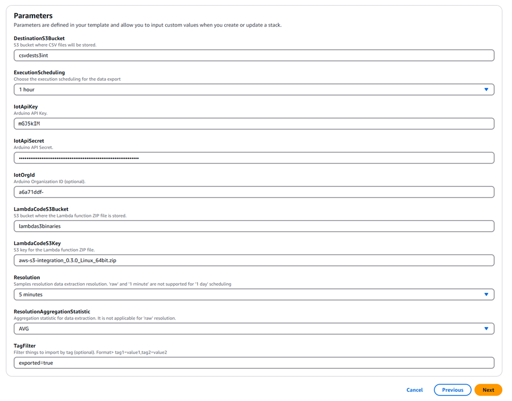

## Overview

The **Arduino AWS S3 CSV Exporter** is designed to extract time series data from **Arduino Cloud** and publish it to an **AWS S3** bucket.

The data extraction is managed by a scheduled AWS Lambda function that operates at configurable intervals, with samples aggregated based on the user’s preference. Data is stored in CSV format and uploaded to S3, providing a structured way to manage and store data.

## Goals

* Learn to create S3 Bucket and CloudFormation Stack
* Understand the functionality of the Arduino AWS S3 CSV Exporter
* Learn how to configure and deploy the Lambda function for data extraction
* Set up filtering and resolution options for optimized data aggregation
* Get started with configuring the exporter using CloudFormation

## Required Software

* [Arduino Cloud](https://cloud.arduino.cc/). **If you do not have an account, you can create one for free inside [cloud.arduino.cc](https://cloud.arduino.cc/home/?get-started=true)**.
* [AWS CLI](https://aws.amazon.com/cli/). **If you do not have an AWS account, please refer to the [online AWS documentation](https://docs.aws.amazon.com/iot/latest/developerguide/setting-up.html)**.
* [Go Programming Language](https://go.dev/) (version 1.22 or higher)
* [Official Arduino AWS S3 CSV Exporter Repository](https://github.com/arduino/aws-s3-integration)

## How It Works

The **Arduino AWS S3 CSV Exporter** extracts time series data from **Arduino Cloud** and publishes it to an **AWS S3** bucket. Data is extracted at a specified resolution using a **GO based AWS Lambda** function triggered periodically by **AWS EventBridge**.

Each function execution generates a CSV file containing samples from the selected **Arduino Things**, which are then uploaded to **S3** for data storage and management.

Data is extracted every hour by default, with samples aggregated at a 5 minute resolution. Both the extraction period and the aggregation rate are configurable.

Aggregation is performed as an average over the aggregation period, and non-numeric values, such as strings, are sampled at the specified resolution. Time series data is exported in **UTC** by default, and all Arduino Things in the account are exported unless filtered using [*tags*](#tag-filtering).

This setup allows you to easily manage and store time series data from connected devices, offering flexibility with configurable parameters like sampling intervals and data filtering.

## AWS Account & CloudFormation Template

If you do not have an existing AWS account and user, refer to the [online AWS documentation](https://docs.aws.amazon.com/iot/latest/developerguide/setting-up.html) for setting up your account. To get started, follow these steps:

- [Sign up for an AWS account](https://docs.aws.amazon.com/iot/latest/developerguide/setting-up.html#aws-registration)
- [Create an administrative user](https://docs.aws.amazon.com/iot/latest/developerguide/setting-up.html#create-an-admin)

The exporter setup involves deploying resources using a [**CloudFormation template**](https://github.com/arduino/aws-s3-integration/blob/0.3.0/deployment/cloud-formation-template/deployment.yaml). The AWS account will be set to have permission for:

* CloudFormation stack creation (policy: `AWSCloudFormationFullAccess`)
* S3 bucket management (policy: `AmazonS3FullAccess`)
* IAM role creation (policy: `IAMFullAccess`)
* Lambda function deployment (policy: `AWSLambda_FullAccess`)
* EventBridge rule configuration (policy: `AmazonEventBridgeFullAccess`)
* Parameter management in SSM (policy: `AmazonSSMFullAccess`)

## S3 Buckets (Pre-Requisite)

Before continuing and creating the CloudFormation stack, two S3 buckets need to be created:

- **Temporary bucket**: This is where the Lambda binaries and **CloudFormation template (CFT)** will be uploaded and stored.
- **CSV destination bucket**: This is where all generated CSV files will be uploaded. Make sure this bucket is in the same AWS region where the stack will be created.


### Creating S3 Bucket

To create the temporary bucket and the CSV destination bucket, you need to go to **Amazon S3** or search for **S3**. Then, you can click on **Create bucket** to start creating the first bucket.

When creating a bucket, you will see several different options of the bucket configuration required for the creation as follows:

- General configuration
- Object ownership
- Block public access for this bucket
- Bucket versioning
- Tags (Optional)
- Default encryption
- Advanced settings

All these parameters are explained briefly within the bucket creation process.


The important configuration here is the **General configuration** in our case. The bucket name **must be** defined and **General purpose** bucket is selected for the purpose of the present integration.

The rest of the configuration can be left with **Default** values that were selected and configured when the bucket creation process started. 

Proceed to **Submit** bucket creation with the defined configuration. The following image shows when a general purpose bucket has been created successfully after submission.

In this process, we created the **Temporary bucket** to store the Lambda binaries and **CloudFormation template (CFT)**. The name assigned to this bucket is: **lambdas3binaries**.


#### Temporary Bucket

The **lambdas3binaries** bucket needs to have:

- [Lambda binaries](https://github.com/arduino/aws-s3-integration/releases) (`.zip` file)
- [CloudFormation template (CFT)](https://github.com/arduino/aws-s3-integration/releases) (`.yaml` file)

Please download the binaries and CFT file to upload to the **lambdas3binaries** bucket.

Enter the **lambdas3binaries** bucket within the general purpose buckets and you will able to see different options available for the bucket as shown in the image below:


Choose the **Upload** option within the **Objects** tab. You can manually upload the binaries and CFT files using the browser explorer or drag and drop the files into the *Upload* area. Once the files are selected, the screen should resemble the following image:


Click **Upload** button to upload the files and you will have similar screen as shown in the image below:


Once every file is uploaded, the binaries and CFT file will be listed within the **Objects** tab of the **lambdas3binaries** bucket:


#### CSV Destination Bucket

A second bucket needs to be created following the same process as the [Temporary bucket](#temporary-bucket). This bucket will be the **CSV destination bucket**, where all generated CSV files will be stored. It is important to make sure this bucket is created in the same AWS region where the CloudFormation stack will be deployed.

Navigate to the Amazon S3 service and select Create bucket. In the bucket creation interface, specify the bucket name and confirm that the correct AWS region is selected.

Keep the recommended default settings for Object Ownership and Public Access to maintain security compliance. Once all settings are verified, proceed with the bucket creation.


After the bucket has been successfully created, it will be listed among other existing buckets. Select the newly created CSV destination bucket to continue with additional configurations if necessary.


Inside the CSV destination bucket, navigate to the **Objects** tab. Here, you can organize files by creating folders if needed.

Click on the **Create folder** button and specify a name for the directory that will store the exported CSV files.


When creating a folder, you will see options for server-side encryption to protect data at rest. By default, encryption settings are inherited from the bucket's global configuration.

If needed, specify a custom encryption key before creating the folder.


Once the folder is created, it will be displayed under the Objects tab of the CSV destination bucket. This ensures that all exported CSV files will be stored well-organized within the dedicated bucket.


## Creating CloudFormation Stack

To create the CloudFormation stack, navigate to the AWS CloudFormation service and select Create stack. This process involves specifying a template source.


Choose the option to use an existing template and enter the Amazon S3 URL for the CloudFormation template.


The following **Object URL** is an example of how it looks for use in the stack creation process:

```bash
https://arduino-s3-data-exporter-deployment.s3.amazonaws.com/deployment.yaml
```

The **Object URL** is required for the **Amazon S3 URL** field within the stack creation.

Proceed with the stack creation by following the steps. The configuration requires specifying parameters, including the Arduino API key and secret, the S3 bucket for code storage and the CSV destination bucket.

Optional parameters such as tag filters, organization ID and data resolution settings can also be configured.


Once all parameters are set, review the configuration to ensure all details are correct before proceeding to create a new stack.


### Stack Parameters

In the **Specify stack details** step, provide a stack name and enter the necessary parameters.

The **`DestinationS3Bucket`** is the location where the CSV files will be stored.

The **`LambdaCodeS3Bucket`** refers to the bucket containing the Lambda function ZIP file.

Specify the corresponding API key and secret in the `IotApiKey` and `IotApiSecret` fields.


The parameters required for creating the stack are categorized as follows:
  
- **Mandatory:** Arduino API key and secret, the S3 bucket for code, and the destination S3 bucket.
- **Optional:** Tag filter, organization ID, and data resolution settings.



Additional parameters include scheduling execution frequency, resolution settings and optional filters. These settings define how often data is exported and the aggregation method applied to collected data.

Once all parameters are filled in, proceed to the review stage. This allows you to verify the stack configuration before finalizing the deployment.


### Stack Build

After confirming the stack creation, AWS CloudFormation will begin deploying the required resources.

The stack creation process can be monitored from the AWS CloudFormation Stacks section.


The deployment status can be tracked, and once completed, the stack should display the status **`CREATE_COMPLETE`**, indicating that all resources have been successfully deployed.


This setup ensures that AWS S3 integrates with the Arduino Cloud for automated CSV data export.


## Configuration Parameters

Below are the supported configuration parameters that are editable in the AWS Parameter Store. These parameters are pre-filled during stack creation but can be modified later:

| **Parameter**                                                  | **Description**                           |
|----------------------------------------------------------------|-------------------------------------------|
| `/arduino/s3-exporter/{stack-name}/iot/api-key`                | IoT API key                               |
| `/arduino/s3-exporter/{stack-name}/iot/api-secret`             | IoT API secret                            |
| `/arduino/s3-exporter/{stack-name}/iot/org-id`                 | Organization ID (Optional)                |
| `/arduino/s3-exporter/{stack-name}/iot/filter/tags`            | Tag filter (e.g., `tag=value`) (Optional) |
| `/arduino/s3-exporter/{stack-name}/iot/samples-resolution`     | Aggregation resolution (Optional)         |
| `/arduino/s3-exporter/{stack-name}/iot/scheduling`             | Execution schedule                        |
| `/arduino/s3-exporter/{stack-name}/iot/align_with_time_window` | Align data extraction with time windows   |
| `/arduino/s3-exporter/{stack-name}/destination-bucket`         | S3 destination bucket                     |
| `/arduino/s3-exporter/{stack-name}/enable_compression`         | Enable gzip compression for CSV uploads   |

## Tag Filtering

To export specific Arduino Things from the Arduino Cloud, you can apply **tag filtering**.

**Tags** can be added in the Arduino Cloud under the **Metadata** section of each device, referred to as **Things**.


When you click on **ADD**, it will ask you to provide a **key** and its **value** for the tag.


During CloudFormation stack creation, configure tag filters using:

```bash
/arduino/s3-exporter/{stack-name}/iot/filter/tags
```


## CSV File Structure

The CSV files generated by the exporter follow this structure:

```csv
timestamp,thing_id,thing_name,property_id,property_name,property_type,value,aggregation_statistic
```

The following is an example of how the CSV files would look with data:

```
2024-09-04T11:00:00Z,07846f3c-37ae-4722-a3f5-65d7b4449ad3,H7,137c02d0-b50f-47fb-a2eb-b6d23884ec51,m3,FLOAT,3,AVG
2024-09-04T11:01:00Z,07846f3c-37ae-4722-a3f5-65d7b4449ad3,H7,137c02d0-b50f-47fb-a2eb-b6d23884ec51,m3,FLOAT,7,AVG
```

Files are organized by date and time stamp, with a structured naming convention for easy identification:

```bash
<bucket>:2024-09-04/2024-09-04-10-00.csv
<bucket>:2024-09-04/2024-09-04-11-00.csv
<bucket>:2024-09-04/2024-09-04-12-00.csv
```

## Building the Code

Ensure that at least [**Go version 1.22**](https://go.dev/) is installed to build the exporter locally. The core code can be built using the following command:

```bash
./compile-lambda.sh
```

This creates a **`arduino-s3-integration-lambda.zip`** file. Alternatively, you can run the following command to build the exporter:

```bash
task go:build
```

## Time Alignment

The data extraction is aligned with the function's execution time.

If required, the extraction can be configured to align with specific time windows by adjusting the following parameter:

```bash
/arduino/s3-exporter/{stack-name}/iot/align_with_time_window
```

## Additional Documentation

To help you get the most out of the exporter, the following documentation resources are recommended for your reference:

* [**Arduino Cloud Documentation**](https://docs.arduino.cc/cloud/iot-cloud): Here you can find information about setting up and managing **Arduino Cloud** projects, including device management, data collection, and integration with external services.

* [**Go Programming Language Documentation**](https://go.dev/doc/): The Go programming language is used to build the exporter. Visit the official Go documentation for guides, tutorials, and reference material to help you set up and build Go projects.

* [**AWS Lambda Documentation**](https://docs.aws.amazon.com/lambda/): You can explore the official AWS Lambda documentation here to learn more about building, deploying, and managing Lambda functions.

* [**AWS S3 Documentation**](https://docs.aws.amazon.com/s3/): Learn about **Amazon S3**, known as Simple Storage Service, where CSV files are stored. Here you can find information on S3 features, storage management, and security best practices.

* [**AWS CloudFormation Documentation**](https://docs.aws.amazon.com/AWSCloudFormation/latest/UserGuide/Welcome.html): CloudFormation is used to deploy the exporter, and you can find more information about AWS CloudFormation here.

## Conclusion

In this tutorial, you have learned to use the **Arduino AWS S3 CSV Exporter** to capture time series data from **Arduino Cloud** and store it in **AWS S3** for management and analysis. With configurable options for aggregation intervals, tag filtering, and data compression, the exporter offers flexibility for various project needs.

Following this tutorial, you can deploy and configure the exporter using a CloudFormation template, making it a useful tool for integrating cloud based data storage into your IoT projects.