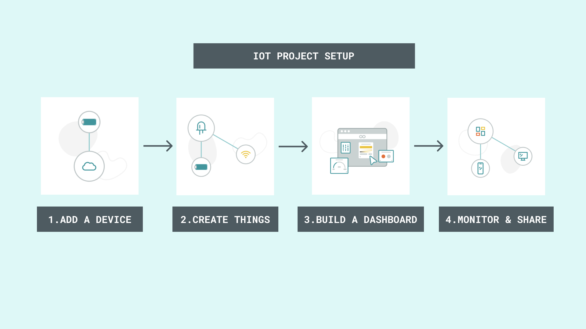
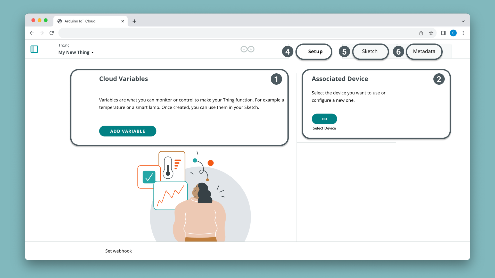
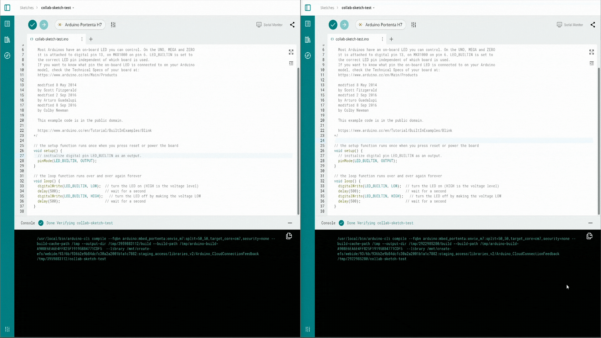

## Introduction

The [Arduino Cloud](https://cloud.arduino.cc/schools/) helps teachers to effectively introduce, manage and facilitate Arduino STEAM projects in their classroom. 

***In order to get started with Arduino Cloud, you need to [have an Arduino account](https://login.arduino.cc/login). If you do not have an account yet, feel free to create a new one. You can follow [this tutorial](https://support.arduino.cc/hc/en-us/articles/360016724040-Create-an-Arduino-account) for a step-by-step explanation on how to do it.***

## Goals

- This guide gives an overview of some important cloud tools that are useful in an educational context. 
-  A glimpse on how Arduino Cloud can enhance both the teaching and learning experience related to coding, electronics and IoT projects.

## Platform for Educators 

Arduino Cloud can be used to meet some of the basic needs of a teacher who wants to implement hands-on learning in the classroom using Arduino Educational kits or hardware. 

**Easy-to-use platform**

The **Arduino Cloud Home** has been designed with the goal of offering a simple and straightforward experience for absolute beginners in order to be efficient in creating Arduino projects with the use of **Quick Actions** and **Sidebar**. 

**Code online using the Web-Editor** 

Low code entry using the **Cloud Editor** gets students started quickly. Instant results motivate students to go further and progress through limitless active learning pathways.

**Get started with IoT Projects quickly** 

Arduino Cloud makes the creation of connected objects quick, simple, and secure. You can connect multiple **devices**, allow them to exchange real-time data very easily and visualize data through interactive **dashboards**. Our extensive collection of pre-built **IoT Templates** gets your project up and running in two minutes. 

**Access rich and deep learning content** 

We understand that it could be a daunting task to find a starting point especially when you are new to Arduino and running out of time to put together a lesson / project with new tools. **Cloud Courses** offer you over 30 different **lessons** and **projects** across various age groups and grades. 

**Organize, manage and track student progress** 

Manage your classroom with ease and make collaboration easier through the use of shared spaces. Through a shared space you can keep tabs on students projects, create assignments through Google Classroom and share learning materials with your students.

## Cloud Home 

The home page is more or less like a control panel where you can access all the important functionalities. From this interface you can create, monitor and navigate to different areas of the platform based on your application. 

### Quick Actions

**Devices** & **Things** shows how many devices are connected and have been linked with your Cloud profile. 

**Create New** button allows you to quickly create Sketches, Dashboards or register new devices to your Cloud platform. 

### Sidebar 

The **Sidebar** on the left provides you quick access to all the important tools such as the Editor (through Sketches), IoT Cloud (through Devices, Things and Dashboards), Templates and even learning materials such as **Courses** and **Resources**. Let's take a closer look at these components and what they are.

- **Sketches** - These are the programs you or your students will create. Here you can access all sketches that you have created in the past or wish to create and access them from any device. 
- **Devices, Things, Dashboards, Triggers** - these are the core functionalities of the Cloud Platform, enabling  you to build IoT projects that allows you to collect, analyze and monitor data from the environment. 
- **Resources, Courses & Templates** - These are learning materials and ready-made IoT projects to get you started with your educational kits or other Arduino hardware. 
- **Integrations** - Integrate with third-party APIs and extend your projects functionality. 
- **Plans Usage** - Here you can track the usage of your free plans.

***If you are new to the platform, make sure you try out the interactive walkthrough for a faster onboarding experience.***

## Cloud Editor 

The [Arduino Cloud Editor](http://create.arduino.cc/editor) allows you to **write code** and **upload sketches** to any Arduino board after installing a [**simple plug-in**](https://create.arduino.cc/getting-started/plugin/welcome) **for your browser**. Your sketches will be stored in the Cloud and accessible from any device. You can use this tool to create both basic and IoT sketches. 

You can **download** your sketch via a .zip file or sort your sketches into **folders**.

The Cloud Editor is part of Arduino Cloud, that simplifies a project by bringing all the different tools you need together in one place. This is a complementary solution for schools or institutions that don't want to install [Arduino IDE](https://www.arduino.cc/en/software) to program their devices.

***Interested in getting started? Get to know more about Arduino Cloud Editor by [visiting this link](https://docs.arduino.cc/arduino-cloud/getting-started/getting-started-web-editor).***

## IoT Tools 

### Devices 

Setting up an IoT projects can be time consuming and complex especially. With the Cloud platform, you can bring your IoT project ideas to life within in four steps. Before starting with a project we recommend you to familiarize yourself with the necessary tools that you will use during your building process.

The Arduino Cloud supports a range of official and third-party boards which are handled in the **"Devices"** tab. Devices are considered to be the digital replicas of your physical boards.

The Arduino Cloud currently supports devices connected via Wi-Fi®, Ethernet, LoRa®-based networks (via The Things Network), and cellular connectivity. You can check the [full list of compatible hardware here](https://support.arduino.cc/hc/en-us/articles/360016077320-What-devices-can-be-used-with-Arduino-IoT-Cloud-).

### Things 

[Things](https://app.arduino.cc/things) are basically a representation of how your Arduino device, sensors, actuators and network is mapped and linked together.

Each Thing is represented by a collection of properties, such as 

- **Variables** - they are very similar to the variables we create in a regular sketch where they are used to retrieve and store information. 
- **Associated device** - The device that is used to collect data from the real world. 
- **Network Credentials** - This can be found on the [**Devices**](https://app.arduino.cc/devices) page. Click on the device you want to configure and on that page you can change the network configuration.
- **Sketch** - access to the editor to edit or preview a sketch saved in the Cloud.
- **Metadata** - such as tags, time zone and Thing ID.

Read more about Things [here](https://docs.arduino.cc/arduino-cloud/cloud-interface/things).

### Dashboards 

Dashboards are used to visualize real-time data and to enable direct interaction with the board through the Cloud. 

Typically a dashboard consists of easily configurable Widgets. Widgets are the ‘building blocks’ of a dashboard, and are directly linked to our properties. They allow us to visualize the data we get from sensors. There are several different widgets: gauges, sliders, switches, color palettes, messenger and more.

### IoT Templates

If you want to quickly setup an IoT project, you don't have to start from scratch. [Templates](https://app.arduino.cc/templates) are ready-made projects that will automatically configure your hardware and set it up with our Cloud Environment.

It's the easiest way to proceed with a beginner class and you can checkout the collection of Templates to get inspiration for your own class project.

## Cloud Courses

Here, you get access to several free online courses, for different age groups and topics. This library of courses gets widened and extended regularly with new releases of educational kits.

For starters we have courses like [Explore Physics](https://courses.arduino.cc/explore-physics/), [Student Kit](https://edu-content-preview.arduino.cc/content-preview/middle_school/lesson/CONTENTPREVIEW+STUDENTKIT) and [Science Journal](https://science-journal.arduino.cc/) to get your students started with some basic coding and electronics challenges that are fun to learn. 

### Lessons & Projects 

Every course contains a couple of Lessons and Projects (Activities in some cases) that distinguishes technical activities from pedagogical ones. 

Lessons help students to understand how to connect sensors and actuators to an Arduino board and focuses on core programming skills, connecting electronics and troubleshooting. 

On the other hand projects focus on the application of core technical knowledge to a more real world context. Here students learn to think more critically about technology, the interactions between a user and the technology and understand the world around them in a more pedagogical manner. 

### Free & Premium Course 

As you may have noticed some courses are available for free while others require you to have a school plan. Although you can always have a preview of a free chapter from any of the courses that you are interested in and can upgrade to a school plan if you think it's interesting for your class. 

Explore our collection of Free and Premium courses [here](https://www.arduino.cc/education/courses/).

***If you have purchased the Explore IoT Rev2 or the Greenhouse Kit, you already have a subscription for the Cloud included and can access all the courses.***

## Shared Spaces 

Foster collaboration in your classroom through the use of Shared Spaces. A **shared space** is a virtual classroom environment where you can optimize classwork, keep track of student’s progress, boost learning and connect with peers and students seamlessly.

Now that you have logged in and have your own private space let's get you started with setting up a space for your classroom. In order to create a shared space go to [this link](https://docs.arduino.cc/arduino-cloud/education/shared-spaces).

### Share learning materials 

Once you've created a space and added members, all of them will have access to the learning materials available on https://app.arduino.cc/courses.

### Manage student projects 

Quickly find all the recent sketch files and IoT Dashboards worked by your students right from the shared spaces dashboard manage your efficiently without unnecessary clicks or complex steps.

***If you are interested in knowing more about Shared Spaces, read this [tutorial](https://docs.arduino.cc/arduino-cloud/education/shared-spaces/).***

## Collaborative Coding

**Collaborative coding** is a feature available in the School Plan that allows multiple users within the same shared space to work together on the same code. Students and teachers can share and edit code, making it easier to collaborate and learn from each other.

In the shared space, everyone can create and modify code simultaneously. Changes are updated and visible to all participants once the last user has finished editing. The code editor notifies users if someone else is editing by highlighting the code area with an orange frame.

The following short clip shows an idea of how the collaborative coding works from a student and teacher perspectives:

While a student or teacher is working on the code, the area they are editing is highlighted with an orange frame, and a warning block appears. This indicates that you should wait to avoid any loss of change. Please wait for them to finish before editing the code to prevent conflicts and ensure all changes are correctly synchronized.

This helps ensure that all students and teachers stay synchronized and can contribute effectively. Collaborative coding makes projects more interactive and engaging, improving the learning experience.

## Cloud Remote App

The Cloud Remote App allows you to monitor your dashboards anywhere, anytime, from a **mobile device** i.e. smartphone or tablet for **free**. Download it from either [Google Play Store](https://play.google.com/store/apps/details?id=cc.arduino.cloudiot&hl=en&gl=US) or the [Apple App Store](https://apps.apple.com/us/app/arduino-iot-cloud-remote/id1514358431) depending on your device.

## Conclusions 

You have now an general overview of the different Cloud tools that are available on the Arduino Cloud platform. It could be a lot if you are using it for the first time, but the best way to learn is by doing. Let’s get you going by [setting up a Shared Space](https://docs.arduino.cc/arduino-cloud/education/shared-spaces/). 

## Learn More

You can find a full list of tutorials on the [Arduino Cloud documentation page](https://docs.arduino.cc/arduino-cloud/).

If you are a enthusiast and would like to explore more about our Cloud platform, here are some documentation on all the important elements you can familiarize yourself with: 

- [Sketches](https://docs.arduino.cc/arduino-cloud/cloud-interface/sketches/)
- [Device Provisioning](https://docs.arduino.cc/arduino-cloud/hardware/device-provisioning/)
- [Arduino Cloud Editor](https://docs.arduino.cc/arduino-cloud/getting-started/getting-started-web-editor)
- [Cloud Variables](https://docs.arduino.cc/arduino-cloud/cloud-interface/variables/) 
- [Dashboards & Widgets](https://docs.arduino.cc/arduino-cloud/cloud-interface/dashboard-widgets)
- [Cloud Remote App](https://docs.arduino.cc/arduino-cloud/iot-remote-app/getting-started)
- [Setup a Shared Space for your class](https://docs.arduino.cc/arduino-cloud/education/shared-spaces)

## Trademark Acknowledgments

- **LoRa®** is a registered trademark of Semtech Corporation.
