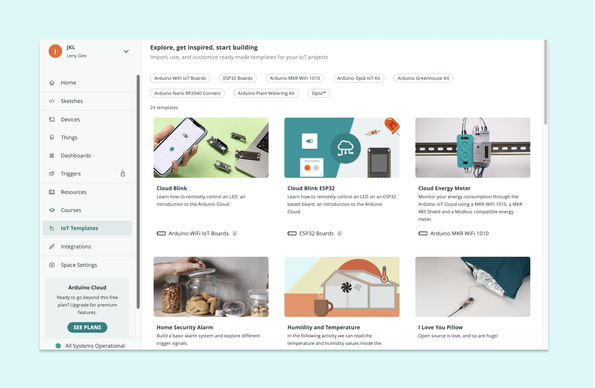
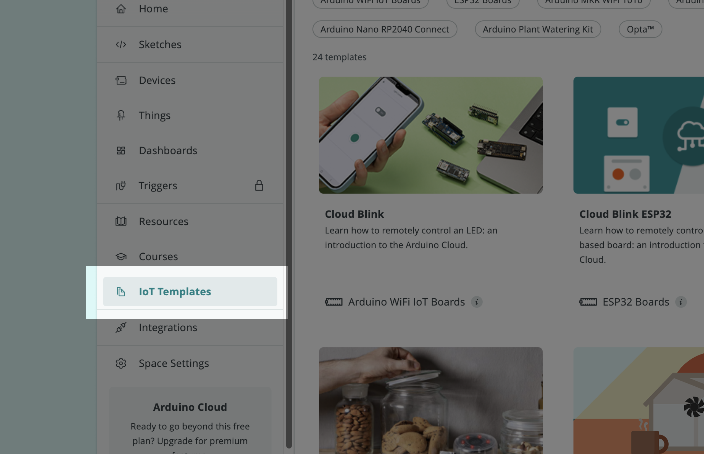
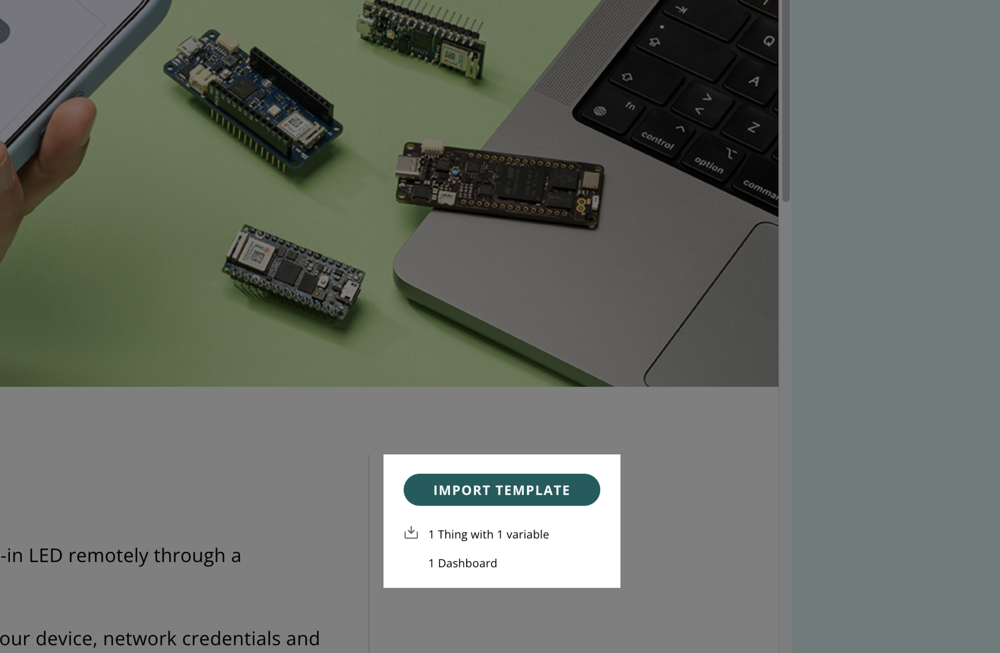
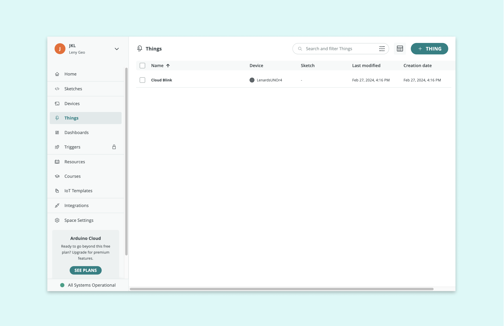

## Introduction 

This tutorial is designed to help educators introduce students to the world of Internet of Things (IoT) using Arduino IoT Templates. Templates are ready-made projects that can significantly lower the entry barrier for teaching and learning about IoT applications. Whether you’re integrating IoT into your curriculum or organizing a hackathon, these templates offer a medium to get started quickly with the basic components of a IoT project.

## What you will learn

- Templates and their benefits
- Collection of Arduino IoT Templates
- Using templates for a subject
- Importing Templates 

## Arduino IoT Templates

<iframe width="100%" height="480" src="https://www.youtube-nocookie.com/embed/J5_QleCPc64?si=I-3lU1mVam3jtA4_" title="YouTube video player" frameborder="0" allow="accelerometer; autoplay; clipboard-write; encrypted-media; gyroscope; picture-in-picture; web-share" allowfullscreen></iframe>

Templates are pre-configured projects that allow users to quickly setup Arduino devices for the Arduino Cloud, creating a dashboard based on the project in two minutes. Through a [Dashboard](https://docs.arduino.cc/arduino-cloud/cloud-interface/dashboard-widgets) you can easily monitor and control IoT projects on a web interface. 

For educational purposes, **Dashboards** provide an excellent opportunity for students to learn about IoT concepts, data collection and analyses and interaction with hardware/sensors without having to build an IoT project from scratch. This reduces the time and the learning curve, which gives students a starting point to build their ideas and learning. 

## Preparing for the Activity 

Once you have decided which template(s) you would like to use, we suggest you to prepare the essentials to conduct this activity in your class. Before you begin using templates, ensure that you have the following items checked: 

- Hardware - Any choice of [Arduino Wi-Fi® boards](https://support.arduino.cc/hc/en-us/articles/4407129094546-Boards-and-shields-with-wireless-connectivity)

- USB Cable - Ensure you have the right one for your board 

- Software - Arduino Account 

- Good Internet Connection 

- Shared Space (optional - only when you are about to use the templates with your students)

- Sensors and Actuators (optional)

***Note: if you haven't created a shared space check out this [article](https://docs.arduino.cc/arduino-cloud/education/shared-spaces/). Ensure that you students have their individual accounts created and have been added to the shared space that you have created.***  

For our tutorial, we will use the [Cloud Blink Template](https://app.arduino.cc/templates/cloud-blink) that will illustrate how to control an Arduino Board’s LED through a dashboard in the Arduino Cloud. This is a great template if you want to get started with the Arduino Cloud since it works with all boards. After you have completed the installation, you can modify the sketch and dashboard freely.

For troubleshooting, we recommend to read this article from our Help Center:

* [Configure your network for Arduino Cloud](https://support.arduino.cc/hc/en-us/articles/360017279260-Configure-your-network-for-Arduino-Cloud)

## Choosing a template 

Once you have logged into your account, Templates can be accessed under the **IoT templates** section from the sidebar. 

Here you will find templates across various categories and different boards. Click on the "Cloud Blink" Template. 

The template page will open, where you will find the description of what the project does together with essential information on hardware and electronics components.

## Importing a Template 

Templates can be imported easily by clicking on the import button from the template description page. The process is similar to that of uploading a sketch to the Arduino board. Once the device is plugged in the USB port, click on **IMPORT TEMPLATE** to import the chosen IoT template.  

Below the `Import Button`, you can find information on how many [Things](https://docs.arduino.cc/arduino-cloud/cloud-interface/things), [Variables](https://docs.arduino.cc/arduino-cloud/cloud-interface/variables) and [Dashboards](https://docs.arduino.cc/arduino-cloud/cloud-interface/dashboard-widgets) are associated with this template. The Arduino Cloud platform will handle the creation of these IoT components along with setting up the device and network for the selected template. 

This process involves creating the necessary components and uploading the sketch (program) to your device:

1. Configure your Arduino hardware and add it to the Cloud platform,
2. Create a virtual representation of your IoT setup,
3. Assign the right network credentials to your devices, 
4. Build a dashboard with the right widgets.

***Note: The process may take up to 5 minutes. Remind students not to unplug the device during this step or close their laptops during the import process.*** 

For troubleshooting, we recommend to read this article from our Help Center:

* [If your device can't be added or won't connect to Arduino Cloud](https://support.arduino.cc/hc/en-us/articles/360019355679-If-your-device-can-t-be-added-or-won-t-connect-to-Arduino-Cloud)

Once connected, the template will become operational. For example, if using the "Cloud Blink" template, you can now control an LED remotely through the Cloud interface.

For troubleshooting, we recommend to read this article from our Help Center:

* ['We were not able to upload the template sketch' in Arduino Cloud](https://support.arduino.cc/hc/en-us/articles/4408887422994--We-were-not-able-to-upload-the-template-sketch-in-Arduino-Cloud)

## Customizing a Template 

This interface is fully customizable and you can extend this template based on your needs and creativity. If you’d like to make changes to the `Dashboard` by adding additional widgets, you can do so by clicking on the **Edit icon**. 

Click on the **Add** to select a widget you would like to add. 

Once you have added the `Widget`, you can either connect it to the available `variables` or you can create a new variable. For this you need to go to **Things** from your sidebar and click on the Thing that **has the same name as your template**. 

As mentioned earlier, a template also creates: **variables**, **sketch files**, **device** and **network information** that can be configured based on your preference. All this information can be found inside a **Thing**.

If you have already worked with Arduino IoT projects, you can go ahead and start customizing the templates based on your choice, otherwise you can [get started reading this tutorial]( https://docs.arduino.cc/arduino-cloud/guides/overview/). 

### Using Templates for your course

Integrating Arduino IoT templates into a course curriculum offers a tangible way to teach concepts like sensor data collection, cloud computing, and Internet of Things principles across various disciplines such as physics, chemistry, biology and computer science. Here are some innovative ways a teacher can use these templates in their course.

| Subject / Project                                            | Physics                                                      | Chemistry                                                    | Biology                                                      | Comp. Science                                                | Arts and Design                                              |
| ------------------------------------------------------------ | ------------------------------------------------------------ | ------------------------------------------------------------ | ------------------------------------------------------------ | ------------------------------------------------------------ | ------------------------------------------------------------ |
| [Remote LED Control](https://app.arduino.cc/templates/cloud-blink) | Electricity & Circuits  Light and optics                     |                                                              |                                                              | Basic concepts of IoT                                        |                                                              |
| [Greenhouse Monitoring](https://app.arduino.cc/templates/watering) | [Thermodynamics](https://app.arduino.cc/templates/ventilation) | [Soil properties](https://app.arduino.cc/templates/soil-moist) | [Photosynthesis and respiration](https://app.arduino.cc/templates/photosynthesis) | Application of Data collection and analyses                  | [UI Design of industrial systems](https://app.arduino.cc/templates/smart-garden) |
| Home Automations                                             |                                                              | [Monitoring indoor air quality](https://app.arduino.cc/templates/thermostat-control) | [Studying indoor plant growth](https://app.arduino.cc/templates/natural-and-artificial-light) | [Introducing Sensor technology](https://app.arduino.cc/templates/remote-controlled-lights) | [Ideation and prototyping easy to use home projects](https://app.arduino.cc/templates/plant-watering-kit) |
| [Weather Stations](https://app.arduino.cc/templates/personal-weather-station) | [Pressure, temperature and light](https://app.arduino.cc/templates/humidity-and-temperature) | Gas Laws and atmospheric properties                          |                                                              | [Basics of structuring data](https://app.arduino.cc/templates/sparkfun-weather-station) |                                                              |
| [Fun and Games](https://app.arduino.cc/templates/pavlovs-cat) |                                                              |                                                              |                                                              | [Loops, Pointers, Arrays and Functions](https://app.arduino.cc/templates/puzzle-box) | [Emotional expressions through technology](https://app.arduino.cc/templates/thinking-about-you) |

As you can see some templates can be used across various disciplines and it totally depends on how you interpret them too. Creativity together with your subject matter can open up new avenues for experimentation and fun exploration for your students: 

* **Group Projects** - Encourage students to work in groups, fostering collaboration and problem-solving skills. For advanced students, these templates can serve as the basis for capstone projects where they design and implement a complete IoT system to solve a real-world problem.

* **Experimenting** - Discuss how the principles learned through these projects can be applied to real-world scenarios, enhancing their understanding of IoT's impact. After mastering the basics, challenge students to modify the templates or come up with their own IoT project ideas.

* **Hackathons or Competitions** - Organize a hackathon where students use the templates as a starting point to innovate and create new projects or improvements. This encourages creativity, teamwork, and practical problem-solving skills.

## Conclusion

Arduino IoT Templates offer a practical and engaging way to introduce students to IoT technology. By guiding them through setting up, programming, and deploying IoT projects, educators can provide a hands-on learning experience that emphasizes the importance of IoT in today's technology-driven world. Encourage your students to explore, experiment, and innovate as they embark on their IoT learning journey.

