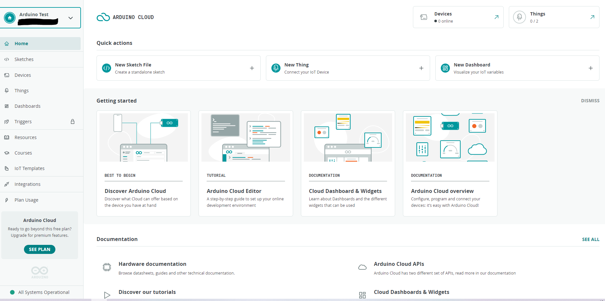
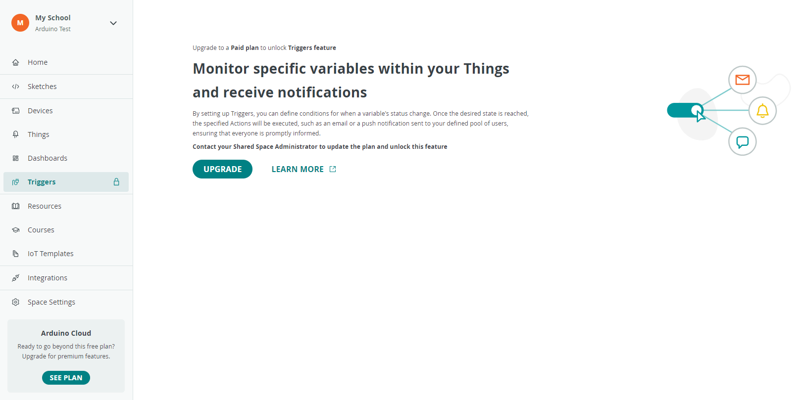
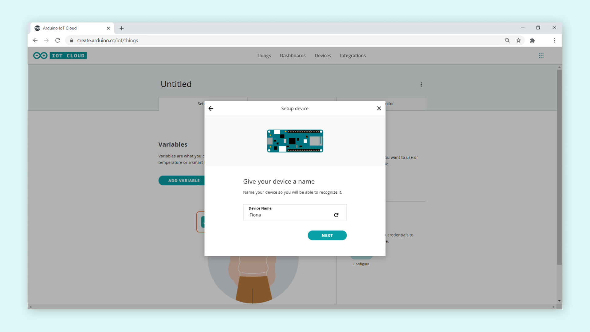
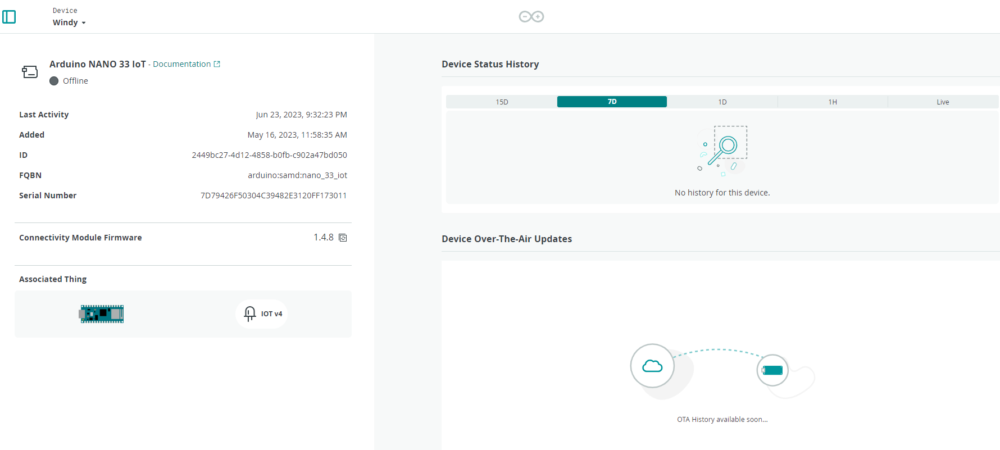
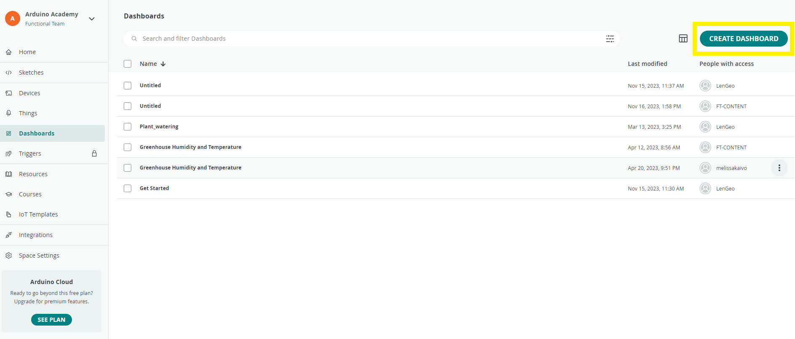
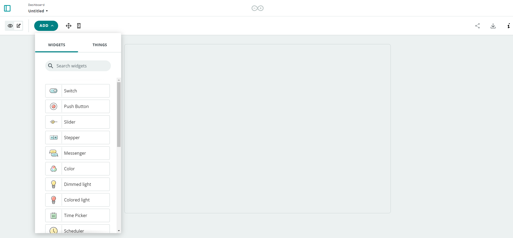
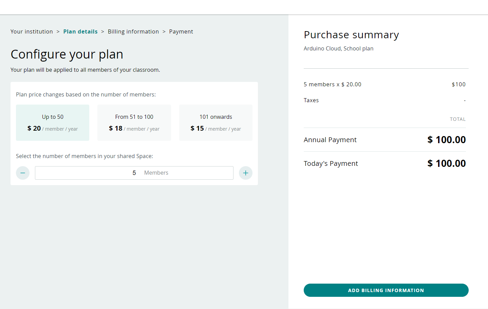

## Introduction

The [Arduino Cloud for Schools](https://cloud.arduino.cc/schools/) is a tool that provides an online space for teachers and students. 

In this article, you will get a general overview of the major features of the Arduino Cloud for Education and the features *Free* and *School* plan can offer.

## What is Arduino Cloud?

Arduino Cloud is an easy-to-use Internet of Things application platform. Arduino Cloud makes the creation of connected objects quick, simple, and secure. You can connect multiple devices and allow them to exchange real-time data. You can also monitor them from anywhere using a simple user interface. It is integrated with the online Arduino Web Editor.

## How to Create an Account

In order to get started with Arduino Cloud, you need to [have an Arduino account](https://login.arduino.cc/login). An **Arduino account gives** you **full access to all Arduino websites, apps**, and **services**.

If you do not have an account yet, feel free to create a new one. You can follow [this tutorial](https://support.arduino.cc/hc/en-us/articles/360016724040-Create-an-Arduino-account) for a step-by-step explanation on how to do it.

After the registration is completed, you should verify your email address by clicking CONFIRM NOW in the email that was automatically sent to your inbox.

Now let's explore https://app.arduino.cc/.

The Arduino Cloud for Education consists of **two main subscriptions**:

* Free Plan
* [School Plan](https://cloud.arduino.cc/plans#school)

By default, any new user who created an Arduino account has access to Arduino Cloud with a *Free Plan*.

## Free Plan

### Access to free online courses content

Once you've logged in, you are free to check out our free content in `Arduino Cloud > Courses` or click [here](https://app.arduino.cc/courses). 

Here, you get access to several free online courses, for different age groups and topics. This library of courses gets widened and extended regularly with new releases.

***With a School Plan you unlock access to extra online courses.***

## Manage Your Spaces

Your Arduino Cloud *Free plan* comes with one **space** by default:

* **Private Space**. Private space is an *automatically* created private space once joined Arduino Cloud. You can use this space for personal projects you do not want to share with all your class. This space is free and includes
  
  * *two Things*, 
  * unlimited dashboards, 
  * 100 MB of sketch storage, 
  * 1-day data retention by default.
  
  You have a quick glance on Device and Things from the menu on the top right corner.
  
* **Shared Space**. It's an easy tool to keep track of your students' recent activities on their IoT projects and monitor their project progress.
	
	*  *Save online unlimited amount of sketches* and dashboards, and easily search for them later,
	*  Quickly share your data flow from sensors adding up to *five Things*
	*  Integrate your lesson plan with Google Classroom, assign tasks and share courses.
	*  Study data analysis with your students with 6 months of data retention by default

### Create a Shared Space

In order to create a shared space go to [this link](https://app.arduino.cc/space?spaceType=%22edu%22).

Then you will be asked which type of Shared Space you want to create (i.e. For Business or For Education). Click on **For Education** and proceed with creating a online space to share with your students or other colleagues.  

Fill in additional information.

Congratulations! Now you own a Shared Space linked to your Arduino account.

### Switch Between Spaces

You can switch to other Shared Spaces at any time using the corresponding menu, which you can find at the top left-corner, and click on it.

***With a Free Plan or School Plan there is no limitations in the number of Shared Space you can have.***

### Change Shared Space Settings

To change the current settings of your Shared Space, navigate to the **Space Settings** tab using the sidebar.

Here you can **Edit** your information, change name or **Disband Shared Space**. From this menu you can also manage the members you've invited into your Shared Space.

From `Arduino Cloud > Space Setting` menu you can check your plan's limit and quota or upgrade it to a School Plan.

### Invite Members Into Your Space

You can add more members to your Shared Space from the `Cloud > Home`, clicking on the shortcut green button `INVITE MEMBERS` or you can [click here](https://app.arduino.cc/settings). 

Once inside the Cloud homepage, from the card on the right top corner, you will find the complete list of all members who have access to your Shared Space, as well as the current role of each member. 

You can add members in **three possible ways**:

1. Type the **email addresses** of each user and define which role they will cover in your Space based on the available options. Click on **Invite**. The users you added will get the invitation by email with a link to join your Shared Space. 

2. You can invite your students to the Space through **Code** invitation (check *Join Space* explained above).

3. **Copy pasting the link** and share it with the whole class.

**Join Space**. Here you copy and paste the space code that another admin or teacher shared with you to join their space. See image below:

### Role types

There are three role types in Arduino Cloud for Schools: 

* Admin
* Teacher
* Students

By default the member who has activated the plan and created the class-space is set as *Admin*. It is possible to have multiple Admins with same permissions. The admin has full control of the rights/permissions each user has in a Shared Space.

The list of supported roles and corresponding permissions can be found here: https://cloud.arduino.cc/home/roles-permissions

Important to remember are **Student role limitations:**

* They are not allowed to add new members to your School organization
* They are not allowed to assign members roles
* They are not allowed to view the Plan Management and Payment information

***There is no limitation on the numbers of members you can add into a Shared Space.***

***

## IoT Components

On the left menu bar in https://app.arduino.cc/, all the elements you will use to set up your IoT projects for a quick access are listed:

1. [Devices](https://app.arduino.cc/devices)
2. [Things](https://app.arduino.cc/things)
3. [Dashboards](https://app.arduino.cc/dashboards)
4. [Triggers](https://app.arduino.cc/triggers)

| Cloud components | Free Plan | School Plan |
| :--------------: | :-------: | :---------: |
|     Devices      |     x     |      x      |
|      Things      |     x     |      x      |
|    Dashboards    |     x     |      x      |
|     Triggers     |           |      x      |

With a *Free Plan* you won't have access to Cloud Triggers, so you'll see something similar to this:

If you want to unlock this function, you'll need to upgrade to a [School Plan](https://digital-store.arduino.cc/education/purchase).

### Let's Setup a IoT Project

In your IoT projects with Arduino you will need **three elements**:

1. The [**Arduino Cloud**](https://docs.arduino.cc/arduino-cloud/guides/overview)
2. The [**Arduino Create Agent**](https://create.arduino.cc/getting-started/plugin/welcome) the middle man between Arduino’s Web Editor, Arduino Cloud and your computer. It allows you to use the browser to edit and deploy sketches to your Arduino board.
3. **A device** of your choice.

### Setup a Device in Arduino Cloud

Arduino Cloud is compatible with multiple Arduino boards or devices based on the ESP32 / ESP8266 microcontrollers. The Arduino Cloud currently supports devices connected via Wi-Fi®, Ethernet, LoRaWAN® (via The Things Network), and cellular connectivity. You can check the [full list of compatible hardware here](https://support.arduino.cc/hc/en-us/articles/360016077320-What-devices-can-be-used-with-Arduino-IoT-Cloud-).

If your device is compatible with Arduino Cloud, you can start to **Setup Device** by connecting it to your computer through a USB cable,  going to `Arduino Cloud Homepage > Devices > Add Device`.

The agent will start looking for your board, select the kind of device you're setting up and continue to follow the next guided steps.

Select a board name to be able to correctly identify your device and click on **Next**.  

If the onboarding proceeds as expected, the following page will appear confirming that your device has been successfully set up.

When you click on a `Device`'s name it displays all the associated `Things`, more information about the device, such as its ID number, FQBN, serial number, firmware version, Device Status history, and the date when the device was added.

The device status indicates whether it is connected to the Arduino Cloud (online), or not connected (offline). Click on the three dots to rename your device.

### Link A Thing To Your Device

To use a device in Arduino Cloud, you need to [create a Thing](https://app.arduino.cc/things), or associate it to an existing Thing. A Thing is the digital twin of your device, like a reference to the actual hardware used to implement them. Each Thing is represented by a collection of properties, the configuration of some variables and other settings, as well as the history of the data collected for those variables.

Let's make your first Thing, going to Cloud homepage sidebar, click on the green button CREATE THING.

If you want to explore more on how Things work, check [here](https://docs.arduino.cc/arduino-cloud/guides/overview#3-creating-a-thing).

***With a Free Plan you can only connect two Things with the Cloud at a time. With a School Plan, each member you've included in your plan can connect up to five Things to a Device.***

### Variables

In order to retrieve and store information we need to create Variables in the Arduino Cloud, they are very similar to the variables we create in a regular sketch. 

When we create variables here, they are automatically generated in a sketch, and when we upload the code to the board, the variables used in the sketch synchronize with the variables in the Cloud.

To learn more about the different types of variables, go to [this tutorial](https://docs.arduino.cc/arduino-cloud/getting-started/cloud-variables).

***The Arduino Cloud - Free Plan allows a maximum number of 5 variables per Thing by default. The Arduino Cloud School Plan allows an unlimited number of variables per Thing.***

### Dashboards

Dashboards are used to visualize real-time data and to enable direct interaction with the board through the Cloud. Go to `Dashboard` and click the green button `Create`. We'll link `Variables` we've created before to a *Widget*.

***With a Free Plan is not possible to share your Dashboard with other users. If you want to unlock this function, you'll need to upgrade to a [School Plan](https://digital-store.arduino.cc/education/purchase).***

**Widgets** are the ‘building blocks’ of a dashboard, and are directly linked to our properties. They allow us to visualize the data we get from sensors. There are several different widgets: gauges, sliders, switches, color palettes, messenger and more.

If you want to learn more on how to customize your dashboard and widgets, check [this link](https://docs.arduino.cc/arduino-cloud/getting-started/dashboard-widgets).

***If want to use to Advanced Chart Widget for your IoT projects, that allows you to visualize multiple variables in one chart, you'll need access to the School Plan.***

You can read more about Advance Chart Widget [here](https://docs.arduino.cc/arduino-cloud/features/advanced-chart).

### Data Export

Arduino Cloud, both with *Free* or *School Plan*, allows any user to download historical data from Arduino Cloud Things and Variables. The data are downloaded in **.csv** format to be ready for further editing.

***The Arduino Cloud Free Plan allows only 1 day of data retention by default. The Arduino Cloud for School Plan includes 6 months of data retention by default; this means that your data will be available and downloadable from your Arduino Cloud account for 6 months.***

To start exporting your data locally, navigate into one of your dashboards on the [Arduino Cloud](https://app.arduino.cc/dashboards). While inside a dashboard, press the **Download** icon in the upper right corner. This will open a new window that will allow you to select which historical data you would like to download.

From here you can select all the variables you want to download by checking the boxes as well as the time frame you are interested in.

Read more about how to use on download collected data [in this tutorial](https://docs.arduino.cc/arduino-cloud/features/iot-cloud-historical-data).

### What is Arduino Web Editor?

[Arduino Web Editor](http://create.arduino.cc/editor) allows you to **write code** and **upload sketches** to any Arduino board after installing a **[simple plug-in](https://create.arduino.cc/getting-started/plugin/welcome) for your browser**. Your Sketchbook will be stored in the Cloud and accessible from any device. If you have a *Free Plan* you can store to a maximum of 100 MB of sketches.

You can import your Sketchbook via a .zip file. Arduino Web Editor is part of Arduino Cloud, that simplifies a project by bringing all the different tools you need together in one place. This is a complementary solutions for schools or institutions that don't want to install [Arduino IDE](https://www.arduino.cc/en/software) to program their devices.

If you want to know more about Arduino Web Editor [visit this link](https://docs.arduino.cc/arduino-cloud/getting-started/getting-started-web-editor).

A **lite version of the Web Editor** is included in the Arduino Cloud, under `Things > Sketch`, which is actually a preview of a sketch saved on the Web Editor. 

***The Arduino Cloud - Free Plan allows a maximum online space to store your sketches and libraries of 100 MB and a maximum of 25 code compilations per day by default. The Arduino Cloud - School Plan allows unlimited online storage space and unlimited code compilations for your sketches.***

You can check how many times you have left to verify and upload your program from the [Arduino Cloud > Space Setting > Plan Usage](https://app.arduino.cc/plan-usage).

 

***

## School Plan

As an Educator you might need:

* To create and store in the Cloud more sketches
* To collaborate in your IoT projects sharing real-time data dashboards and programs
* To integrate your IoT Project with an LMS tool
* To customize your projects with additional functionalities provided by APIS
* To handle several students' accounts with one Admin 

### Buy a School Plan

To upgrade from a *Free Plan* to *School Plan* and get access to the features mentioned in this article, go here:

https://digital-store.arduino.cc/education/purchase/institution

1. If you're not logged in with an Arduino account, you'll be redirected to the login page. If you've already created a Shared Space **select the institution Space you want to add your members' seats to** or click **Set up new shared Space** to make a brand new one.

	

2. **Add as many members seats** you need for your classes.

	

3. Then click on the button **Add Billing Information** and fill in with your educational institution information and payment method.

	

Then click on the green button `ACTIVATE PLAN`.

Congratulations! Now you own a *School Plan* linked to your Arduino account. You should have received a confirmation email. Continue reading to discover more about the additional functions you've now unlocked.

### Sharing Dashboards

With a *School Plan* is possible to share any Dashboard with anyone. Go to the [Dashboard](https://app.arduino.cc/dashboards) tab in Arduino Cloud, go inside the Dashboard you would like to share, click on the three dots, next to the download button.

As shown in the image below you can either send it directly to the user's *email* or *username*, or *share the link* with your class.

You can check [this tutorial](https://docs.arduino.cc/arduino-cloud/features/sharing-dashboards) to learn more about sharing a dashboard.

### Google Classroom™ Integration

With a *School plan* any educator that is part of a Shared Space can create assignments and share a sketch directly from the Arduino Web Editor.

It is also possible to share the content of a course or give it as an assignment.

## IoT Templates

[Templates](https://app.arduino.cc/templates) are ready-made projects that will automatically configure your device, Thing, and variables.

It's the easiest way to proceed with a beginner class and you can check that section to get inspiration for your own class project.

### Over-the-air Uploads

This feature, included in the Arduino Cloud *School Plan*, allows you to upload programs wirelessly to your Arduino boards. If you have a compatible board connected to a Wi-Fi®/Ethernet network and configured it to work with OTA (over-the-air), you won’t need to physically connect the board to the computer in order to upload new sketches to it. 

Check [this tutorial](https://docs.arduino.cc/arduino-cloud/features/ota-getting-started#how-does-it-work) to learn how to upload your program remotely to your board.

### Billing & subscriptions

School Plan is specifically designed for institutions that aim to cover a larger amount of users. The billing account can be managed by a single Arduino account that then will grant access to different users and assign a role.

### Account settings - Junior Account

If your students are **under the age of 14**, they need parental consent to sign up for an Arduino account. We recommend to read [this tutorial](https://support.arduino.cc/hc/en-us/articles/360022234360) to learn how to manage a Junior account. Arduino Education provides [several solutions for middle school](https://www.arduino.cc/education/middle-school/) students. The content courses included in the *School Plan* are only partially available for minor users. They will get access only to COPPA-compliant courses. 

## Cloud Remote App

Cloud Remote App allows you to monitor your dashboards anywhere, anytime, from a **mobile device** i.e. smartphone or tablet for **free**. Download it from either [Google Play Store](https://play.google.com/store/apps/details?id=cc.arduino.cloudiot&hl=en&gl=US) or the [Apple App Store](https://apps.apple.com/us/app/arduino-iot-cloud-remote/id1514358431) depending on your device.

***Do you want to get started with Cloud Remote app? Read [this tutorial](https://docs.arduino.cc/arduino-cloud/tutorials/iot-remote-phone-sensors#phone-setup).***

## Arduino Cloud Tutorials

You can find a full list of tutorials on the [Arduino Cloud documentation page](https://docs.arduino.cc/arduino-cloud/).

