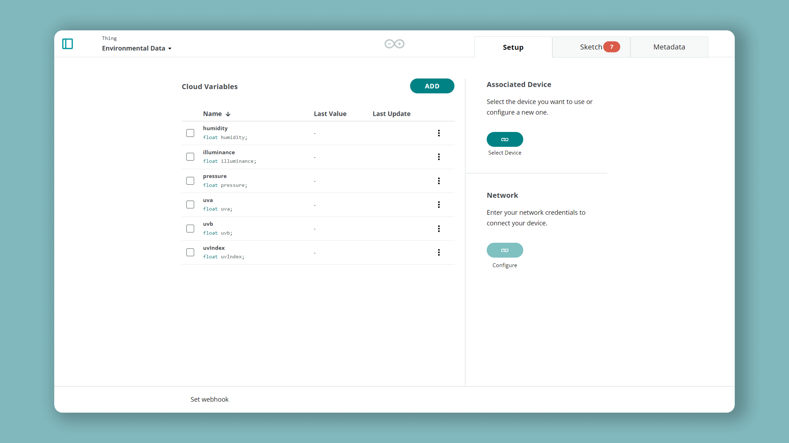
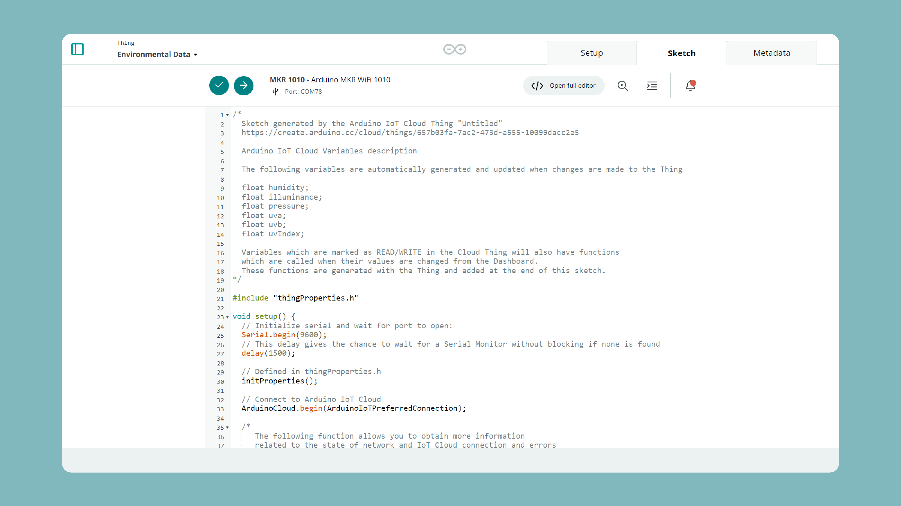
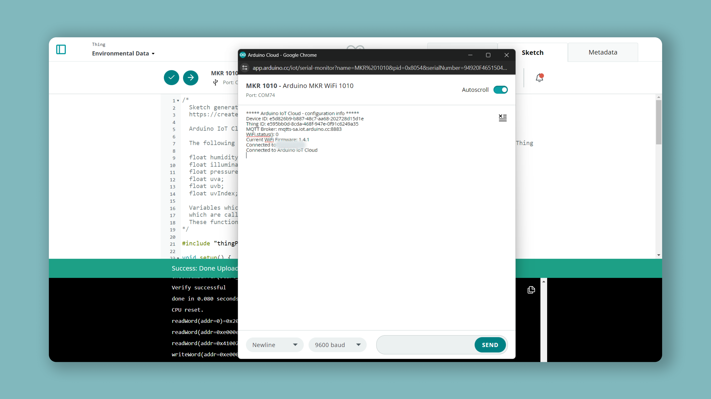
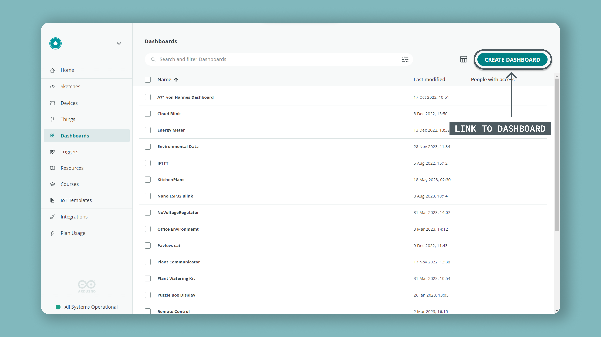

## Introduction

In this tutorial, we will combine the functionality of the [MKR WiFi 1010](https://store.arduino.cc/mkr-wifi-1010) and the [MKR ENV Shield](https://store.arduino.cc/arduino-mkr-env-shield). The shield, mounted on top of the board, will record environmental data, such as temperature, humidity, pressure and illuminance. This data will be synced with the [Arduino Cloud](https://app.arduino.cc/), a service that allows us to remotely control and monitor our devices. 

This means that whenever we read data on the board, it will also be visible in the cloud dashboard, where we can create different ways of visualizing the data.

>**Note:** Newer versions of the MKR ENV Shield does not have the UV sensor component. You can read more about the different versions in [this Arduino Help Center article](https://support.arduino.cc/hc/en-us/articles/360019197540-Different-MKR-ENV-Shield-versions).

## Goals

The goals of this project are:

- Configure the Arduino Cloud.
- Create a program to read the sensors on the MKR ENV shield.
- Read the data live in the Cloud dashboard.

## Hardware & Software needed

- [Arduino Cloud](https://app.arduino.cc/).
- [Arduino MKR WiFi 1010](https://store.arduino.cc/mkr-wifi-1010).
- [Arduino MKR ENV Shield](https://store.arduino.cc/arduino-mkr-env-shield).
- [Arduino_MKRENV](https://www.arduino.cc/en/Reference/ArduinoMKRENV) library.

## Circuit


## Configuring the Cloud

***This tutorial assumes you know the basics of the Arduino Cloud. If you are new check out our [Getting Started Guide](/arduino-cloud/guides/overview).***

- Create a **Thing** with the following variables:

| Name            | Data type | Permission |
| --------------- | --------- | ---------- |
| humidity        | float     | Read Only  |
| illuminance     | float     | Read Only  |
| pressure        | float     | Read Only  |
| **uva**\*       | float     | Read Only  |
| **uvb**\*       | float     | Read Only  |
| **uvIndex**\*   | float     | Read Only  |

>**Note:** the `uva`, `uvb` and `uvIndex` variables will only work with the MKR ENV Shield v1. Newer versions does not have the UV sensor. If you have a newer version, do not add these variables. You can read more about the different versions in the this [Arduino Help Center article](https://support.arduino.cc/hc/en-us/articles/360019197540-Different-MKR-ENV-Shield-versions).

When we have added these, the variable list will look something like this:



- Set up your [MKR WiFi 1010](https://store.arduino.cc/products/arduino-mkr-wifi-1010) and configure your network credentials.


## Creating the program

Now, the final thing needed is the actual program that will run on the MKR 1010 board. We can edit the program directly in the Arduino Cloud, by clicking on the **"Sketch"** tab. This will open up the built-in editor, where we can write the program directly.



For the program, we will need to include the **Arduino_MKRENV** library, which is used to read all the sensors. Below is the code that will allow us to do so, and you can see that the variables in the code is identical to the ones we just created.

Copy and paste the code below, and upload the program to the board, by clicking the upload button at the top of the editor.

>**Note:** Newer versions of the MKR ENV Shield does not have the UV sensor component. You will need to remove the `ENV.readUVA()`, `ENV.readUVB()` and `ENV.readUVIndex()` functions in the program if you have a newer version.

```arduino
#include "thingProperties.h"
#include <Arduino_MKRENV.h>

void setup() {
  // Initialize serial and wait for port to open:
  Serial.begin(9600);
  
  while(!Serial);
  // This delay gives the chance to wait for a Serial Monitor without blocking if none is found
  delay(1500); 

  // Defined in thingProperties.h
  initProperties();

  // Connect to Arduino Cloud
  ArduinoCloud.begin(ArduinoIoTPreferredConnection);
  
  /*
     The following function allows you to obtain more information
     related to the state of network and Cloud connection and errors
     the higher number the more granular information you’ll get.
     The default is 0 (only errors).
     Maximum is 4
 */
  setDebugMessageLevel(2);
  ArduinoCloud.printDebugInfo();
  
    if (!ENV.begin()) {
    Serial.println("Failed to initialize MKR ENV shield!");
    while (1);
  }
  
}

void loop() {
  ArduinoCloud.update();
  // Your code here 
  temperature = ENV.readTemperature();
  humidity    = ENV.readHumidity();
  pressure    = ENV.readPressure();
  illuminance = ENV.readIlluminance();
  uva         = ENV.readUVA(); //comment out if using a newer version of the ENV shield
  uvb         = ENV.readUVB(); //comment out if using a newer version of the ENV shield
  uvIndex     = ENV.readUVIndex(); //comment out if using a newer version of the ENV shield
}
```

Once the code has been uploaded, open the Serial Monitor (tab next to sketch) to initialize the program. If everything went well, it should like the image below:



The most important thing is that the two following commands are printed:

```
Connected to "Network"
Connect to the Arduino Cloud
```
### Over the Air Uploads

Did you know that the Arduino Cloud supports over-the-air uploads? When you've uploaded a sketch to your board once, it will become available for you to upload a new sketch to the board without connecting it to your computer!

***Over the Air uploads require an Entry plan to the Arduino Cloud. Read more about it [here](/arduino-cloud/features/ota-getting-started)***

To use this feature, make sure the board has power. If your board is already connected to the Cloud, you will be able to upload to it over the air. Navigate to the Things sketch tab in the Arduino Cloud interface, and you should see it being discovered just as if it was connected via USB.

## Building a dashboard

Once we have confirmed that the board is connected to the cloud, the last step is to build the dashboard that we can monitor the environmental data in. Click on the **"Dashboards"** tab, which will take you to the dashboards page. Here, we need to click on the **"Build Dashboard"** button.



We will now see an empty dashboard, where we are now going to create something called **widgets**. Widgets are the visual representation of our variables. There's two ways of creating widgets: either we add them one by one, and link them manually, or we can add and link **them all at once**. To save some time, let's do that! 

Simply click on the **"Add"** button, and a dropdown menu will appear. Here we will click on **"Things"**, and select the Thing that appears here. 


In this case, we changed the name to **Environmental Data**, but whatever you name your thing will appear here. By clicking on it, it gives you a list of variables with a checkpoint, and we can simply click **"Create widgets"**


All new widgets will now appear here, and when the board is connected to the cload, it will continue to update these values. 


Congratulations! You can now view your real time data directly in the dashboard.

## Conclusion

In this tutorial, we demonstrated simply how a MKR WiFi 1010, a MKR ENV Shield and the Arduino Cloud is used to create a simple IoT application. This, without having to connect a single wire, or create a difficult program: the cloud takes care of all of that. 

You can now start thinking about how this application might work in real life. There are a lot of different things you can add to it, such as wind sensors (anemometers), rain sensors, CO2 sensors and much more. With some easy connections, you can build anything you want to, connect it to the cloud and view all the data live from anywhere in the world!

### More tutorials

You can find more tutorials in the [Arduino Cloud documentation page](/arduino-cloud/).
