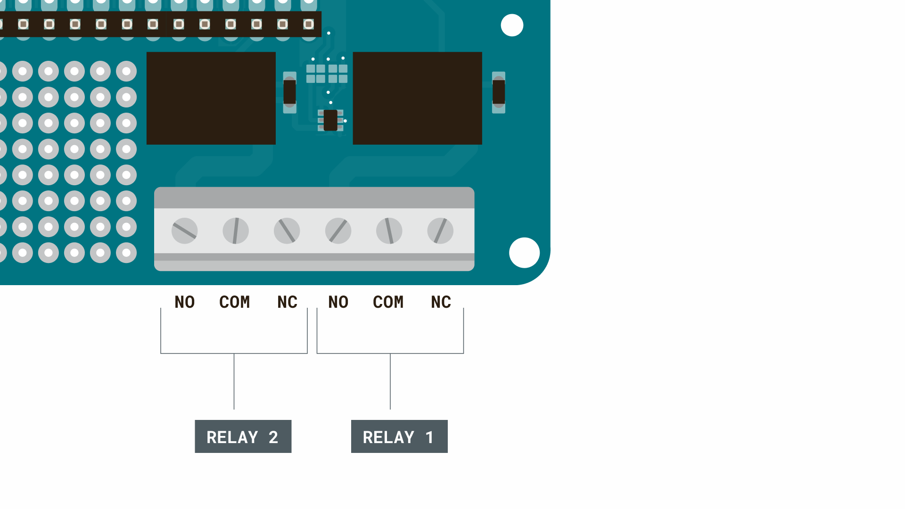

## Introduction

This tutorial demonstrates how to use a MKR WiFi 1010 and a MKR Relay shield with the [Arduino Cloud](https://app.arduino.cc/). We will create a simple configuration that allows us activate the relays on the shield through a dashboard.

***You can easily change the board and shield for another setup, as long as the board is supported by the Arduino Cloud.***

## Goals

The goals of this project are:

- Set up the Arduino Cloud.
- Create a program that controls the relays.
- Create a dashboard to remotely control the relays.
- Use the Arduino Cloud Remote app to control relays.

## Hardware & Software needed

- [Arduino Cloud](https://app.arduino.cc/)
- [Arduino MKR WiFi 1010](https://store.arduino.cc/mkr-wifi-1010)
- [Arduino MKR Relay Shield](https://store.arduino.cc/arduino-mkr-relay-proto-shield)
- Arduino Cloud Remote app (optional). 
  - [Play Store](https://play.google.com/store/apps/details?id=cc.arduino.cloudiot&hl=en&gl=US)
  - [Apple Store](https://apps.apple.com/us/app/arduino-iot-cloud-remote/id1514358431)

## Circuit


## Cloud Setup

To set up the Arduino Cloud, follow the steps below. In there, we will
- create and configure a device,
- create a Thing,
- create cloud variables,
- upload a program to the MKR WiFi 1010 board,
- create a dashboard.

### Device Configuration

To configure a device, navigate to the [app.arduino.cc/devices](https://app.arduino.cc/devices) and click on the **"create a new device"** button. Connect your board to your computer, and make sure you have the [Create Agent](https://create.arduino.cc/getting-started/plugin/welcome) installed. Your board will appear, and the installation takes a couple of minutes.

***Learn more about Devices in the [Devices documentation](/arduino-cloud/hardware/devices).***

### Thing Configuration

1. Create a new Thing, by clicking on the **"Create Thing"** button.
2. Click on the **"Select Device"** in the **"Associated Devices"** section of your Thing. Your previously configured device will appear from the list.
3. In the network section, enter your network credentials.

***Learn more about Things in the [Things documentation](/arduino-cloud/cloud-interface/things).***

### Create Variables

Next step is to create some cloud variables, which we will later sync with our Arduino MKR WiFi 1010 board.

While in Thing configuration, click on **"Add Variable"** which will open a new window. Add the following variables with the specified configurations:

| Variable Name | Data Type | Permission   |
| ------------- | --------- | ------------ |
| `relay_1`     | Boolean   | Read & Write |
| `relay_2`     | Boolean   | Read & Write |

Your Thing interface should now look something like this:


***Need help understanding cloud variables? Check out the [Variables](/arduino-cloud/cloud-interface/variables) section.***

### Create Sketch

After your device & Thing is configured, you can program your board. Navigate to the **"Sketch"** tab inside your Thing, where you can compile & upload your programs. You will find the sketch for this application in the code snippet below:

```arduino
#include "thingProperties.h"

void setup() {
  // Initialize serial and wait for port to open:
  Serial.begin(9600);
  // This delay gives the chance to wait for a Serial Monitor without blocking if none is found
  delay(1500); 
  
  pinMode(1, OUTPUT);
  pinMode(2, OUTPUT);
  
  // Defined in thingProperties.h
  initProperties();

  // Connect to Arduino Cloud
  ArduinoCloud.begin(ArduinoIoTPreferredConnection);
  
  /*
     The following function allows you to obtain more information
     related to the state of network and Cloud connection and errors
     the higher number the more granular information you’ll get.
     The default is 0 (only errors).
     Maximum is 4
 */
  setDebugMessageLevel(2);
  ArduinoCloud.printDebugInfo();
}

void loop() {
  ArduinoCloud.update();
  // Your code here 
  
}

void onRelay1Change() {
  // Do something
  if(relay_1){
    digitalWrite(1, LOW);
  }
  else{
    digitalWrite(1, HIGH);
  }
}

void onRelay2Change() {
  // Do something
    if(relay_2){
    digitalWrite(2, LOW);
  }
  else{
    digitalWrite(2, HIGH);
  }
}
```

Upload this sketch to your board, and your board will start attempting to connect to the Arduino Cloud and sync its data.

You can verify that your device is connecting properly, by checking the Serial Monitor just after connection. Error codes are printed here.

### Create a Dashboard

Once you have your device running a sketch and syncing with the Arduino Cloud, you can create a **dashboard**, a visualization tool for monitoring & interacting with your board.

Navigate to [app.arduino.cc/dashboard](https://app.arduino.cc/dashboard) and create a dashboard. Add two switches (or any other preferred widgets), and link them to each `relay_x` variable that we created earlier. These switches will be directly linked with your Arduino MKR WiFi 1010's variables, and will turn ON/OFF the relays on your board.

You can also access your dashboard via the [Arduino IoT Remote app](/arduino-cloud/iot-remote-app/getting-started).


***For more information on dashboards, available widgets and how to link them to your sketch, visit the [Dashboard & Widgets](/arduino-cloud/cloud-interface/dashboard-widgets) section.***

## High Power Pins

***Note: Working with higher voltage components should be done with extreme caution. Do not alter the circuit while it is connected to a higher power source, and do not connect any high voltage components directly to the Arduino.*** 

We've now set up the cloud to control the relays, but there's nothing connected to the relays. The relays on the MKR Relay Shield are designed to typically handle anything from 5-24V, where you will need to connect an external power supply and a higher power component that can be controlled through the relays.

There are six **high power pins** for both relays on the shield, with three different type of connections: NO, COM and NC. 



We are going to use the **NC** configuration, which means writing a **LOW** signal to the relay will connect the NC pin to COM, which provides power to the component connected. The circuit for this could look like this:


In this circuit, we are using a 24V power supply and a 24V heater. To control them, we need to use the following commands:

To activate the relays:

```
digitalWrite(relay_1, LOW)
```

To de-activate the relays:

```
digitalWrite(relay_1, HIGH)
```

>**Note:** Use extreme caution when creating higher power circuits. Make sure that both the power supply and the component does not exceed 24V, as the relays are not designed to handle higher voltages.

## Use Cases

Relays can be used for practically any project that needs to switch on and off circuits. Typically, relays can be used to control:
- LED strips
- Fans
- Pumps
- Low power heating elements
- Low power fridges

12/24V systems are also frequent in cars, boats & remote setups where a system might be powered by a 12/24V battery.