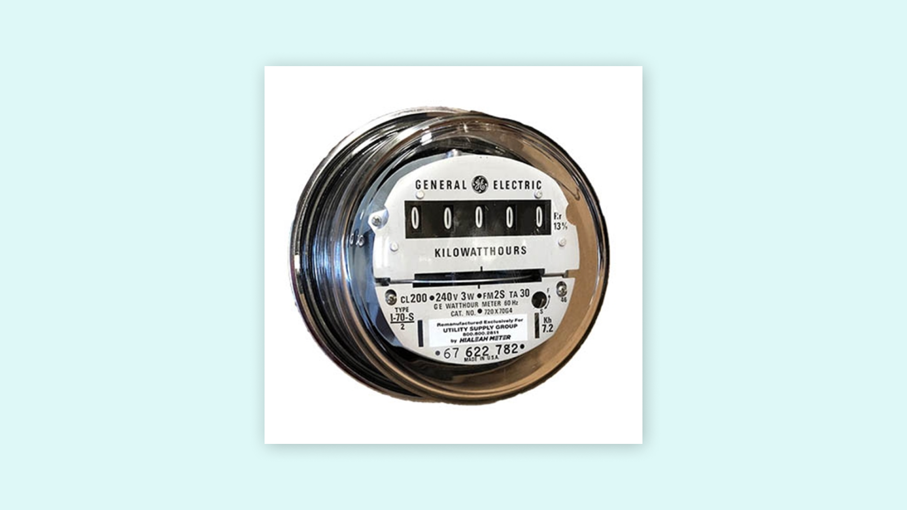
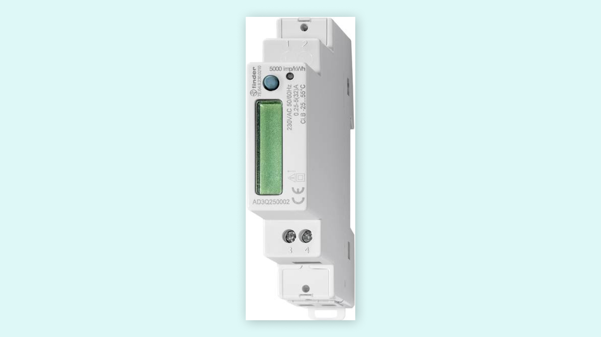
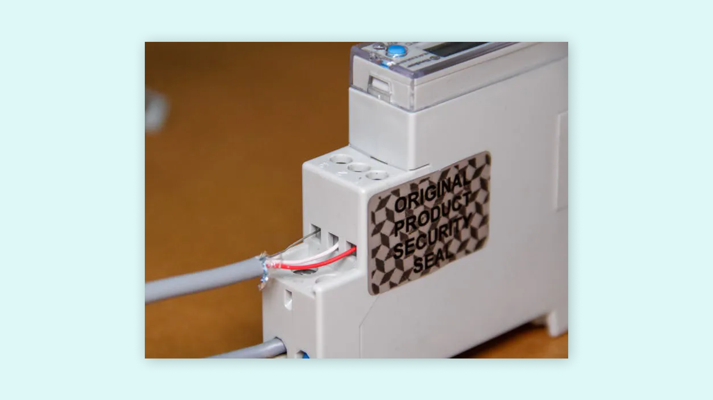
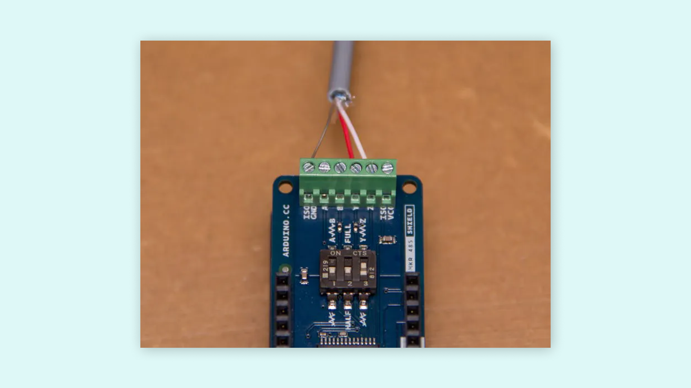
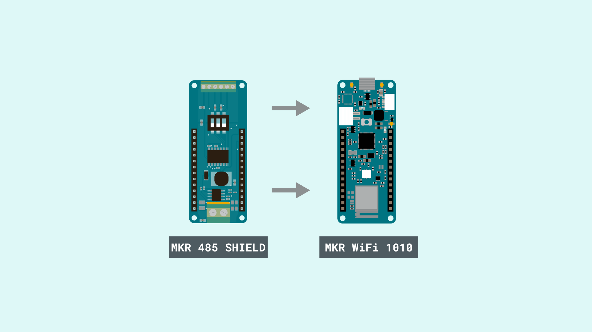
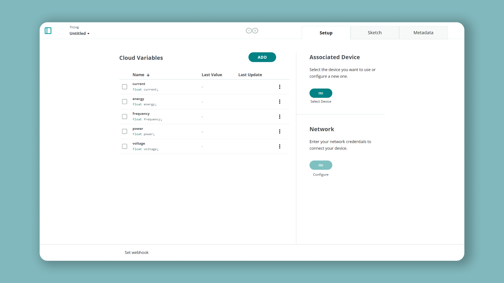

## Introduction

If you really want to make your home smarter, you'll probably want start from your monthly bills (for example, energy, gas, etc...). As some say: **good for the planet, the wallet and the bottom line**. In this tutorial, we are going to learn how to connect a Modbus energy meter to the Arduino Cloud IoT using an Arduino® MKR WiFi 1010 board and an Arduino® MKR 485 Shield. 

***This tutorial assumes you know the basics of the Arduino Cloud. If you are new check out our [Getting Started Guide](/arduino-cloud/guides/overview).***

## Goals

The goals with this tutorial are: 

- Learn how to connect a Modbus energy meter to the [Arduino Cloud IoT](https://create.arduino.cc/iot).
- Learn how to use the [Arduino® MKR 485 Shield](https://store.arduino.cc/arduino-mkr-485-shield) with an [Arduino® MKR WiFi 1010 board](https://store.arduino.cc/arduino-mkr-wifi-1010).

## Hardware and Software Needed

The hardware and software used in this tutorial:

- [Arduino Cloud IoT](https://create.arduino.cc/iot).
- [Arduino Create Agent](https://support.arduino.cc/hc/en-us/articles/360014869820-How-to-install-the-Arduino-Create-Agent).
- [Arduino Modbus library](https://www.arduino.cc/en/ArduinoModbus/ArduinoModbus)
- [Arduino® MKR WiFi 1010](https://store.arduino.cc/arduino-mkr-wifi-1010) board.
- [Arduino® MKR 485 Shield](https://store.arduino.cc/arduino-mkr-485-shield).
- [Finder Type 7E.64 Energy Meter](https://www.findernet.com/en/usa/series/7e-series-energy-meters/type/type-7e64-energy-meter/).
- Twisted single pair shielded cable.
- Micro USB cable.

## Electric Meters a.k.a Energy Meters

**Energy consumption awareness** is a key factor to **reduce energy costs and improve energy efficiency**; we can measure energy consuption using **electric meters**, a.k.a **energy meters**. 

 

Electric meters, also known as energy meters, are **electronic devices that can measure the amount of energy consumed by an electrically powered equipment** such as a refrigerator or a lamp. Energy meters can be use also to measure the energy consuption of houses and buildings. While different types of energy meters exist, in this tutorial we choose a [Finder Type 7E.64 Energy Meter](https://www.findernet.com/en/usa/series/7e-series-energy-meters/type/type-7e64-energy-meter/). This energy meter is designed for DIN rail use and fits perfectly in the main cabinet of our house. Also, this energy meter has a **RS-485 Modbus interface**, this is an industrial communication protocol that can be decoded in Arduino boards using an [Arduino MKR 485 Shield](https://store.arduino.cc/arduino-mkr-485-shield) and the [Arduino Modbus library](https://www.arduino.cc/en/ArduinoModbus/ArduinoModbus).

 

## Setting Up the Finder Type 7E.64 Energy Meter

First, you must install the energy meter in your electrical cabinet. To ensure you are working in a safe environment, turn off the power from the electrical terminal ahead of your system and double check with a multimeter that there is no voltage between the terminals.

***Warning! Check your country regulations about dealing with your house electrical system and be extremely careful because it can be deadly! If you don't know how, call an electrician.***

Place the energy meter inside your cabinet and connect the live and neutral wires from the main breaker to the input of the meter, remember to use the standard color convention (blue for neutral and brown/black/grey for live in EU. The output has to be connected to the rest of the system.

 

Now  it is time make the connection between the energy meter and our MKR WiFi 1010 board! For this, we will use twisted single pair cable with ground. This type of cable is typically used for phone lines, so it can be used to transmit electrical signals over long distances (up to 1.2 km). However, we are going to use a cable long enough to exit the cabinet and place our MKR WiFi 1010 board in an accessible place.



The RS-485 standard names its terminals **A**, **B** and **COM**. A common de-facto standard is the use of **TX+/RX+ (or D+) as an alternative for B** (high for mark i.e. idle) and **TX-/RX- (or D-) as an alternative for A** (low for mark i.e. idle). As shown in the image above, we connected the **red cable to the D+ terminal**, the **white cable to the D- terminal** and the **brown cable to the COM terminal** of the energy meter.  You can read more about the RS-485 standard [here](https://en.wikipedia.org/wiki/RS-485). 

The Finder energy meter supports **half-duplex communication**, this means that **data can move in two directions, but not at the same time**. The MKR 485 Shield supports both half and full-duplex communication (this means data moving in two directions simultaneously), so we need to set up the shield for half-duplex communication. **In the MKR 485 Shield, half-duplex communication uses Y and Z terminals**, **Y terminal is B or D+ and Z terminal y A or D-**, this means that the red cable must be connected to Y terminal and the white cable to Z terminal; the brown cable (COM) must be connected to ISOGND terminal. Also, we need to set the second switch to HALF (2 to OFF) and the third switch to Y-Z (3 to ON): the first switch is not used in half-duplex communication. The third switch is used for setting up the termination, this is a resistor connecting the two data terminals that is used for dampening interferences. The complete shield setup is shown in the image below:



Now, we can connect the MKR 485 Shield and the MKR WiFi 1010 board:



Now that we have finished setting up the hardware, it is time to connect our energy meter to the Arduino Cloud IoT

## Setting Up the Arduino Cloud IoT

- Create a **Thing** with the following variables:

|  **Variable** |          **Type**         | **Permission** |  **Update Policy**  |
|:---------:|:---------------------:|:----------:|:---------------:|
|  voltage  | Floating Point Number |  Read Only |    On change    |
|  current  | Floating Point Number |  Read Only |    On change    |
|   power   | Floating Point Number |  Read Only |    On change    |
| frequency | Floating Point Number |  Read Only |    On change    |
|   energy  | Floating Point Number |  Read Only |    On change    |



- Set up your [MKR WiFi 1010](https://store.arduino.cc/products/arduino-mkr-wifi-1010) and configure your network credentials.

### Creating a Sketch for a "Thing" in the Arduino Cloud IoT

Once we are finished with all the configurations of the "Energy Thing", we can move on to creating the sketch that we are going to upload to our MKR WiFi 1010 board. To do so, we first need to go to the "**Sketch**" tab. But before, let's talk about **Modbus**. 


Modbus is an open source communication protocol designed specifically for industrial sensors and machines. In simple terms, it is a method used for transmitting information over serial lines between electronic devices. Our MKR WiFi 1010 board can talk Modbus using the [Arduino Modbus library](https://www.arduino.cc/en/ArduinoModbus/ArduinoModbus). This library packs all the handlers and makes hooking up any Modbus device to some of the Arduino® boards (like the MKR family boards) really fast and easy. You can read more about Modbus [here](https://en.wikipedia.org/wiki/Modbus). 

***In the datasheet of the energy meter we can find all the Modbus related information we need like its function codes, address of its registers and also their sizes.***

Modbus messages follow a simple structure, for example:

`01 03 04 00 16 00 02 25 C7`

In this structure:

- `0x01` is the **device address**.
- `0x03` is the **function code** that tells the Modbus device if we want to read or write data. In this tutorial, we want to **read data from the holding registers of the energy meter**.
- `0x04` for **byte count**, this specifies how may data items are being returned.
- `00 16` is **register address** from the Modbus device we want to read.
- `00 02` is the **size of the register** in words (every word is 2 bytes long).
- `25 C7` is a **CRC code**. This code is generated from a math function over previous bytes, it ensures that the message has been received correctly.

The Arduino Modbus library handles this structure. For example, for reading the register of the energy meter that holds information about current, we have the following function that uses the `requestFrom()` function of the Arduino Modbus library:

```arduino
/* 
Function readCurrent()
Description: read current value from the Finder energy meter holding registers

Created by Alberto Perro (Officine Innesto)
Modified by José Bagur
*/

float readCurrent() {        
  float ampere = 0.;
  // Send reading request over RS485      
    if (!ModbusRTUClient.requestFrom(0x01, HOLDING_REGISTERS, 0x0016, 2)) {
      // Error handling   
      Serial.print("- Failed to read the current! ");    
      Serial.println(ModbusRTUClient.lastError());         
    } else {        
      // Response handler 
      uint16_t word1 = ModbusRTUClient.read();  // Read word1 from buffer
      uint16_t word2 = ModbusRTUClient.read();  // Read word2 from buffer
      int32_t milliamp = word1 << 16 | word2;   // Join word1 and word2 to retrieve current value in milliampere
      ampere = milliamp/1000.0;                 // Convert current to ampere
    }        
return ampere;
}
```

In the `else` we have the response handler. Since this register is two words long, we have to join them with binary math. We read the words from the buffer and store them in an unsigned 16-bit integer (2 bytes or a word); then we join them in a signed 32-bit integer by bitshifting the first word to the left and apply an OR over the second word. The result is the current measurement in milliampere (in ampere after dividing it by 1000). This process can adapted to everything else we want to read from the energy meter: voltage, power, frequency and energy.

The complete sketch we are going to upload to out MKR WiFi 1010 board can be found below, notice that the Arduino Cloud IoT generated automatically the code that is dedicated to handling Internet connectivity:

```arduino
/* -----------------------------------------
 * Finder Energy Meter to Arduino Cloud IoT
 * -----------------------------------------
 * This sketch provides a full bridge between the Finder energy meter and the 
 * Arduino Cloud IoT. This sketch was developed to monitor electricity costs 
 * and usage in Casa Jasmina.
 *
 * Created by Alberto Perro (Officine Innesto)
 * Modified by José Bagur
*/
 
#include <ArduinoRS485.h>
#include <ArduinoModbus.h>

#undef ON
#undef OFF

#include "thingProperties.h"

unsigned long rate = 60000; // Default refresh rate in ms
unsigned long lastMillis = 0;

void setup() {
  // Initialize serial port at 9600 bauds and wait for it to open
  Serial.begin(9600);
  delay(1500); 

  // Defined in thingProperties.h
  initProperties();

  // Connect to Arduino Cloud IoT
  ArduinoCloud.begin(ArduinoIoTPreferredConnection);
  
  /*
     The following function allows you to obtain more information
     related to the state of network and Cloud IoT connection and errors
     The higher number the more granular information you’ll get
     The default value is 0 (only errors)
     Maximum is 4
 */
  setDebugMessageLevel(2);
  ArduinoCloud.printDebugInfo();
  
  // Start Modbus RTU client
  if (!ModbusRTUClient.begin(9600)) {
    Serial.println("- Failed to start Modbus RTU Client!");
    while (1);
  }
}

void loop() {
  // Update "Energy Thing" variables connected to Arduino Cloud IoT
  ArduinoCloud.update();
  
  // Update energy meter data and show it via the Serial Monitor
  if (millis() - lastMillis > rate) {
    lastMillis = millis();
  
    voltage = readVoltage();
    delay(100);
    current = readCurrent();
    delay(100);
    power = readPower();
    delay(100);
    frequency = readFreq();
    delay(100);
    energy = readEnergy();
  
    Serial.print("- " + String(voltage, 3) + "V " + String(current, 3) + "A " + String(power, 3) + "W ");
    Serial.println(String(frequency, 3) + "Hz " + String(power, 3) + "kWh");
    delay(100);
  }   
}

/* Functions to read Finder energy meter holding registers
 * For more information: https://gfinder.findernet.com/public/attachments/7E/EN/PRT_Modbus_7E_64_68_78_86EN.pdf
 */

/* 
Function readVoltage()
Description: read voltage value from the Finder energy meter holding registers
*/ 
float readVoltage() {
  float volt = 0.;
  // Send reading request over RS485 
  if (!ModbusRTUClient.requestFrom(0x01, HOLDING_REGISTERS, 0x000C, 2)) {
    // Error handling
    Serial.print("- Failed to read the voltage! ");
    Serial.println(ModbusRTUClient.lastError()); 
  } else {
    // Response handler 
    uint16_t word1 = ModbusRTUClient.read();  // Read word1 from buffer
    uint16_t word2 = ModbusRTUClient.read();  // Read word2 from buffer
    uint32_t millivolt = word1 << 16 | word2; // Join word1 and word2 to retrieve voltage value in millivolts
    volt = millivolt/1000.0;                  // Convert to volts
  }

  return volt;
}

/* 
Function readCurrent()
Description: read current value from the Finder energy meter holding registers
*/
float readCurrent() {        
  float ampere = 0.;
  // Send reading request over RS485      
  if (!ModbusRTUClient.requestFrom(0x01, HOLDING_REGISTERS, 0x0016, 2)) {
    // Error handling   
    Serial.print("- Failed to read the current! ");    
    Serial.println(ModbusRTUClient.lastError());         
  } else {        
    // Response handler 
    uint16_t word1 = ModbusRTUClient.read();  // Read word1 from buffer
    uint16_t word2 = ModbusRTUClient.read();  // Read word2 from buffer
    int32_t milliamp = word1 << 16 | word2;   // Join word1 and word2 to retrieve current value in milliampere
    ampere = milliamp/1000.0;                 // Convert current to ampere
  }

  return ampere;
}

/* 
Function readPower()
Description: read power value from the Finder energy meter holding registers
*/
double readPower() {
  double watt = 0.;
  // Send reading request over RS485
  if (!ModbusRTUClient.requestFrom(0x01, HOLDING_REGISTERS, 0x0025, 3)) {
    // Error handling   
    Serial.print("- Failed to read power! ");
    Serial.println(ModbusRTUClient.lastError());
  } else {
    // Response handler 
    uint16_t word1 = ModbusRTUClient.read();  // Read word1 from buffer
    uint16_t word2 = ModbusRTUClient.read();  // Read word2 from buffer
    uint16_t word3 = ModbusRTUClient.read();  // Read word3 from buffer

    uint64_t milliwatt;

    // Join word1 and word2 to retrieve power value in milliwatt
    if (word1 >> 7 == 0) {
      milliwatt = word1 << 32 | word2 << 16 | word3;
    } else {
      word1 &= 0b01111111;
      milliwatt = 0b1 << 48 | word1 << 32 | word2 << 16 | word3;
    }

    watt = milliwatt/1000.;                   // Convert power to watts
  }

  return watt;
}

/* 
Function readFreq()
Description: read frequency value from the Finder energy meter holding registers
*/
float readFreq() {
  float freq = 0.;
  // Send reading request over RS485
  if (!ModbusRTUClient.requestFrom(0x01, HOLDING_REGISTERS, 0x0040, 2)) {
    // Error handling   
    Serial.print("- Failed to read frequency! ");
    Serial.println(ModbusRTUClient.lastError());
  } else {
    // Response handler 
    uint16_t word1 = ModbusRTUClient.read();  // Read word1 from buffer
    freq = word1/1000.0;                      // Retrieve frequency value
  }
  return freq;
}

/* 
Function readEnergy()
Description: read energy value from the Finder energy meter holding registers
*/
double readEnergy() {
  double kwh = 0.;
  // Send reading request over RS485
  if (!ModbusRTUClient.requestFrom(0x01, HOLDING_REGISTERS, 0x0109, 3)) {
    // Error handling   
    Serial.print("- Failed to read energy! ");
    Serial.println(ModbusRTUClient.lastError());
  } else {
    // Response handler 
    uint16_t word1 = ModbusRTUClient.read();            // Read word1 from buffer
    uint16_t word2 = ModbusRTUClient.read();            // Read word2 from buffer
    uint16_t word3 = ModbusRTUClient.read();            // Read word3 from buffer
    uint64_t dwh = word1 << 32 | word2 << 16 | word3;   // Join word1 and word2 to retrieve energy value in dwh
    kwh = dwh/10000.0;                                  // Convert energy to kwh
  }
  return kwh;
}
```
### Over the Air Uploads

Did you know that the Arduino Cloud supports over the air uploads? When you've uploaded a sketch to your board once, it will become available for you to upload a new sketch to the board without connecting it to your computer!

***Over the Air uploads require an Entry plan to the Arduino Cloud***


To use this feature, make sure the board has power. If your board is already connected to the Cloud, you will be able to upload to it over the air. Navigate to the Things sketch tab in the Arduino Cloud interface, and you should see it being discovered just as if it was connected via USB.


### Creating a Dashboard in the Arduino Cloud IoT


After our code has been successfully uploaded to our board, we we will need to create a **dashboard** for **visualizing** the energy meter data.

Create a dashboard with the following widgets:

|  **Widget** |          **Linked Variable**         |
|:---------:|:---------------------:|
| Value  |  voltage  |
| Value  |  current  |
| Value  |   power   |
| Value  | frequency |
| Value  |   energy  |

Your dashboard should look something like this:


That's it! You have now a Modbus energy meter connected to the Arduino Cloud IoT!

## Troubleshoot

Sometimes errors occur, if the code is not working or data is not in the to the Arduino Cloud IoT there are some common issues we can troubleshoot:

- Missing a bracket or a semicolon.
- Accidental interruption of cable connection.
- Wrong network credentials. 
- No variable linked to a widget. 

## Conclusion

In this tutorial, we learned how to connect a Modbus energy meter to the Arduino Cloud IoT using a MKR WiFi 1010 board and a MKR 485 Shield. We also learned how to visualize the energy meter data in a dashboard using widgets. More tutorials? You can find them in the [Arduino Cloud IoT documentation page](/cloud/iot-cloud).