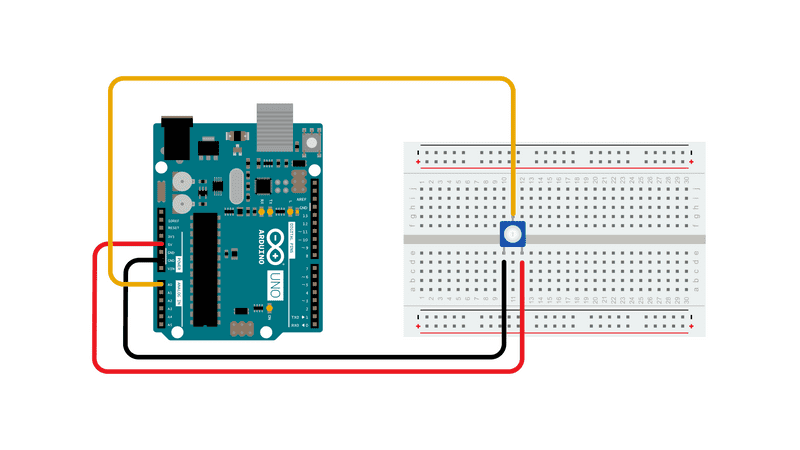
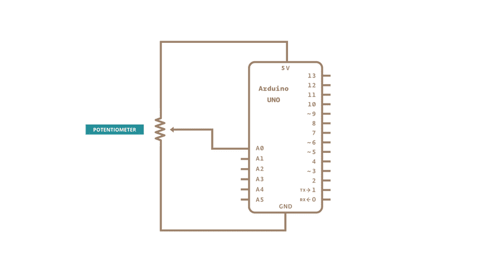

This example shows you how to read analog input from the physical world using a potentiometer. A **potentiometer** is a simple mechanical device that provides a varying amount of resistance when its shaft is turned. By passing voltage through a potentiometer and into an analog input on your board, it is possible to measure the amount of resistance produced by a potentiometer (or *pot* for short) as an analog value. In this example you will monitor the state of your potentiometer after establishing serial communication between your Arduino and your computer running the Arduino Software (IDE).

### Hardware Required

- [Arduino Board](https://store.arduino.cc/collections/boards-modules)

- 10k ohm Potentiometer

### Circuit

Connect the three wires from the potentiometer to your board. The first goes from one of the outer pins of the potentiometer to ground. The second goes from the other outer pin of the potentiometer to 5 volts. The third goes from the middle pin of the potentiometer to the analog pin A0.

By turning the shaft of the potentiometer, you change the amount of resistance on either side of the wiper, which is connected to the center pin of the potentiometer. This changes the voltage at the center pin. When the resistance between the center and the side connected to 5 volts is close to zero (and the resistance on the other side is close to 10k ohm), the voltage at the center pin nears 5 volts.  When the resistances are reversed, the voltage at the center pin nears 0 volts, or ground. This voltage is the *analog voltage* that you're reading as an input.

The Arduino boards have a circuit inside called an *analog-to-digital converter or ADC* that reads this changing voltage and converts it to a number between 0 and 1023.  When the shaft is turned all the way in one direction, there are 0 volts going to the pin, and the input value is 0. When the shaft is turned all the way in the opposite direction, there are 5 volts going to the pin and the input value is 1023. In between, [analogRead](https://www.arduino.cc/reference/en/language/functions/analog-io/analogread/)() returns a number between 0 and 1023 that is proportional to the amount of voltage being applied to the pin.

### Schematic

### Code

In the sketch below, the only thing that you do in the setup function is to begin serial communications, at 9600 bits of data per second, between your board and your computer with the command:

`Serial.begin(9600);`

Next, in the main loop of your code, you need to establish a variable to store the resistance value (which will be between 0 and 1023, perfect for an [`int`datatype](https://www.arduino.cc/reference/en/language/variables/data-types/int/)) coming in from your potentiometer:

`int sensorValue = analogRead(A0);`

Finally, you need to print this information to your serial monitor window. You can do this with the command [Serial.println](https://www.arduino.cc/en/Serial/Println)()  in your last line of code:

`Serial.println(sensorValue);`

Now, when you open your Serial Monitor in the Arduino Software (IDE) (by clicking the icon that looks like a lens, on the right,  in the green top bar or using the keyboard shortcut Ctrl+Shift+M), you should see a steady stream of numbers ranging from 0-1023, correlating to the position of the pot. As you turn your potentiometer, these numbers will respond almost instantly.

<iframe src='https://create.arduino.cc/example/builtin/01.Basics%5CAnalogReadSerial/AnalogReadSerial/preview?embed&snippet' style='height:510px;width:100%;margin:10px 0' frameborder='0'></iframe>

### Learn more

You can find more basic tutorials in the [built-in examples](/built-in-examples) section.

You can also explore the [language reference](https://www.arduino.cc/reference/en/), a detailed collection of the Arduino programming language.