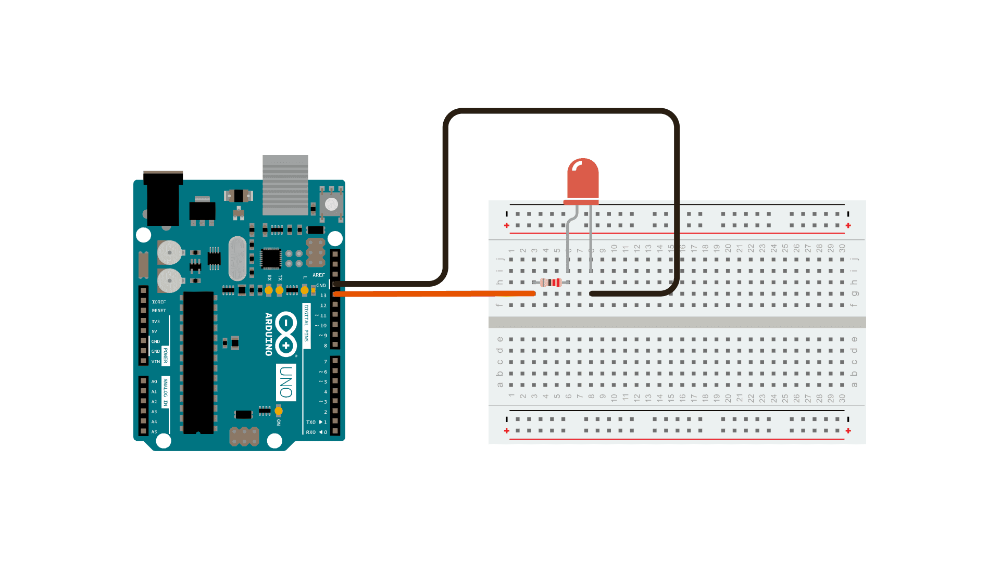
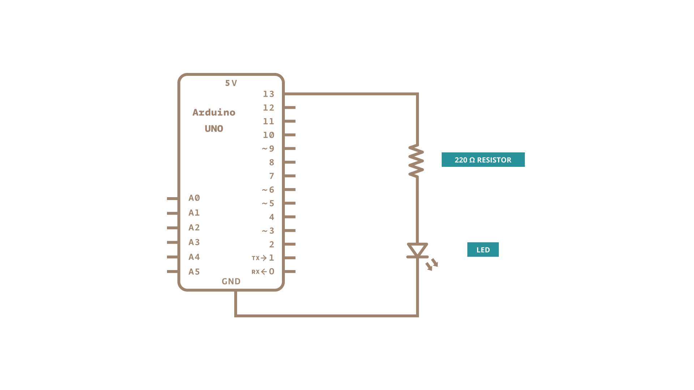

This example shows the simplest thing you can do with an Arduino to see physical output: it blinks the on-board LED.

### Hardware Required

- [Arduino Board](https://store.arduino.cc/collections/boards-modules)

optional

- LED

- 220 ohm resistor

### Circuit

This example uses the built-in LED that most Arduino boards have. This LED is connected to a digital pin and its number may vary from board type to board type. To make your life easier, we have a constant that is specified in every board descriptor file. This constant is *LED_BUILTIN* and allows you to control the built-in LED easily. Here is the correspondence between the constant and the digital pin.

- D13 - 101

- D13 - Due

- D1  - Gemma

- D13 - Intel Edison

- D13 - Intel Galileo Gen2

- D13 - Leonardo and Micro

- D13 - LilyPad
- D13 - LilyPad USB

- D13 - MEGA2560
- D13 - Mini

- D6  - MKR1000
- D13 - Nano

- D13 - Pro

- D13 - Pro Mini

- D13 - UNO

- D13 - Yún

- D13 - Zero

If you want to light an external LED with this sketch, you need to build this circuit, where you connect one end of the resistor to the digital pin correspondent to the *LED_BUILTIN* constant.  Connect the long leg of the LED (the positive leg, called the anode) to the other end of the resistor. Connect the short leg of the LED (the negative leg, called the cathode) to the GND. In the diagram below we show an UNO board that has D13 as the LED_BUILTIN value.

The resistor is essential for safe operation as it limits the current flowing through the LED, preventing damage to both the LED and the Arduino's output pin. You can choose the resistor value based on the desired current using Ohm's Law (V = IR) where V is the voltage of your board (5V or 3.3V) minus the forward voltage for the LED you are using (typical for red would be 1.8 to 2.2 volts). In this case, using a 220-ohm resistor with an Arduino UNO R3 (a 5V board) limits the current to a safe level for both the LED and the Arduino pin. Adjusting the resistor value allows you to control the LED's brightness while ensuring safe operation. For 5V boards you can expect the LED to be visible to a resistor value of up to 1K Ohm.

### Schematic

### Code

After you build the circuit plug your Arduino board into your computer, start the Arduino Software (IDE) and enter the code below.  You may also load it from the menu File/Examples/01.Basics/Blink .
The first thing you do is to initialize LED_BUILTIN pin as an output pin with the line

`pinMode(LED_BUILTIN, OUTPUT);`

In the main loop, you turn the LED on with the line:

`digitalWrite(LED_BUILTIN, HIGH);`

This supplies 5 volts to the LED anode.  That creates a voltage difference across the pins of the LED, and lights it up. Then you turn it off with the line:

`digitalWrite(LED_BUILTIN, LOW);`

That takes the LED_BUILTIN pin back to 0 volts, and turns the LED off. In between the on and the off, you want enough time for a person to see the change, so the `delay()` commands tell the board to do nothing for 1000 milliseconds, or one second. When you use the `delay()` command, nothing else happens for that amount of time. Once you've understood the basic examples, check out the [BlinkWithoutDelay](/built-in-examples/digital/BlinkWithoutDelay) example to learn how to create a delay while doing other things.

Once you've understood this example, check out the [DigitalReadSerial](/built-in-examples/basics/DigitalReadSerial) example to learn how read a switch connected to the board.

<iframe class='arduino-sketch-iframe' src='https://create.arduino.cc/example/builtin/01.Basics%5CBlink/Blink/preview?embed&snippet' style='height:752px;width:100%;margin:10px 0' frameborder='0'></iframe>

**See Also**

### Learn more

You can find more basic tutorials in the [built-in examples](/built-in-examples) section.

You can also explore the [language reference](https://www.arduino.cc/reference/en/), a detailed collection of the Arduino programming language.

*Last revision 2015/07/28 by SM*
