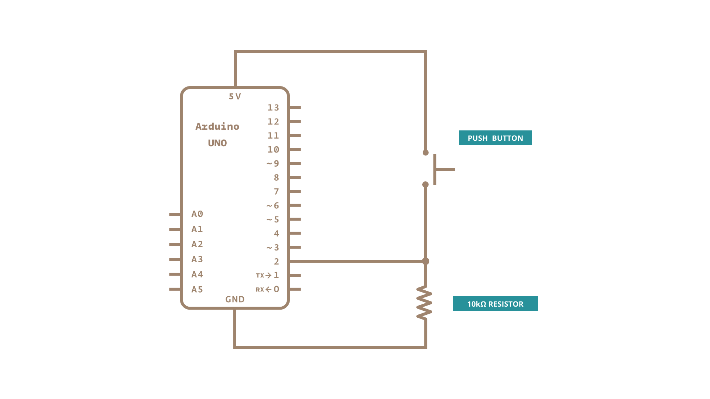

This example shows you how to monitor the state of a switch by establishing [serial communication](https://www.arduino.cc/en/Reference/Serial) between your Arduino and your computer over USB.

### Hardware Required

- [Arduino Board](https://store.arduino.cc/collections/boards-modules)

- A momentary switch, button, or toggle switch

- 10k ohm resistor

- hook-up wires

- breadboard

### Circuit

Connect three wires to the board. The first two, red and black, connect to the two long vertical rows on the side of the breadboard to provide access to the 5 volt supply and ground. The third wire goes from digital pin 2 to one leg of the pushbutton. That same leg of the button connects through a pull-down resistor (here 10k ohm) to ground. The other leg of the button connects to the 5 volt supply.

Pushbuttons or switches connect two points in a circuit when you press them. When the pushbutton is open (unpressed) there is no connection between the two legs of the pushbutton, so the pin is connected to ground (through the pull-down resistor) and reads as LOW, or 0. When the button is closed (pressed), it makes a connection between its two legs, connecting the pin to 5 volts, so that the pin reads as HIGH, or 1.

If you disconnect the digital i/o pin from everything, its reading may change erratically. This is because the input is "floating" - that is, it doesn't have a solid connection to voltage or ground, and it will randomly return either HIGH or LOW. That's why you need a pull-down resistor in the circuit.

### Schematic

### Code

In the program below, the very first thing that you do will in the setup function is to begin serial communications, at 9600 bits of data per second, between your board and your computer with the line:

`Serial.begin(9600);`

Next, initialize digital pin 2, the pin that will read the output from your button, as an input:

`pinMode(2,INPUT);`

Now that your setup has been completed, move into the main loop of your code. When your button is pressed, 5 volts will freely flow through your circuit, and when it is not pressed, the input pin will be connected to ground through the 10k ohm resistor. This is a digital input, meaning that the switch can only be in either an on state (seen by your Arduino as a "1", or HIGH)  or an off state (seen by your Arduino as a "0", or LOW), with nothing in between.

The first thing you need to do in the main loop of your program is to establish a variable to hold the information coming in from your switch. Since the information coming in from the switch will be either a "1" or a "0",  you can use an [`int`datatype](https://www.arduino.cc/reference/en/language/variables/data-types/int/). Call this variable `sensorValue`, and set it to equal whatever is being read on digital pin 2. You can accomplish all this with just one line of code:

`int sensorValue = digitalRead(2);`

Once the board has read the input, make it print this information back to the computer as a decimal value. You can do this with the command [Serial.println](https://www.arduino.cc/en/Serial/Println)()  in our last line of code:

`Serial.println(sensorValue);`

Now, when you open your Serial Monitor in the Arduino Software (IDE), you will see a stream of "0"s if your switch is open, or "1"s if your switch is closed.

<iframe src='https://create.arduino.cc/example/builtin/01.Basics%5CDigitalReadSerial/DigitalReadSerial/preview?embed&snippet' style='height:510px;width:100%;margin:10px 0' frameborder='0'></iframe>

### Learn more

You can find more basic tutorials in the [built-in examples](/built-in-examples) section.

You can also explore the [language reference](https://www.arduino.cc/reference/en/), a detailed collection of the Arduino programming language.

*Last revision 2015/07/29 by SM*
