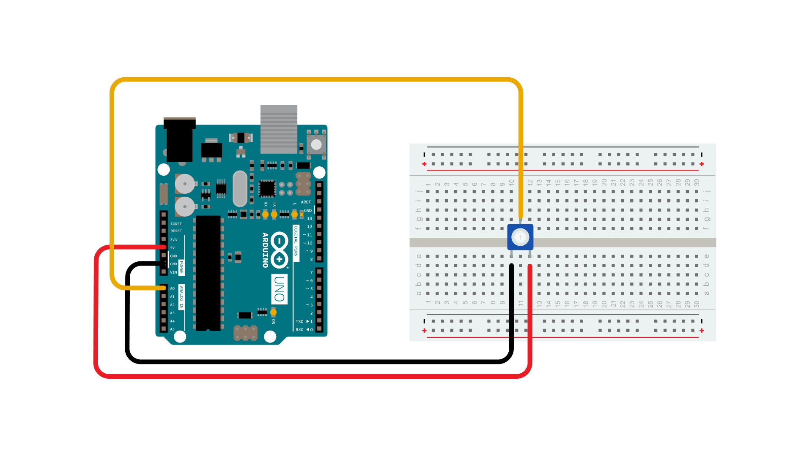

This example shows you how to read an analog input on analog pin 0, convert the values from analogRead() into voltage, and print it out to the serial monitor of the Arduino Software (IDE).

### Hardware Required

- [Arduino Board](https://store.arduino.cc/collections/boards-modules)

- 10k ohm potentiometer

### Circuit

Connect the three wires from the potentiometer to your board. The first goes to ground from one of the outer pins of the potentiometer. The second goes to 5 volts from the other outer pin of the potentiometer. The third goes from the middle pin of the potentiometer to analog input 0.

By turning the shaft of the potentiometer, you change the amount of resistance on either side of the wiper which is connected to the center pin of the potentiometer. This changes the voltage at the center pin. When the resistance between the center and the side connected to 5 volts is close to zero (and the resistance on the other side is close to 10 kilohms), the voltage at the center pin nears 5 volts.  When the resistances are reversed, the voltage at the center pin nears 0 volts, or ground. This voltage is the **analog voltage** that you're reading as an input.

The microcontroller of the board has a circuit inside called an *analog-to-digital converter* or *ADC* that reads this changing voltage and converts it to a number between 0 and 1023 (on boards with a 10 bit resolution ADC).  When the shaft is turned all the way in one direction, there are 0 volts going to the pin, and the input value is 0. When the shaft is turned all the way in the opposite direction, there are 5 volts going to the pin and the input value is 1023. In between, [analogRead](https://www.arduino.cc/reference/en/language/functions/analog-io/analogread/)() returns a number between 0 and 1023 that is proportional to the amount of voltage being applied to the pin.

### Schematic

### Code

In the program below, the very first thing you'll do will be in the setup function, to begin serial communication at 9600 bits of data per second, between your board and your computer with the line:

`Serial.begin(9600);`

Next, in the main loop of your code, you need to establish a variable to store the resistance value (which will be between 0 and 1023, perfect for an [`int`datatype](https://www.arduino.cc/reference/en/language/variables/data-types/int/)) coming in from your potentiometer:

`int sensorValue = analogRead(A0);`

To change the values from 0-1023 to a range that corresponds to the voltage the pin is reading, you'll need to create another variable, a [`float`](https://www.arduino.cc/reference/en/language/variables/data-types/float/), and do a little math. To scale the numbers between 0.0 and 5.0, divide 5.0 by 1023.0 and multiply that by **sensorValue** :

`float voltage= sensorValue * (5.0 / 1023.0);`

***Please note that this example was initially conceived for 5V boards. If you are using a 3.3V board, you should change '5.0' to '3.3' in the code above to ensure it correctly aligns with your hardware. Similarly, if you are using a board with a default ADC resolution different from 10 bits, you must change the value '1023' to correspond to the number of discrete levels supported by your hardware.***

Finally, you need to print this information to your serial monitor. You can do this with the command [Serial.println](https://www.arduino.cc/en/Serial/Println)()  in your last line of code:

`Serial.println(voltage)`

Now, when you open your Serial Monitor in the Arduino IDE (by clicking on the icon on the right side of the top green bar or pressing Ctrl+Shift+M), you should see a steady stream of numbers ranging from 0.0 - 5.0. As you turn the pot, the values will change, corresponding to the voltage coming into pin A0.

<iframe src='https://create.arduino.cc/example/builtin/01.Basics%5CReadAnalogVoltage/ReadAnalogVoltage/preview?embed&snippet' style='height:510px;width:100%;margin:10px 0' frameborder='0'></iframe>

### Learn more

You can find more basic tutorials in the [built-in examples](/built-in-examples) section.

You can also explore the [language reference](https://www.arduino.cc/reference/en/), a detailed collection of the Arduino programming language.

*Last revision Nov. 20, 2022 by Killaship*
