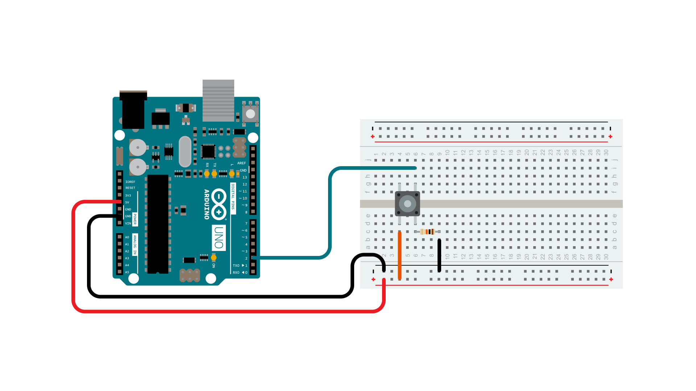
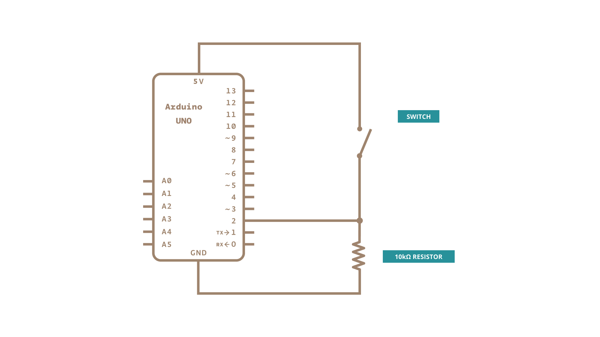

Pushbuttons often generate spurious open/close transitions when pressed, due to mechanical and physical issues: these transitions may be read as multiple presses in a very short time fooling the program. This example demonstrates how to **debounce** an input, which means checking twice in a short period of time to make sure the pushbutton is definitely pressed. Without debouncing, pressing the button once may cause unpredictable results. This sketch uses the `millis()` function to keep track of the time passed since the button was pressed.

### Hardware Required

- [Arduino Board](https://store.arduino.cc/collections/boards-modules)

- momentary button or switch

- 10k ohm resistor

- hook-up wires

- breadboard

### Circuit

### Schematic

###  Code

The sketch below is based on **Limor Fried's version of debounce**, but the logic is inverted from her example. In her example, the switch returns LOW when closed, and HIGH when open.  Here, the switch returns HIGH when pressed and LOW when not pressed.

<iframe src='https://create.arduino.cc/example/builtin/02.Digital%5CDebounce/Debounce/preview?embed&snippet' style='height:510px;width:100%;margin:10px 0' frameborder='0'></iframe>

### Learn more

You can find more basic tutorials in the [built-in examples](/built-in-examples) section.

You can also explore the [language reference](https://www.arduino.cc/reference/en/), a detailed collection of the Arduino programming language.

*Last revision 2015/07/29 by SM*