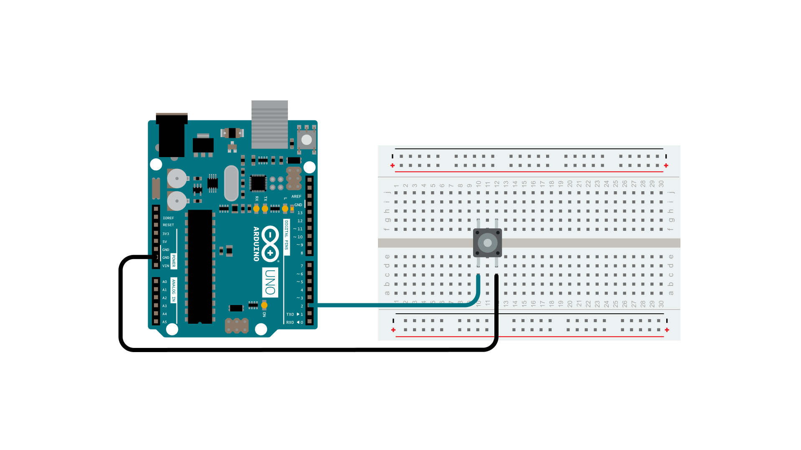
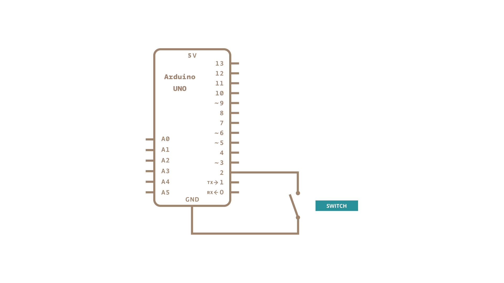

### Input Pullup Serial

This example demonstrates the use of INPUT_PULLUP with pinMode(). It monitors the state of a switch by establishing [serial communication](https://www.arduino.cc/en/Reference/Serial) between your Arduino and your computer over USB.

Additionally, when the input is HIGH, the onboard LED attached to pin 13 will turn on; when LOW, the LED will turn off.

### Hardware Required

- [Arduino Board](https://store.arduino.cc/collections/boards-modules)

- A momentary switch, button, or toggle switch

- breadboard

- hook-up wire

### Circuit

Connect two wires to the Arduino board. The black wire connects ground to one leg of the pushbutton. The second wire goes from digital pin 2 to the other leg of the pushbutton.

Pushbuttons or switches connect two points in a circuit when you press them. When the pushbutton is open (unpressed) there is no connection between the two legs of the pushbutton. Because the internal pull-up on pin 2 is active and connected to 5V, we read HIGH when the button is open. When the button is closed, the Arduino reads LOW because a connection to ground is completed.

### Schematic

### Code

In the program below, the very first thing that you do will in the setup function is to begin serial communications, at 9600 bits of data per second, between your Arduino and your computer with the line:

`Serial.begin(9600);`

Next, initialize digital pin 2  as an input with the internal pull-up resistor enabled:

`pinMode(2,INPUT_PULLUP);`

The following line make pin 13, with the onboard LED, an output :

`pinMode(13, OUTPUT);`

Now that your setup has been completed, move into the main loop of your code. When your button is not pressed, the internal pull-up resistor connects to 5 volts. This causes the Arduino to report "1" or HIGH. When the button is pressed, the Arduino pin is pulled to ground, causing the Arduino report a "0", or LOW.

The first thing you need to do in the main loop of your program is to establish a variable to hold the information coming in from your switch. Since the information coming in from the switch will be either a "1" or a "0",  you can use an [`int`datatype](https://www.arduino.cc/reference/en/language/variables/data-types/int/). Call this variable `sensorValue`, and set it to equal whatever is being read on digital pin 2. You can accomplish all this with just one line of code:

`int sensorValue = digitalRead(2);`

Once the Arduino has read the input, make it print this information back to the computer as a decimal (`DEC`) value. You can do this with the command [Serial.println](https://www.arduino.cc/en/Serial/Println)()  in our last line of code:

`Serial.println(sensorValue, DEC);`

Now, when you open your Serial Monitor in the Arduino environment, you will see a stream of "0"s if your switch is closed, or "1"s if your switch is open.

The LED on pin 13 will illuminate when the switch is HIGH, and turn off when LOW.

<iframe src='https://create.arduino.cc/example/builtin/02.Digital%5CDigitalInputPullup/DigitalInputPullup/preview?embed&snippet' style='height:510px;width:100%;margin:10px 0' frameborder='0'></iframe>

### Learn more

You can find more basic tutorials in the [built-in examples](/built-in-examples) section.

You can also explore the [language reference](https://www.arduino.cc/reference/en/), a detailed collection of the Arduino programming language.