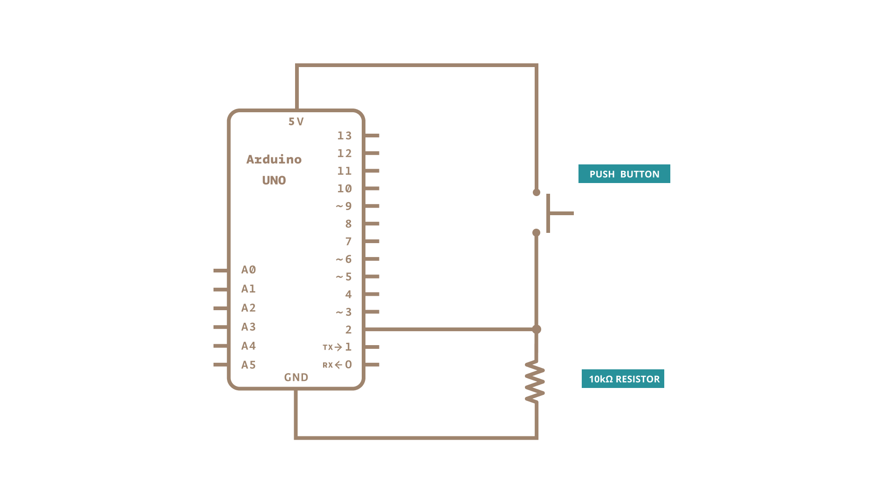

Once you've got a [pushbutton](/built-in-examples/digital/Button) working, you often want to do some action based on how many times the button is pushed. To do this, you need to know when the button changes state from off to on, and count how many times this change of state happens.  This is called **state change detection** or **edge detection.** In this tutorial we learn how to check the state change, we send a message to the Serial Monitor with the relevant information and we count four state changes to turn on and off an LED.

### Hardware Required

- [Arduino Board](https://store.arduino.cc/collections/boards-modules)

- momentary button or switch

- 10k ohm resistor

- hook-up wires

- breadboard

### Circuit

Connect three wires to the board.  The first goes from one leg of the pushbutton through a pull-down resistor (here 10k ohm) to ground.  The second goes from the corresponding leg of the pushbutton to the 5 volt supply.  The third connects to a digital I/O pin (here pin 2) which reads the button's state.

When the pushbutton is open (unpressed) there is no connection between the two legs of the pushbutton, so the pin is connected to ground (through the pull-down resistor) and we read a LOW.  When the button is closed (pressed), it makes a connection between its two legs, connecting the pin to voltage, so that we read a HIGH.  (The pin is still connected to ground, but the resistor resists the flow of current, so the path of least resistance is to +5V.)

If you disconnect the digital I/O pin from everything, the LED may blink erratically.  This is because the input is "floating" - that is, not connected to either voltage or ground. It will more or less randomly return either HIGH or LOW.  That's why you need a pull-down resistor in the circuit.

### Schematic

### Code

The sketch below continually reads the button's state.  It then compares the button's state to its state the last time through the main loop.  If the current button state is different from the last button state and the current button state is high, then the button changed from off to on.  The sketch then increments a button push counter.

The sketch also checks the button push counter's value, and if it's an even multiple of four, it turns the LED on pin 13 ON.  Otherwise, it turns it off.

<iframe src='https://create.arduino.cc/example/builtin/02.Digital%5CStateChangeDetection/StateChangeDetection/preview?embed&snippet' style='height:510px;width:100%;margin:10px 0' frameborder='0'></iframe>

### Learn more

You can find more basic tutorials in the [built-in examples](/built-in-examples) section.

You can also explore the [language reference](https://www.arduino.cc/reference/en/), a detailed collection of the Arduino programming language.

*Last revision 2015/07/28 by SM*