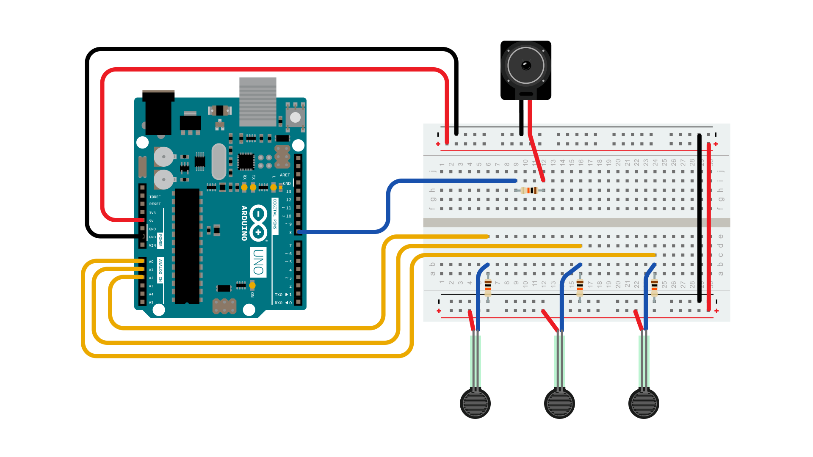
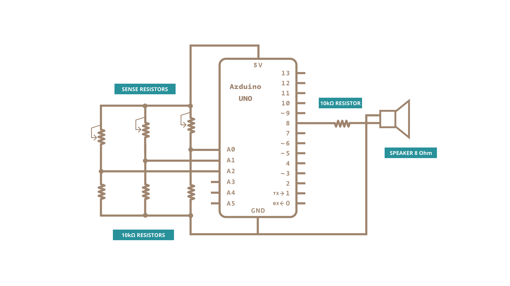

This example shows how to use the tone() command to generate different pitches depending on which sensor is pressed.

### Hardware Required

- [Arduino Board](https://store.arduino.cc/collections/boards-modules)

- 8 ohm speaker

- 3 force sensing resistors

- 3 10k ohm resistors

- 100 ohm resistor

- hook-up wires

- breadboard

### Circuit

Connect one terminal of your speaker to digital pin 8 through a 100 ohm resistor, and its other terminal to ground.

Power your three FSRs (or any other analog sensor) with 5V in parallel. Connect each sensor to analog pins 0-2, using a 10K resistor as a reference to groud on each input line.





### Schematic




### Code

The sketch below reads three analog sensors. Each corresponds to a note value in an array of notes.  If any of the sensors is above a given threshold, the corresponding note is played.

Here's the main sketch:

<iframe src='https://create.arduino.cc/example/builtin/02.Digital%5CtoneKeyboard/toneKeyboard/preview?embed&snippet' style='height:510px;width:100%;margin:10px 0' frameborder='0'></iframe>

The sketch uses an extra file, pitches.h.  This file contains all the pitch values for typical notes. For example, NOTE_C4 is middle C.  NOTE_FS4 is F sharp, and so forth.  This note table was originally written by Brett Hagman, on whose work the tone() command was based. You may find it useful for whenever you want to make musical notes.

To make the pitches.h file, either click on the button just below the serial monitor icon and choose "New Tab", or use Ctrl+Shift+N.

Then paste in the following code:

```arduino

/*************************************************

 * Public Constants

 *************************************************/

#define NOTE_B0  31
#define NOTE_C1  33
#define NOTE_CS1 35
#define NOTE_D1  37
#define NOTE_DS1 39
#define NOTE_E1  41
#define NOTE_F1  44
#define NOTE_FS1 46
#define NOTE_G1  49
#define NOTE_GS1 52
#define NOTE_A1  55
#define NOTE_AS1 58
#define NOTE_B1  62
#define NOTE_C2  65
#define NOTE_CS2 69
#define NOTE_D2  73
#define NOTE_DS2 78
#define NOTE_E2  82
#define NOTE_F2  87
#define NOTE_FS2 93
#define NOTE_G2  98
#define NOTE_GS2 104
#define NOTE_A2  110
#define NOTE_AS2 117
#define NOTE_B2  123
#define NOTE_C3  131
#define NOTE_CS3 139
#define NOTE_D3  147
#define NOTE_DS3 156
#define NOTE_E3  165
#define NOTE_F3  175
#define NOTE_FS3 185
#define NOTE_G3  196
#define NOTE_GS3 208
#define NOTE_A3  220
#define NOTE_AS3 233
#define NOTE_B3  247
#define NOTE_C4  262
#define NOTE_CS4 277
#define NOTE_D4  294
#define NOTE_DS4 311
#define NOTE_E4  330
#define NOTE_F4  349
#define NOTE_FS4 370
#define NOTE_G4  392
#define NOTE_GS4 415
#define NOTE_A4  440
#define NOTE_AS4 466
#define NOTE_B4  494
#define NOTE_C5  523
#define NOTE_CS5 554
#define NOTE_D5  587
#define NOTE_DS5 622
#define NOTE_E5  659
#define NOTE_F5  698
#define NOTE_FS5 740
#define NOTE_G5  784
#define NOTE_GS5 831
#define NOTE_A5  880
#define NOTE_AS5 932
#define NOTE_B5  988
#define NOTE_C6  1047
#define NOTE_CS6 1109
#define NOTE_D6  1175
#define NOTE_DS6 1245
#define NOTE_E6  1319
#define NOTE_F6  1397
#define NOTE_FS6 1480
#define NOTE_G6  1568
#define NOTE_GS6 1661
#define NOTE_A6  1760
#define NOTE_AS6 1865
#define NOTE_B6  1976
#define NOTE_C7  2093
#define NOTE_CS7 2217
#define NOTE_D7  2349
#define NOTE_DS7 2489
#define NOTE_E7  2637
#define NOTE_F7  2794
#define NOTE_FS7 2960
#define NOTE_G7  3136
#define NOTE_GS7 3322
#define NOTE_A7  3520
#define NOTE_AS7 3729
#define NOTE_B7  3951
#define NOTE_C8  4186
#define NOTE_CS8 4435
#define NOTE_D8  4699
#define NOTE_DS8 4978
```

### Learn more

You can find more basic tutorials in the [built-in examples](/built-in-examples) section.

You can also explore the [language reference](https://www.arduino.cc/reference/en/), a detailed collection of the Arduino programming language.

*Last revision 2015/08/11 by SM*