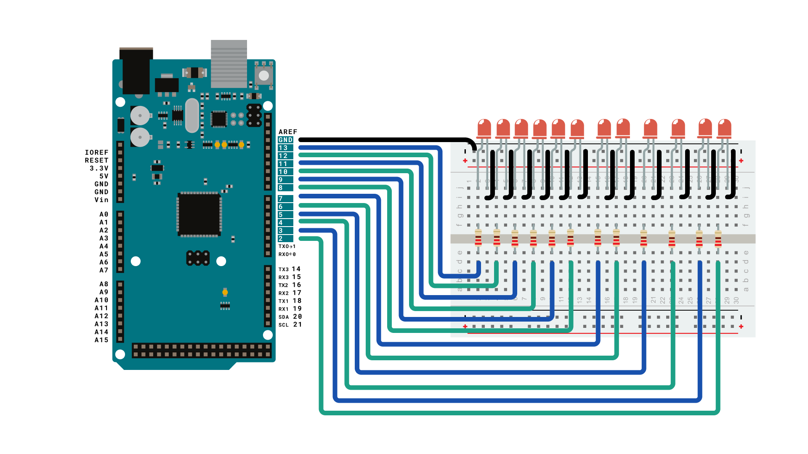
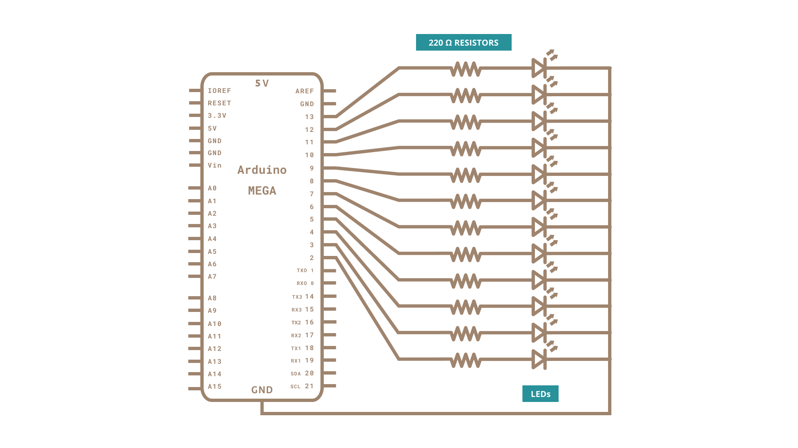

This example fades 12  LEDs up and the down, one by one, on an Arduino Mega board, taking advantage of the increased number of PWM enabled digital pins of this board.

### Hardware Required

- [Arduino Mega Board](https://store.arduino.cc/products/arduino-mega-2560-rev3)

- 12 Red LEDs
- 12 220 ohm resistors

- hook-up wires

- breadboard

### Circuit




Connect the longer, positive legs (anodes) of 12 LEDs to digital pins 2-13 through 220 ohm current limiting resistors. Connect the shorter, negative legs (cathodes) to ground.

### Schematic



### Code

In the `setup()` function of the code below, a [`for()`](https://www.arduino.cc/reference/en/language/structure/control-structure/for/) loop is used to assign digital pins 2-13 of the Mega as outputs.

Next, in the `loop()` function of the program below, a trio of nested `for()` loops are used.

The first of these loops,

`for (int thisPin =lowestPin; thisPin <= highestPin; thisPin++)`

moves through each of the LEDS one by one, from the lowest pin to the highest. Before this loop is allowed to move from one pin to the next, two things must be accomplished. First, you brighten the individual LED through these lines of code:

`for (int brightness = 0; brightness < 255; brightness++) {`
`analogWrite(thisPin, brightness);`
`delay(2);`
`}`

With each pass through the loop above, the variable brightness increases by one point, and that value is  written to the pin currently selected to the main loop. One that pin reaches the maximum PWM value (255), the following loop kicks in:

`for (int brightness = 255; brightness >= 0; brightness--) {`
`analogWrite(thisPin, brightness);`
`delay(2);`
`}`

This loop subtracts a point from the brightness variable, dimming the LED back down to 0. Once zero is reached, the main `for()` loop kicks in, and the program moves on to the next LED pin, repeating all the steps mentioned above.

```arduino

/*

  Mega analogWrite() test

  This sketch fades LEDs up and down one at a time on digital pins 2 through 13.

  This sketch was written for the Arduino Mega, and will not work on other boards.

  The circuit:

  - LEDs attached from pins 2 through 13 to ground.

  created 8 Feb 2009

  by Tom Igoe

  This example code is in the public domain.

  https://www.arduino.cc/en/Tutorial/AnalogWriteMega

*/

// These constants won't change. They're used to give names to the pins used:

const int lowestPin = 2;

const int highestPin = 13;

void setup() {

  // set pins 2 through 13 as outputs:

  for (int thisPin = lowestPin; thisPin <= highestPin; thisPin++) {

    pinMode(thisPin, OUTPUT);

  }
}

void loop() {

  // iterate over the pins:

  for (int thisPin = lowestPin; thisPin <= highestPin; thisPin++) {

    // fade the LED on thisPin from off to brightest:

    for (int brightness = 0; brightness < 255; brightness++) {

      analogWrite(thisPin, brightness);

      delay(2);

    }

    // fade the LED on thisPin from brightest to off:

    for (int brightness = 255; brightness >= 0; brightness--) {

      analogWrite(thisPin, brightness);

      delay(2);

    }

    // pause between LEDs:

    delay(100);

  }
}
```

### Learn more

You can find more basic tutorials in the [built-in examples](/built-in-examples) section.

You can also explore the [language reference](https://www.arduino.cc/reference/en/), a detailed collection of the Arduino programming language.

*Last revision 2015/07/28 by SM*