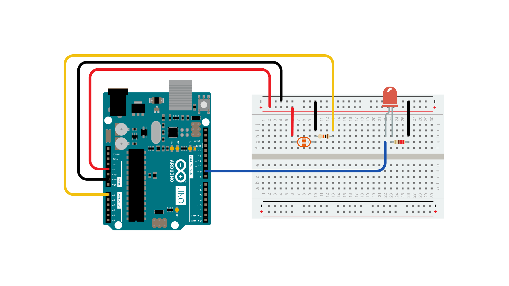
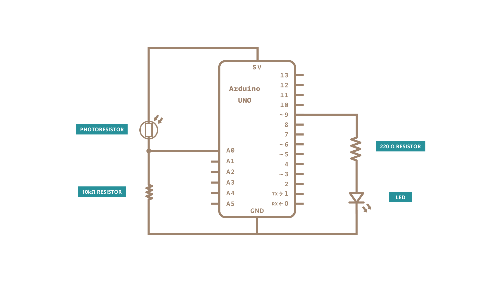

This example demonstrates one technique for calibrating sensor input.  The board takes sensor readings for five seconds during the startup, and tracks the highest and lowest values it gets. These sensor readings during the first five seconds of the sketch execution define the minimum and maximum of expected values for the readings taken during the loop.

### Hardware Required

- [Arduino Board](https://store.arduino.cc/collections/boards-modules)

- LED

- analog sensor (a photoresistor will do)

- 10k ohm resistor

- 220 ohm resistor

- hook-up wires

- breadboard

### Circuit

Analog sensor (e.g. potentiometer, light sensor) on Analog input 2.  LED on Digital pin 9.





Connect an LED to digital pin 9 with a 220 ohm current limiting resistor in series. Connect a photoresistor to 5V and then to analog pin 0 with a 10K ohm resistor to ground.

### Schematic




### Code

Before the setup, you set initial values for the minimum and maximum like so:

```arduino
int sensorMin = 1023;        // minimum sensor value
int sensorMax = 0;           // maximum sensor value

```

These may seem backwards. Initially, you set the minimum high and read for anything  lower than that, saving it as the new minimum. Likewise, you set the maximum low and read for anything higher as the new maximum, like so:

```arduino
// calibrate during the first five seconds
while (millis() < 5000) {
sensorValue = analogRead(sensorPin);
// record the maximum sensor value
if (sensorValue > sensorMax) {
sensorMax = sensorValue;
}
// record the minimum sensor value
if (sensorValue < sensorMin) {
sensorMin = sensorValue;
}
}

```

This way, any further readings you take can be mapped to the range between this minimum and maximum like so:

```arduino
// apply the calibration to the sensor reading
sensorValue = map(sensorValue, sensorMin, sensorMax, 0, 255);

```

Here's the whole program:

<iframe src='https://create.arduino.cc/example/builtin/03.Analog%5CCalibration/Calibration/preview?embed&snippet' style='height:510px;width:100%;margin:10px 0' frameborder='0'></iframe>

### Learn more

You can find more basic tutorials in the [built-in examples](/built-in-examples) section.

You can also explore the [language reference](https://www.arduino.cc/reference/en/), a detailed collection of the Arduino programming language.

*Last revision 2015/07/29 by SM*