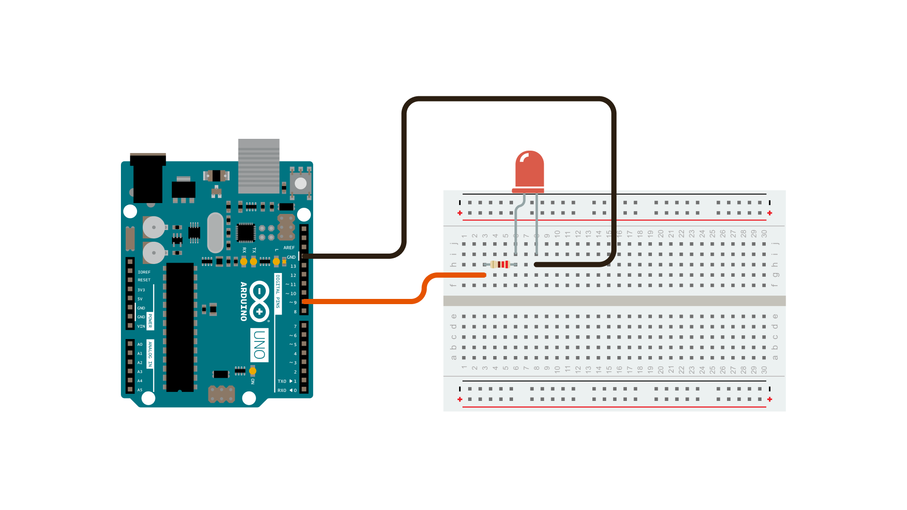

This example demonstrates the use of analog output ([Pulse Width Modulation (PWM)](/learn/microcontrollers/analog-output)) to fade an LED.  PWM is a technique for getting an analog-like behavior from a digital output by switching it off and on very fast and with different ratio between on and off time.

### Hardware Required

- [Arduino Board](https://store.arduino.cc/collections/boards-modules)

- LED

- 220 ohm resistor

- hook-up wires

- breadboard

### Circuit

An LED connected to digital output pin 9 through a 220 ohm resistor.




### Schematic


### Code

In this example two loops are executed one after the other to increase and then decrease the value of the output on pin 9.

```arduino

/*

  Fading

  This example shows how to fade an LED using the analogWrite() function.

  The circuit:

  - LED attached from digital pin 9 to ground.

  created 1 Nov 2008

  by David A. Mellis

  modified 30 Aug 2011

  by Tom Igoe

  This example code is in the public domain.

  https://www.arduino.cc/en/Tutorial/Fading

*/

int ledPin = 9;    // LED connected to digital pin 9

void setup() {

  // nothing happens in setup
}

void loop() {

  // fade in from min to max in increments of 5 points:

  for (int fadeValue = 0 ; fadeValue <= 255; fadeValue += 5) {

    // sets the value (range from 0 to 255):

    analogWrite(ledPin, fadeValue);

    // wait for 30 milliseconds to see the dimming effect

    delay(30);

  }

  // fade out from max to min in increments of 5 points:

  for (int fadeValue = 255 ; fadeValue >= 0; fadeValue -= 5) {

    // sets the value (range from 0 to 255):

    analogWrite(ledPin, fadeValue);

    // wait for 30 milliseconds to see the dimming effect

    delay(30);

  }
}
```

### Learn more

You can find more basic tutorials in the [built-in examples](/built-in-examples) section.

You can also explore the [language reference](https://www.arduino.cc/reference/en/), a detailed collection of the Arduino programming language.

*Last revision 2015/07/29 by SM*