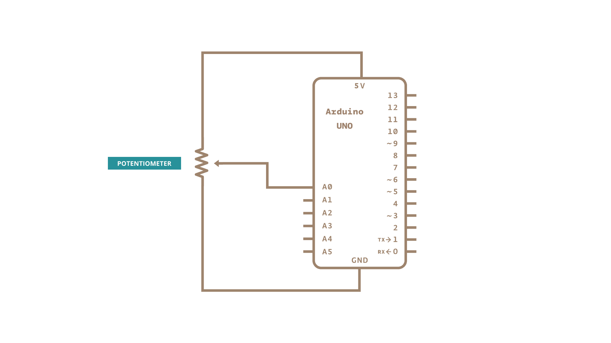

This sketch reads repeatedly from an analog input, calculating a running average and printing it to the computer.  This example is useful for smoothing out the values from jumpy or erratic sensors, and also demonstrates the use of [arrays](https://www.arduino.cc/reference/en/language/variables/data-types/array/) to store data.

### Hardware

- [Arduino Board](https://store.arduino.cc/collections/boards-modules)

- 10k ohm potentiometer

### Circuit

Connect one pin of a potentiometer to 5V, the center pin to analog pin 0, and the the last pin to ground.

### Schematic

### Code

The code below sequentially stores 10 readings from your analog sensor into an [arrays](https://www.arduino.cc/reference/en/language/variables/data-types/array/), one by one. With each new value, the sum of all the numbers is generated and divided, producing an average value which then be used to smooth outlying data. Because this averaging takes place each time a new value is added to the array (rather then waiting for 10 new values, for instance) there is no lag time in calculating this running average.

Altering the size of the array used, by changing `numReadings` to a larger value will smooth the data collected even further.

<iframe src='https://create.arduino.cc/example/builtin/03.Analog%5CSmoothing/Smoothing/preview?embed&snippet' style='height:510px;width:100%;margin:10px 0' frameborder='0'></iframe>

### Learn more

You can find more basic tutorials in the [built-in examples](/built-in-examples) section.

You can also explore the [language reference](https://www.arduino.cc/reference/en/), a detailed collection of the Arduino programming language.
*Last revision 2015/07/29 by SM*