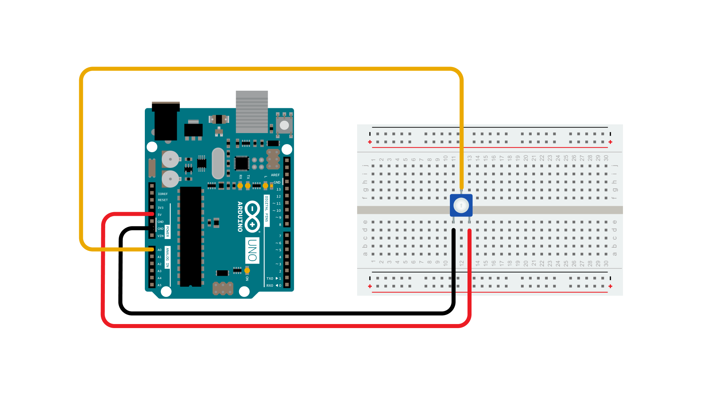
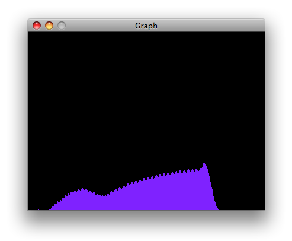
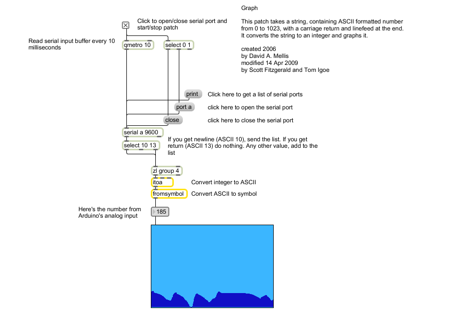

This example shows you how to send a byte of data from the Arduino to a personal computer and graph the result. This is called serial communication because the connection appears to both the board and the computer as a serial port, even though it may actually use a USB cable, a serial to USB and a USB to serial converter.

You can use the serial monitor of the Arduino Software (IDE) to view the sent data, or it can be read by Processing (see code below), Flash, PD, Max/MSP, etc.

### Hardware Required

- [Arduino Board](https://store.arduino.cc/collections/boards-modules)

- Analog Sensor (potentiometer, photocell, FSR, etc.)

### Software Required

- [Processing](http://www.processing.org) or

- [Max/MSP version 5](https://cycling74.com/downloads/older/)

### Circuit

Connect a potentiometer or other analog sensor to analog input 0.

### Schematic

### Code

<iframe src='https://create.arduino.cc/example/builtin/04.Communication%5CGraph/Graph/preview?embed&snippet' style='height:510px;width:100%;margin:10px 0' frameborder='0'></iframe>

### Processing Sketch

Using the Processing sketch in the code sample above, you'll get a graph of the sensor's value. As you change the value of the analog sensor, you'll get a graph something like this:

### Max Code

The max patch looks like this.  The text of the patch is in the code sample above.  Copy the text and paste it into a new Max window to see the sketch.

### Learn more

You can find more basic tutorials in the [built-in examples](/built-in-examples) section.

You can also explore the [language reference](https://www.arduino.cc/reference/en/), a detailed collection of the Arduino programming language.

*Last revision 2015/07/29 by SM*