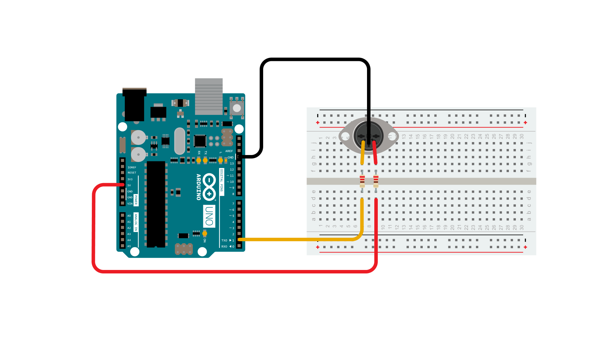
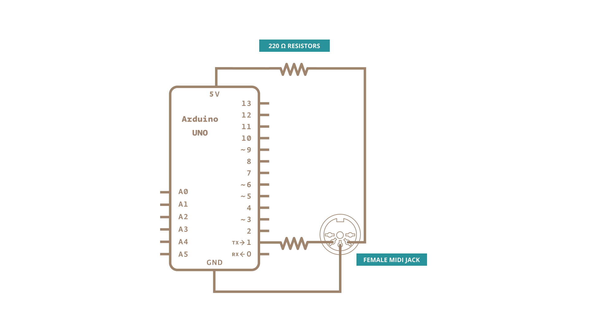

This tutorial shows how to send MIDI notes from an Arduino board to a MIDI instrument connected through the standard 5 poles DIN cable.

[MIDI](http://en.wikipedia.org/wiki/MIDI), the Musical Instrument Digital Interface, is a useful protocol for controlling synthesizers, sequencers, and other musical devices. MIDI devices are generally grouped in to two broad classes: controllers (i.e. devices that generate MIDI signals based on human actions) and synthesizers (including samplers, sequencers, and so forth). The latter take MIDI data in and make sound, light, or some other effect.

MIDI is a serial protocol that operates at 31,250 bits per second. The board built-in serial port (all of them on the Mega as well) can send data at that rate.

MIDI bytes are divided into two types: **command bytes** and **data bytes**. Command bytes are always 128 or greater, or 0x80 to 0xFF in hexadecimal.  Data bytes are always less than 127, or 0x00 to 0x7F in hex. Commands include things such as note on, note off, pitch bend, and so forth.  Data bytes include things like the pitch of the note to play, the velocity, or loudness of the note, amount of pitch bend and so forth.  For more details, see the MIDI specification or one of the many [MIDI Protocol Guides](http://hinton-instruments.co.uk/reference/midi/protocol/index.htm) on the Web.

MIDI data is usually notated in hexadecimal because MIDI banks and instruments are grouped in groups of 16.

For more see this [introduction to MIDI](https://web.archive.org/web/20220331023548/https://www.tigoe.com/pcomp/code/communication/midi/) (web archive link) or this [example](https://itp.nyu.edu/physcomp/labs/labs-serial-communication/lab-midi-output-using-an-arduino/).

### Hardware Required

- [Arduino Board](https://store.arduino.cc/collections/boards-modules)

- Female MIDI jack

- 2 220 ohm resistors

- hook-up wires

- MIDI enabled device *(optional, for testing)*

### Circuit

All MIDI connectors are female, by definition of the MIDI spec. Here's how to wire the connector to the board:

- MIDI jack pin 5 connected to Digital pin 1 through a 220 ohm resistor

- MIDI jack pin 2 connected to ground

- MIDI jack pin 4 connected to +5V through a 220 ohm resistor

### Schematic

### Code

**Attention**
If you're using a board with ATmega32U4 like DUE or Leonardo, please replace Serial with Serial1 in the sketch below.

<iframe src='https://create.arduino.cc/example/builtin/04.Communication%5CMidi/Midi/preview?embed&snippet' style='height:510px;width:100%;margin:10px 0' frameborder='0'></iframe>

### Learn more

You can find more basic tutorials in the [built-in examples](/built-in-examples) section.

You can also explore the [language reference](https://www.arduino.cc/reference/en/), a detailed collection of the Arduino programming language.

*Last revision 2015/12/10 by AG*
