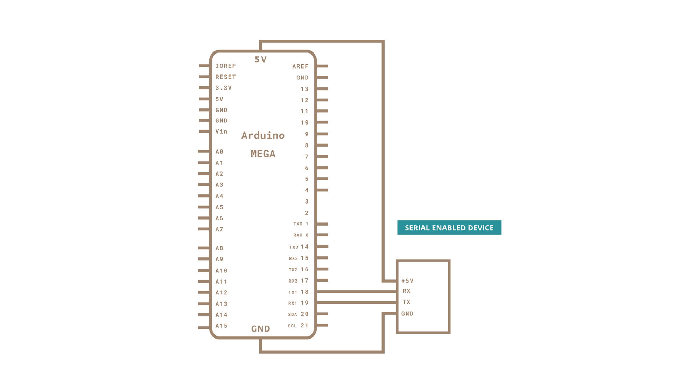

Sometimes, one serial port just isn't enough! When trying to communicate with multiple serial enabled devices, while also sending info back to the main serial window, a few extra RX/TX ports can be a welcomed thing. This example makes use of one of Arduino Mega's 3 auxiliary serial ports, routing any incoming data read on that connection straight to the main TX line, and, in turn, to the main serial window for you to view.

### Hardware Required

- [Arduino Mega Board](https://store.arduino.cc/products/arduino-mega-2560-rev3)

- Serial enabled device  (a Xbee Radio, a Bluetooth® module, or RFID reader, or another board, for instance).

### Circuit

After checking the data sheet of whatever serial enabled device you choose to use for this example, make sure that it is both properly wired and powered. Connect the RX pin and TX pins of your device to the TX1 and RX1 pins of your Mega, as shown in the schematic below.

Make sure that your Mega is connected to your computer, via USB, to enable serial communication.


### Schematic



### Code

This sketch assumes that you connect your serial enabled device is attached to TX1 and RX1.

```arduino

/*

  Multiple Serial test

  Receives from the main serial port, sends to the others.

  Receives from serial port 1, sends to the main serial (Serial 0).

  This example works only with boards with more than one serial like Arduino Mega, Due, Zero etc.

  The circuit:

  - any serial device attached to Serial port 1

  - Serial Monitor open on Serial port 0

  created 30 Dec 2008

  modified 20 May 2012

  by Tom Igoe & Jed Roach

  modified 27 Nov 2015

  by Arturo Guadalupi

  This example code is in the public domain.

*/

void setup() {

  // initialize both serial ports:

  Serial.begin(9600);

  Serial1.begin(9600);
}

void loop() {

  // read from port 1, send to port 0:

  if (Serial1.available()) {

    int inByte = Serial1.read();

    Serial.write(inByte);

  }

  // read from port 0, send to port 1:

  if (Serial.available()) {

    int inByte = Serial.read();

    Serial1.write(inByte);

  }
}
```

### Learn more

You can find more basic tutorials in the [built-in examples](/built-in-examples) section.

You can also explore the [language reference](https://www.arduino.cc/reference/en/), a detailed collection of the Arduino programming language.

*Last revision 2015/07/29 by SM*