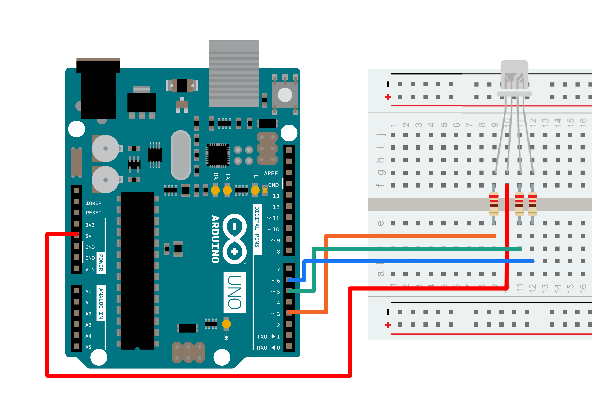

This sketch uses the [Serial.parseInt](https://www.arduino.cc/en/Reference/ParseInt)() function to locate values separated by a non-alphanumeric character. Often people use a comma to indicate different pieces of information (this format is commonly referred to as **comma-separated-values** or **CSV**), but other characters like a space or a period will work too. The values are parsed into integers and used to determine the color of a RGB LED. You'll use the Arduino Software (IDE) serial monitor to send strings like "5,220,70" to the board to change the light color.

### Hardware Required

- Arduino Board

- common anode RGB LED

- 3 220 ohm resistors

- hook-up wires

- breadboard

### Circuit




### Schematic


You'll need four wires to make the circuit above. A wire connects the 5V from the POWER connector of the board to the longest pin of the RGB LED. You should turn the LED so that the longest pin is the second from the left..

Place the RGB LED on your breadboard with the longest pin as the second from the top. Check the datasheet for your specific LED to verify the pins, but they should be R, V+, G and B. The wire from 5V should therefore connect that second pin from top, as in the connection scheme above.

With your remaining wires, connect your red cathode to pin 3, green cathode to pin 5, and blue cathode to pin 6 in series with the resistors.

RGB LEDs with a common anode share a common power pin. Instead of turning a pin HIGH to illuminate the LED, you need to turn the pin LOW, to create a voltage difference across the diode. So sending 255 via analogWrite() turns the LED off, while a value of 0 turns it on at full brightness. In the code below, you'll use a little bit of math on the sketch side, so you can send values which correspond to the expected brightness. Essentially, instead of using analogWrite(pin, brightness), you'll be calling analogWrite(pin, 255-brightness).

### Code

You'll first set up some [global variables](https://www.arduino.cc/reference/en/language/variables/variable-scope-qualifiers/scope/) for the pins your LED will connect to. This will make it easier to differentiate which one is red, green, and blue in the main part of your program:

```arduino
const int redPin = 3;
const int greenPin = 5;
const int bluePin = 6;
```

In your [setup](https://www.arduino.cc/en/Reference/Setup)(), begin serial communication at 9600 bits of data per second between the board and your computer with the line:

```arduino
Serial.begin(9600);
```

Also in the setup, you'll want to configure the pins as outputs:

```arduino
pinMode(redPin, OUTPUT);
pinMode(greenPin, OUTPUT);
pinMode(bluePin, OUTPUT);
```

In the [loop](https://www.arduino.cc/en/Reference/Loop)(), check to see if there is any data in the serial buffer. By making this a [while()](https://www.arduino.cc/reference/en/language/structure/control-structure/while/) statement, it will run as long as there is information waiting to be read :

```arduino
while (Serial.available() > 0) {
```

Next, declare some local variables for storing the serial information. This will be the brightness of the LEDs. Using [Serial.parseInt](https://www.arduino.cc/en/Serial/ParseInt)() to separate the data by commas, read the information into your variables:

```arduino
int red = Serial.parseInt();
int green = Serial.parseInt();
int blue = Serial.parseInt();
```

Once you've read the data into your variables, check for the newline character to proceed:

```arduino
if (Serial.read() == '\n') {
```

Using [constrain](https://www.arduino.cc/en/Reference/Constrain)(), you can keep the values in an acceptable range for PWM control. This way, if the value was outside the range of what PWM can send, it will be limited to a valid number. By subtracting this value from 255 you will be formatting the value to use with a common anode LED. As explained above, these LEDs will illuminate when there is a voltage difference between the anode and the pin connected to the board:

```arduino
red = 255 - constrain(red, 0, 255);
green = 255 - constrain(green, 0, 255);
blue = 255 - constrain(blue, 0, 255);
```

Now that you have formatted the values for PWM, use [analogWrite](https://www.arduino.cc/en/Reference/AnalogWrite)() to change the color of the LED. Because you subtracted your value from 255 in the step above:

```arduino
analogWrite(redPin, red);
analogWrite(greenPin, green);
analogWrite(bluePin, blue);
```

Send the value of each LED back to the serial monitor in one string as HEX values :

```arduino
Serial.print(red, HEX);
Serial.print(green, HEX);
Serial.println(blue, HEX);
```

Finally, close up your brackets from the [if](https://www.arduino.cc/reference/en/language/structure/control-structure/if/) statement, while statement, and main loop :

```arduino
}
}
}
```

Once you have programmed the board, open your Arduino Software (IDE) serial monitor. Make sure you have chosen to send a newline character when sending a message. Enter values between 0-255 for the lights in the following format : Red,Green,Blue. Once you have sent the values to the board, the attached LED will turn into the color you specified and you will receive back the HEX values in the serial monitor.

```arduino

/*

  Reading a serial ASCII-encoded string.

  This sketch demonstrates the Serial parseInt() function.

  It looks for an ASCII string of comma-separated values.

  It parses them into ints, and uses those to fade an RGB LED.

  Circuit: Common-Cathode RGB LED wired like so:

  - red anode: digital pin 3

  - green anode: digital pin 5

  - blue anode: digital pin 6

  - cathode: GND

  created 13 Apr 2012

  by Tom Igoe

  modified 14 Mar 2016

  by Arturo Guadalupi

  This example code is in the public domain.

*/

// pins for the LEDs:

const int redPin = 3;

const int greenPin = 5;

const int bluePin = 6;

void setup() {

  // initialize serial:

  Serial.begin(9600);

  // make the pins outputs:

  pinMode(redPin, OUTPUT);

  pinMode(greenPin, OUTPUT);

  pinMode(bluePin, OUTPUT);

}

void loop() {

  // if there's any serial available, read it:

  while (Serial.available() > 0) {

    // look for the next valid integer in the incoming serial stream:

    int red = Serial.parseInt();

    // do it again:

    int green = Serial.parseInt();

    // do it again:

    int blue = Serial.parseInt();

    // look for the newline. That's the end of your sentence:

    if (Serial.read() == '\n') {

      // constrain the values to 0 - 255 and invert

      // if you're using a common-cathode LED, just use "constrain(color, 0, 255);"

      red = 255 - constrain(red, 0, 255);

      green = 255 - constrain(green, 0, 255);

      blue = 255 - constrain(blue, 0, 255);

      // fade the red, green, and blue legs of the LED:

      analogWrite(redPin, red);

      analogWrite(greenPin, green);

      analogWrite(bluePin, blue);

      // print the three numbers in one string as hexadecimal:

      Serial.print(red, HEX);

      Serial.print(green, HEX);

      Serial.println(blue, HEX);

    }

  }
}
```

### Learn more

You can find more basic tutorials in the [built-in examples](/built-in-examples) section.

You can also explore the [language reference](https://www.arduino.cc/reference/en/), a detailed collection of the Arduino programming language.

*Last revision 2015/07/29 by SM*