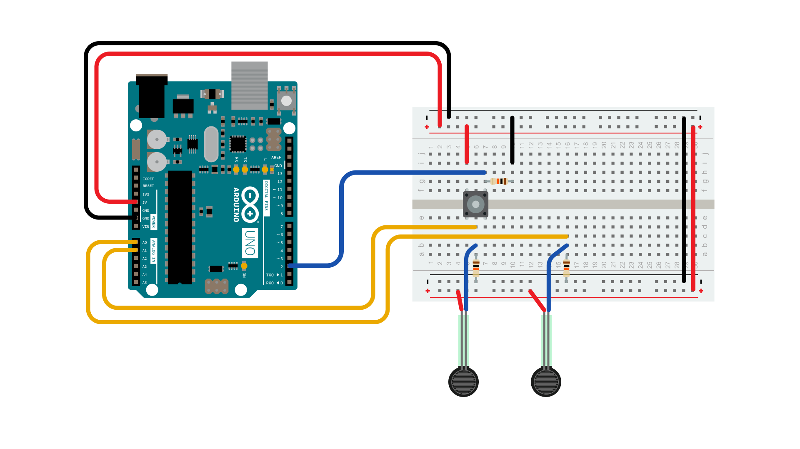
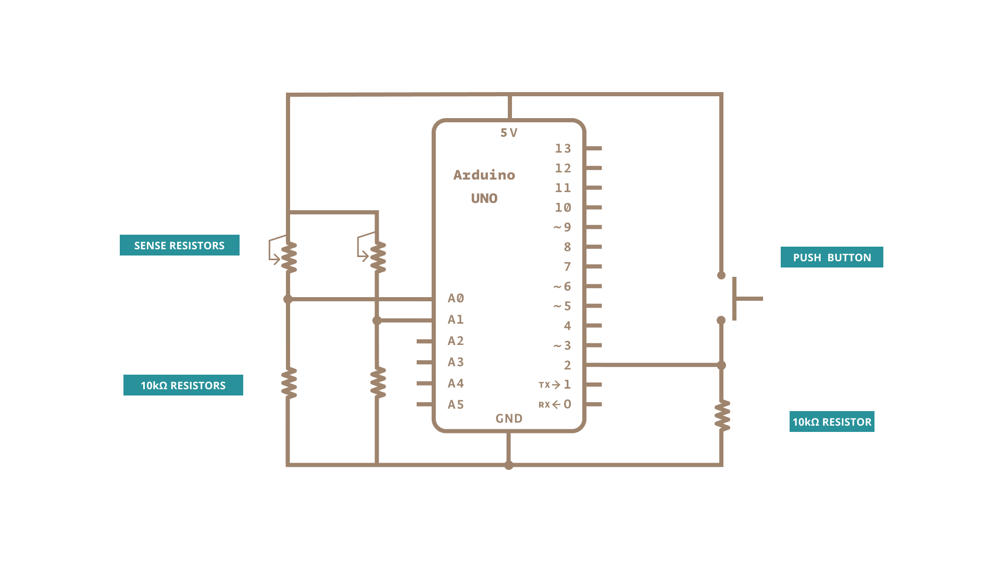
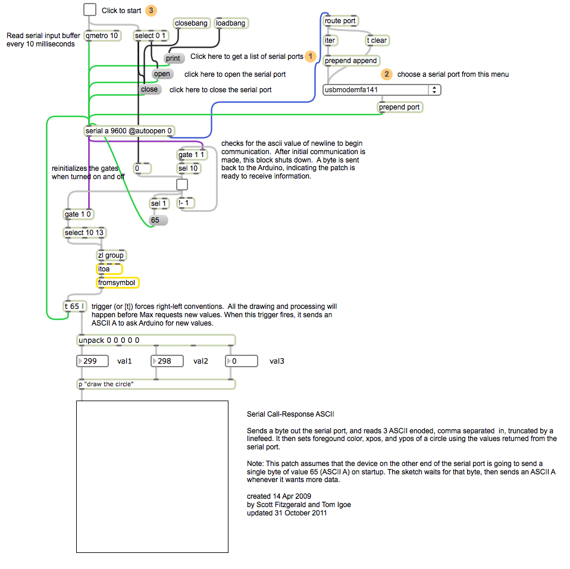

This example demonstrates string-based communication from the Arduino board to the computer using a call-and-response (handshaking) method.

The sketch sends an ASCII string on startup and repeats that until it gets a serial response from the computer. Then it sends three sensor values as ASCII-encoded numbers, separated by commas and terminated by a linefeed and carriage return, and waits for another response from the computer.

You can use the Arduino Software (IDE) serial monitor to view the sent data, or it can be read by Processing (see code below), Flash, PD, Max/MSP (see example below), etc. The examples below split the incoming string on the commas and convert the string into numbers again.

Compare this to the [Serial call and response example](/built-in-examples/communication/SerialCallResponse). They are similar, in that both use a handshaking method, but this one encodes the sensor readings as strings, while the other sends them as binary values.  While sending as ASCII-encoded strings takes more bytes, it means you can easily send values larger than 255 for each sensor reading. It's also easier to read in a serial terminal program.

### Hardware Required

- [Arduino Board](https://store.arduino.cc/collections/boards-modules)

- 2x analog sensors (potentiometer, photocell, FSR, etc.)

- pushbutton

- 3x 10K ohm resistors

- hook-up wires

- breadboard

### Software Required

- [Processing](http://www.processing.org) or

- [Max/MSP version 5](https://cycling74.com/downloads/older/)

### Circuit

Connect analog sensors to analog input pin 0 and 1 with 10K ohm resistors used as voltage dividers. Connect a pushbutton or switch to digital I/O pin 2 with a 10K ohm resistor as a reference to ground.

### Schematic

### Code

<iframe src='https://create.arduino.cc/example/builtin/04.Communication%5CSerialCallResponseASCII/SerialCallResponseASCII/preview?embed&snippet' style='height:510px;width:100%;margin:10px 0' frameborder='0'></iframe>

### Processing Code

Copy the Processing sketch from the code sample above. As you change the value of the analog sensor, you'll get a ball moving onscreen something like this.  The ball will appear only when you push the button:

### Max Code

The max patch looks like this.  Copy the text from the code sample above and paste it into a new Max window

### Learn more

You can find more basic tutorials in the [built-in examples](/built-in-examples) section.

You can also explore the [language reference](https://www.arduino.cc/reference/en/), a detailed collection of the Arduino programming language.

*Last revision 2015/07/29 by SM*