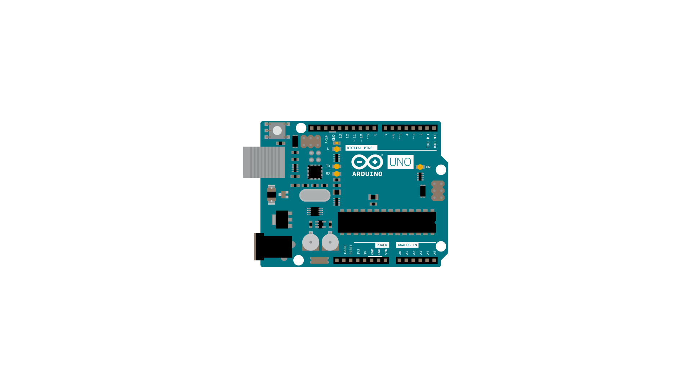

This example demonstrates how to virtually connect together Serial and Serial1. This tutorial can be so loaded on boards that have two different UART interfaces on the 0 and 1 pins and the USB port (like Zero, MKR1000, 101). In particular every data coming from the RX pin of the Serial1 is transmitted to Serial and vice versa.

### Hardware Required

- [Arduino Board](https://store.arduino.cc/collections/boards-modules)

### Circuit




None, but the board has to be connected to the computer; the Arduino Software (IDE) serial monitor may be used to communicate the single or multiple characters and receive the string back.

### Code

```arduino

/*

  SerialPassthrough sketch

  Some boards, like the Arduino 101, the MKR1000, Zero, or the Micro, have one

  hardware serial port attached to Digital pins 0-1, and a separate USB serial

  port attached to the IDE Serial Monitor. This means that the "serial

  passthrough" which is possible with the Arduino UNO (commonly used to interact

  with devices/shields that require configuration via serial AT commands) will

  not work by default.

  This sketch allows you to emulate the serial passthrough behaviour. Any text

  you type in the IDE Serial monitor will be written out to the serial port on

  Digital pins 0 and 1, and vice-versa.

  On the 101, MKR1000, Zero, and Micro, "Serial" refers to the USB Serial port

  attached to the Serial Monitor, and "Serial1" refers to the hardware serial

  port attached to pins 0 and 1. This sketch will emulate Serial passthrough

  using those two Serial ports on the boards mentioned above, but you can change

  these names to connect any two serial ports on a board that has multiple ports.

  created 23 May 2016

  by Erik Nyquist

*/

void setup() {

  Serial.begin(9600);

  Serial1.begin(9600);
}

void loop() {

  if (Serial.available()) {      // If anything comes in Serial (USB),

    Serial1.write(Serial.read());   // read it and send it out Serial1 (pins 0 & 1)

  }

  if (Serial1.available()) {     // If anything comes in Serial1 (pins 0 & 1)

    Serial.write(Serial1.read());   // read it and send it out Serial (USB)

  }
}
```

### Learn more

You can find more basic tutorials in the [built-in examples](/built-in-examples) section.

You can also explore the [language reference](https://www.arduino.cc/reference/en/), a detailed collection of the Arduino programming language.

*Last revision 2016/05/26 by AG*