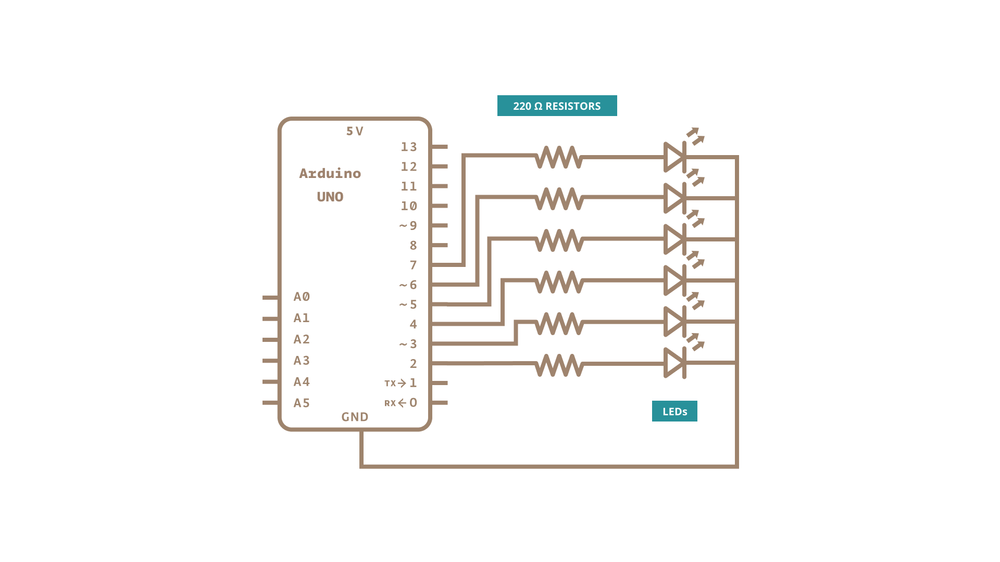

This variation on the [For Loop Iteration](/built-in-examples/control-structures/ForLoopIteration) example shows how to use an [**array**](https://www.arduino.cc/reference/en/language/variables/data-types/array/).  An array is a variable with multiple parts.  If you think of a variable as a cup that holds values, you might think of an array as an ice cube tray. It's like a series of linked cups, all of which can hold the same maximum value.

The [For Loop Iteration](/built-in-examples/control-structures/ForLoopIteration) example shows you how to light up a series of LEDs attached to pins 2 through 7 of the Arduino board, with certain limitations (the pins have to be numbered contiguously, and the LEDs have to be turned on in sequence).

This example shows you how you can turn on a sequence of pins whose numbers are neither contiguous nor necessarily sequential.  To do this is, you can put the pin numbers in an **array** and then use **for loops** to iterate over the array.

This example makes use of 6 LEDs connected to the pins 2 - 7 on the board using 220 ohm resistors, just like in the For Loop. However, here the order of the LEDs is determined by their order in the array, not by their physical order.

This technique of putting the pins in an array is very handy. You don't have to have the pins sequential to one another, or even in the same order.  You can rearrange them in any order you want.

### Hardware Required

- [Arduino Board](https://store.arduino.cc/collections/boards-modules)

- 6 LEDs
- 6 220 ohm resistors

- hook-up wires

- breadboard

### Circuit

Connect six LEDs, with 220 ohm resistors in series, to digital pins 2-7 on your board.


### Schematic




### Code

```arduino

/*

  Arrays

  Demonstrates the use of an array to hold pin numbers in order to iterate over

  the pins in a sequence. Lights multiple LEDs in sequence, then in reverse.

  Unlike the For Loop tutorial, where the pins have to be contiguous, here the

  pins can be in any random order.

  The circuit:

  - LEDs from pins 2 through 7 to ground

  created 2006

  by David A. Mellis

  modified 30 Aug 2011

  by Tom Igoe

  This example code is in the public domain.

  https://www.arduino.cc/en/Tutorial/Array

*/

int timer = 100;           // The higher the number, the slower the timing.
int ledPins[] = {

  2, 7, 4, 6, 5, 3
};       // an array of pin numbers to which LEDs are attached
int pinCount = 6;           // the number of pins (i.e. the length of the array)

void setup() {

  // the array elements are numbered from 0 to (pinCount - 1).

  // use a for loop to initialize each pin as an output:

  for (int thisPin = 0; thisPin < pinCount; thisPin++) {

    pinMode(ledPins[thisPin], OUTPUT);

  }
}

void loop() {

  // loop from the lowest pin to the highest:

  for (int thisPin = 0; thisPin < pinCount; thisPin++) {

    // turn the pin on:

    digitalWrite(ledPins[thisPin], HIGH);

    delay(timer);

    // turn the pin off:

    digitalWrite(ledPins[thisPin], LOW);

  }

  // loop from the highest pin to the lowest:

  for (int thisPin = pinCount - 1; thisPin >= 0; thisPin--) {

    // turn the pin on:

    digitalWrite(ledPins[thisPin], HIGH);

    delay(timer);

    // turn the pin off:

    digitalWrite(ledPins[thisPin], LOW);

  }
}
```

### Learn more

You can find more basic tutorials in the [built-in examples](/built-in-examples) section.

You can also explore the [language reference](https://www.arduino.cc/reference/en/), a detailed collection of the Arduino programming language.

*Last revision 2015/07/28 by SM*