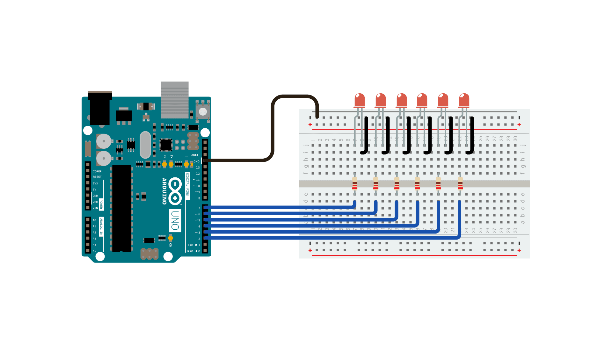
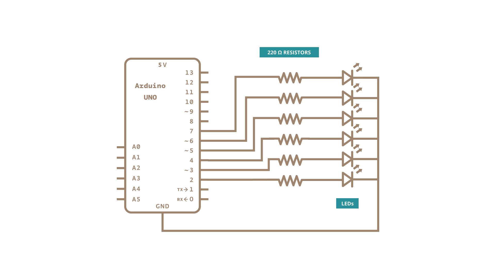

Often you want to iterate over a series of pins and do something to each one.  For instance, this example blinks 6 LEDs  attached to the Arduino by using a  [**for()**](https://www.arduino.cc/reference/en/language/structure/control-structure/for/) loop to cycle back and forth through digital pins 2-7. The LEDS are turned on and off, in sequence, by using both the [digitalWrite()](https://www.arduino.cc/en/Reference/DigitalWrite)  and [delay()](https://www.arduino.cc/reference/en/language/functions/time/delay/) functions .

We also call this example "[Knight Rider](http://en.wikipedia.org/wiki/KITT)" in memory of a TV-series from the 80's where David Hasselhoff had an AI machine named KITT driving his Pontiac. The car had been augmented with plenty of LEDs in all possible sizes performing flashy effects. In particular, it had a display that scanned back and forth across a line, as shown in this exciting [fight between KITT and KARR](https://www.youtube.com/watch?v=PO5E5mQIy_Q). This example duplicates the KITT display.

### Hardware Required

- [Arduino Board](https://store.arduino.cc/collections/boards-modules)

- 6 220 ohm resistors

- 6 LEDs
- hook-up wires

- breadboard

### Circuit

Connect six LEDS, with 220 ohm resistors in series, to digital pins 2-7 on your Arduino.





### Schematic:




### Code

The code below begins by utilizing a `for()` loop to assign digital pins 2-7 as outputs for the 6 LEDs used.

In the main loop of the code, two `for()` loops are used to loop incrementally, stepping through the LEDs, one by one, from pin 2 to pin seven. Once pin 7 is lit, the process reverses, stepping back down through each LED.

```arduino

/*

  For Loop Iteration

  Demonstrates the use of a for() loop.

  Lights multiple LEDs in sequence, then in reverse.

  The circuit:

  - LEDs from pins 2 through 7 to ground

  created 2006

  by David A. Mellis

  modified 30 Aug 2011

  by Tom Igoe

  This example code is in the public domain.

  https://www.arduino.cc/built-in-examples/ForLoopIteration

*/

int timer = 100;           // The higher the number, the slower the timing.

void setup() {

  // use a for loop to initialize each pin as an output:

  for (int thisPin = 2; thisPin < 8; thisPin++) {

    pinMode(thisPin, OUTPUT);

  }
}

void loop() {

  // loop from the lowest pin to the highest:

  for (int thisPin = 2; thisPin < 8; thisPin++) {

    // turn the pin on:

    digitalWrite(thisPin, HIGH);

    delay(timer);

    // turn the pin off:

    digitalWrite(thisPin, LOW);

  }

  // loop from the highest pin to the lowest:

  for (int thisPin = 7; thisPin >= 2; thisPin--) {

    // turn the pin on:

    digitalWrite(thisPin, HIGH);

    delay(timer);

    // turn the pin off:

    digitalWrite(thisPin, LOW);

  }
}
```

### Learn more

You can find more basic tutorials in the [built-in examples](/built-in-examples) section.

You can also explore the [language reference](https://www.arduino.cc/reference/en/), a detailed collection of the Arduino programming language.

*Last revision 2015/07/29 by SM*
