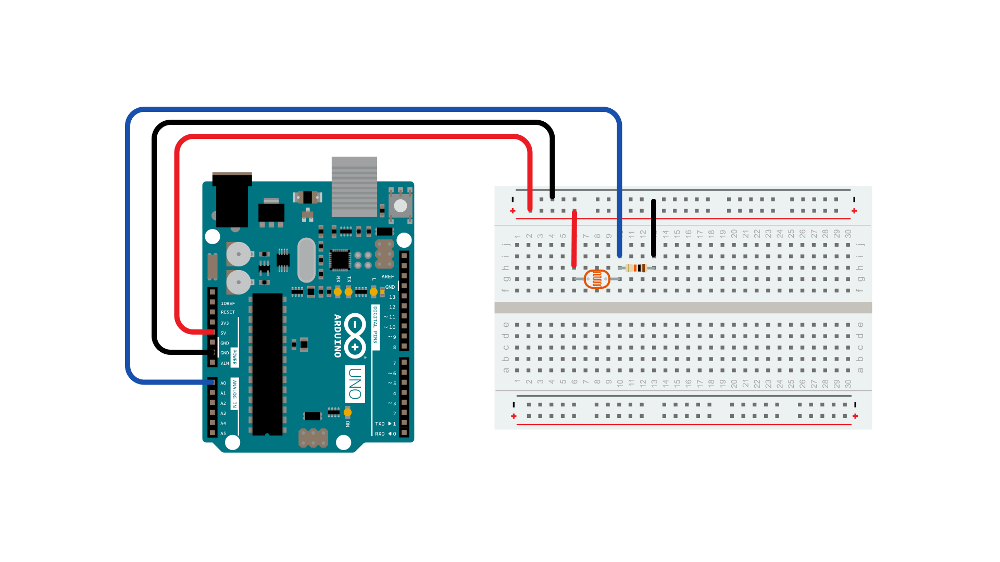
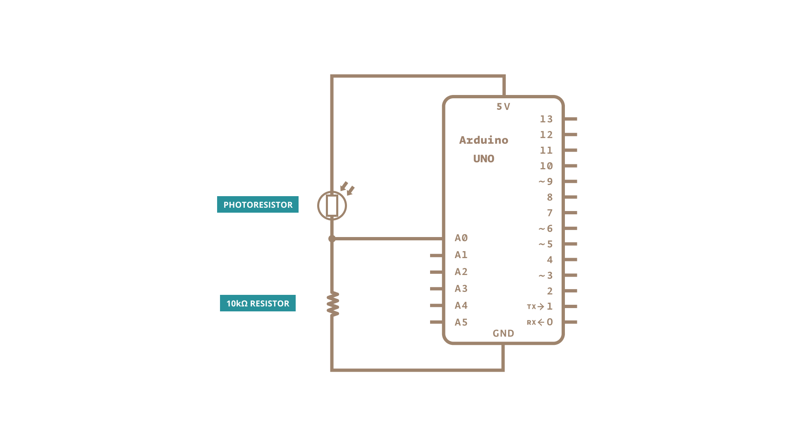

An if statement allows you to choose between two discrete options, TRUE or FALSE.  When there are more than two options, you can use multiple if statements, or you can use the [**switch**](https://www.arduino.cc/reference/en/language/structure/control-structure/switchcase/) statement.  Switch allows you to choose between several discrete options.  This tutorial shows you how to use it to switch between four desired states of a photo resistor:  really dark, dim, medium, and bright.

This program first reads the photoresistor.  Then it uses the `map()` function to map its output to one of four values: 0, 1, 2, or 3.  Finally, it uses the `switch()` statement to print one of four messages back to the computer depending on which of the four values is returned.

### Hardware Required

- [Arduino Board](https://store.arduino.cc/collections/boards-modules)

- photoresistor, or another analog sensor

- 10k ohm resistors

- hook-up wires

- breadboard

### Circuit

The photoresistor is connected to analog in pin 0 using a [voltage divider](http://www.tigoe.com/pcomp/code/controllers/input-output/analog-input/)  circuit.  A 10K ohm resistor makes up the other side of the voltage divider, running from Analog in 0 to ground.  The `analogRead()` function returns a range of about 0 to 600 from this circuit in a reasonably lit indoor space.

### Schematic

### Code

<iframe src='https://create.arduino.cc/example/builtin/05.Control%5CswitchCase/switchCase/preview?embed&snippet' style='height:510px;width:100%;margin:10px 0' frameborder='0'></iframe>

### Learn more

You can find more basic tutorials in the [built-in examples](/built-in-examples) section.

You can also explore the [language reference](https://www.arduino.cc/reference/en/), a detailed collection of the Arduino programming language.

*Last revision 2015/08/11 by SM*