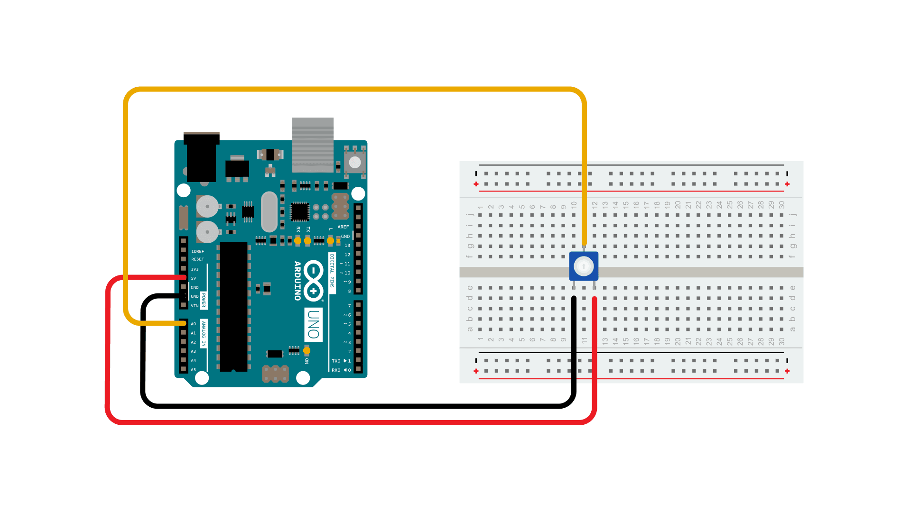

The [**if()**](https://www.arduino.cc/reference/en/language/structure/control-structure/if/) statement is the most basic of all programming control structures.  It allows you to make something happen or not, depending on whether a given condition is true or not.  It looks like this:

```arduino
if (someCondition) {
// do stuff if the condition is true
}
```

There is a common variation called if-else that looks like this:

```arduino
if (someCondition) {
// do stuff if the condition is true
} else {
// do stuff if the condition is false
}
```

There's also the else-if, where you can check a second condition if the first is false:

```arduino
if (someCondition) {
// do stuff if the condition is true
} else if (anotherCondition) {
// do stuff only if the first condition is false
// and the second condition is true
}
```

You'll use if statements all the time.  The example below turns on an LED on pin 13 (the built-in LED on many Arduino boards) if the value read on an analog input goes above a certain threshold.

### Hardware Required

- [Arduino Board](https://store.arduino.cc/collections/boards-modules)

- Potentiometer or variable resistor

### Circuit





### Schematic


### Code

In the code below, a variable called `analogValue` is used to store the data collected from a potentiometer connected to the board on analogPin 0. This data is then compared to a threshold value. If the analog value is found to be above the set threshold the built-in LED connected to digital pin 13 is turned on. If analogValue is found to be `<` (less than) threshold, the LED remains off.

<iframe src='https://create.arduino.cc/example/builtin/05.Control%5CIfStatementConditional/IfStatementConditional/preview?embed&snippet' style='height:510px;width:100%;margin:10px 0' frameborder='0'></iframe>

### Learn more

You can find more basic tutorials in the [built-in examples](/built-in-examples) section.

You can also explore the [language reference](https://www.arduino.cc/reference/en/), a detailed collection of the Arduino programming language.

*Last revision 2015/07/29 by SM*