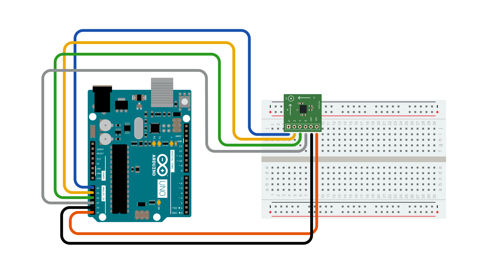
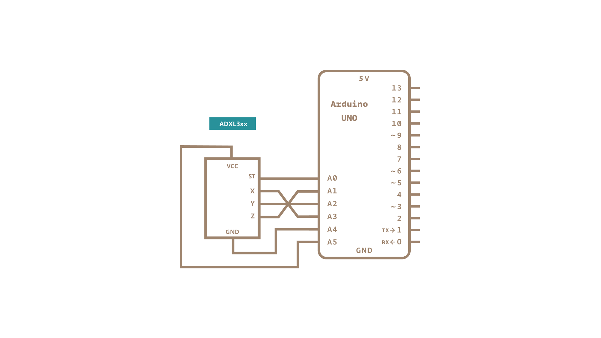

This tutorial shows you how to read from the ADXL3xx series (e.g. ADXL320, ADXL321, ADXL322, ADXL330) [**accelerometer**](http://en.wikipedia.org/wiki/Accelerometer) and receive the values in the serial monitor of the Arduino Software (IDE) or another application that receives data over the serial port.

This tutorial was built using the [breakout boards from Sparkfun](http://www.sparkfun.com/commerce/categories.php?c=80).  The [Adafruit® accelerometer breakout board](http://www.adafruit.com/index.php?main_page=product_info&amp;cPath=35&amp;products_id=163&amp;zenid=48f2b4f461fed55c1d7f9fb38644fd9f) also works, though it must be wired differently.

The ADXL3xx outputs the acceleration on each axis as an analog voltage between 0 and 5 volts.  To read this, all you need is the `analogRead()` function.

### Hardware Required

- [Arduino Board](https://store.arduino.cc/collections/boards-modules)

- ADXL3xx Accelerometer

### Circuit

The accelerometer uses very little current, so it can be plugged into your board and run directly off of the output from the digital output pins.  To do this, you'll use three of the analog input pins as digital I/O pins, for power and ground to the accelerometer, and for the self-test pin.  You'll use the other three analog inputs to read the accelerometer's analog outputs.




### Schematic:




Here are the pin connections for the configuration shown above:

| **Breakout Board Pin**       | Self-Test | Z-Axis | Y-Axis | X-Axis | Ground | VDD |
| ---------------------------- | --------- | ------ | ------ | ------ | ------ | --- |
| **Arduino Analog Input Pin** | 0         | 1      | 2      | 3      | 4      | 5   |

Or, if you're using just the accelerometer:

| **ADXL3xx Pin** | Self-Test            | ZOut           | YOut           | XOut           | Ground | VDD |
| --------------- | -------------------- | -------------- | -------------- | -------------- | ------ | --- |
| **Arduino Pin** | _None_ (unconnected) | Analog Input 1 | Analog Input 2 | Analog Input 3 | GND    | 5V  |

Please, be aware that some accelerometers use 3.3V power supply and might be damaged by 5V. Check the supplier's documentation to find out which is the correct voltage.

### Code

The accelerometer connections are defined as constants at the beginning of the sketch, using the two Analog pins 4 and 5 as source of power. This is accomplished using them as Digital I/O pins 18 and 19. If needed, A0 is D14, A1 is D15 and so on.

`const int groundpin = 18;`
`const int powerpin = 19;`

Setting pin 19 (A5) as HIGH and pin 18 (A4) as LOW provides the 5V with few milliamps needed by the accelerometer to work.

`pinMode(groundpin, OUTPUT);`
`pinMode(powerpin, OUTPUT);`
`digitalWrite(groundpin, LOW);`
`digitalWrite(powerpin, HIGH);`

This solution allows the [breakout boards from Sparkfun](http://www.sparkfun.com/commerce/categories.php?c=80) to be connected directly to your Arduino board. Different boards may be connected to standard 5V - or 3.3V -and GND pins. In this latter case, the code may be amended commenting the lines above in the `void setup()` section.

```arduino

/*

  ADXL3xx

  Reads an Analog Devices ADXL3xx accelerometer and communicates the

  acceleration to the computer. The pins used are designed to be easily

  compatible with the breakout boards from SparkFun, available from:

  http://www.sparkfun.com/commerce/categories.php?c=80

  The circuit:

  - analog 0: accelerometer self test

  - analog 1: z-axis

  - analog 2: y-axis

  - analog 3: x-axis

  - analog 4: ground

  - analog 5: vcc

  created 2 Jul 2008

  by David A. Mellis

  modified 30 Aug 2011

  by Tom Igoe

  This example code is in the public domain.

  https://www.arduino.cc/en/Tutorial/ADXL3xx

*/

// these constants describe the pins. They won't change:

const int groundpin = 18;             // analog input pin 4 -- ground

const int powerpin = 19;              // analog input pin 5 -- voltage

const int xpin = A3;                  // x-axis of the accelerometer

const int ypin = A2;                  // y-axis

const int zpin = A1;                  // z-axis (only on 3-axis models)

void setup() {

  // initialize the serial communications:

  Serial.begin(9600);

  // Provide ground and power by using the analog inputs as normal digital pins.

  // This makes it possible to directly connect the breakout board to the

  // Arduino. If you use the normal 5V and GND pins on the Arduino,

  // you can remove these lines.

  pinMode(groundpin, OUTPUT);

  pinMode(powerpin, OUTPUT);

  digitalWrite(groundpin, LOW);

  digitalWrite(powerpin, HIGH);
}

void loop() {

  // print the sensor values:

  Serial.print(analogRead(xpin));

  // print a tab between values:

  Serial.print("\t");

  Serial.print(analogRead(ypin));

  // print a tab between values:

  Serial.print("\t");

  Serial.print(analogRead(zpin));

  Serial.println();

  // delay before next reading:

  delay(100);
}
```

### Data

Here are some accelerometer readings collected by positioning the y-axis of an ADXL322 2g accelerometer at various angles from ground.  Values should be the same for the other axes, but will vary based on the sensitivity of the device.  With the axis horizontal (i.e. parallel to ground or 0&#xB0;), the accelerometer reading should be around 512, but values at other angles will be different for a different accelerometer (e.g. the ADXL302 5g one).

| **Angle**        | -90 | -80 | -70 | -60 | -50 | -40 | -30 | -20 | -10 | 0   |
| ---------------- | --- | --- | --- | --- | --- | --- | --- | --- | --- | --- |
| **Acceleration** | 662 | 660 | 654 | 642 | 628 | 610 | 589 | 563 | 537 | 510 |

| **Angle**        | 0   | 10  | 20  | 30  | 40  | 50  | 60  | 70  | 80  | 90  |
| ---------------- | --- | --- | --- | --- | --- | --- | --- | --- | --- | --- |
| **Acceleration** | 510 | 485 | 455 | 433 | 408 | 390 | 374 | 363 | 357 | 355 |

### Learn more

You can find more basic tutorials in the [built-in examples](/built-in-examples) section.

You can also explore the [language reference](https://www.arduino.cc/reference/en/), a detailed collection of the Arduino programming language.

*Last revision 2015/07/28 by SM*