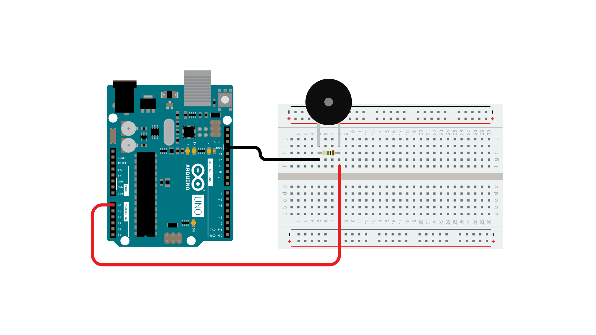

This tutorial shows you how to use a [**Piezo element**](http://en.wikipedia.org/wiki/Piezoelectric_sensor) to detect vibration, in this case, a knock on a door, table, or other solid surface.

A **piezo** is an electronic device that generates a voltage when it's physically deformed by a vibration, sound wave, or mechanical strain.  Similarly, when you put a voltage across a piezo, it vibrates and creates a tone. Piezos can be used both to play tones and to detect tones.

The sketch reads the piezo output using the `analogRead()` command, encoding the voltage range from 0 to 5 volts to a numerical range from 0 to 1023 in a process referred to as *analog-to-digital conversion*, or *ADC*.

If the sensors output is stronger than a certain threshold, your board will send the string "Knock!" to the computer over the serial port.

Open the serial monitor to see this text.

### Hardware Required

- [Arduino Board](https://store.arduino.cc/collections/boards-modules)

- Piezo electric disc

- 1 Megohm resistor

- solid surface

### Circuit

Piezos are **polarized**, meaning that voltage passes through them (or out of them) in a specific direction. Connect the black wire (the lower voltage) to ground and the red wire (the higher voltage) to analog pin 0. Additionally, connect a 1-megohm resistor in parallel to the Piezo element to limit the voltage and current produced by the piezo and to protect the analog input.

It is possible to acquire piezo elements without a plastic housing. These will  look like a metallic disc, and are easier to use as input sensors. Piezo sensors work best when firmly pressed against, taped, or glued their sensing surface.

### Schematic

The piezo is attached to analog pin 0 with a 1 Megohm resistor in between the two legs. The placement of the resistor is used to save the piezo from damage from extra current. Without it, the analog pin might not be capable of reading the piezo's signal.

### Code

In the code below, the incoming piezo data is compared to a threshold value set by the user. Try raising or lowering this value to increase your sensor's overall sensitivity.

<iframe src='https://create.arduino.cc/example/builtin/06.Sensors%5CKnock/Knock/preview?embed&snippet' style='height:510px;width:100%;margin:10px 0' frameborder='0'></iframe>

### Learn more

You can find more basic tutorials in the [built-in examples](/built-in-examples) section.

You can also explore the [language reference](https://www.arduino.cc/reference/en/), a detailed collection of the Arduino programming language.