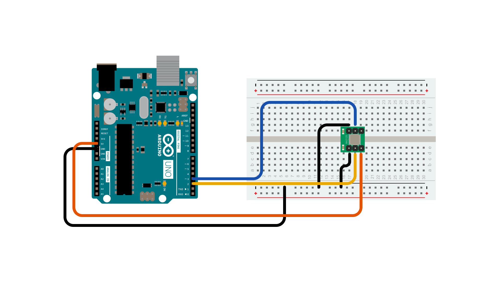
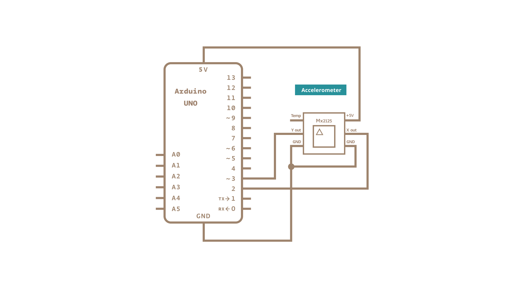

The Memsic 2125 ([datasheet](https://www.parallax.com/sites/default/files/downloads/28017-Memsic-MXD2125-Datasheet.pdf)) is a two-axis [**accelerometer**](http://en.wikipedia.org/wiki/Accelerometer) capable of measuring acceleration up to plus or minus 2g.  It has a simple digital interface: two pins (one for each axis) emit pulses whose duration corresponds to the acceleration of that axis. By measuring the length of that pulse, in microseconds, using the  [**pulseIn()**](https://www.arduino.cc/reference/en/language/functions/advanced-io/pulsein/) function, it is possible to determine the rate of acceleration and to use that data for your purposes.

### Hardware Required

- [Arduino Board](https://store.arduino.cc/collections/boards-modules)

- Memsic 2125 Accelerometer

- hook-up wires

- breadboard

### Circuit


Use the small triangle on the Memsic to properly orient the sensor on your breadboard. Connect  the 5V and GND pins of the Memsic 2125 to the power and ground ports on the board. Connect digital pin 2 of the board to the X out pin of the accelerometer, and digital pin 3 to the Y out pin.

Your Arduino must be connected to your computer in order for it to transmit serial data.





### Schematic




### Code

Open the Serial Monitor of the Arduino Software (IDE) to see the values read from the accelerometer position.

```arduino

/*

  Memsic2125

  Read the Memsic 2125 two-axis accelerometer. Converts the pulses output by the

  2125 into milli-g's (1/1000 of Earth's gravity) and prints them over the

  serial connection to the computer.

  The circuit:

    - X output of accelerometer to digital pin 2

    - Y output of accelerometer to digital pin 3

    - +V of accelerometer to +5V

    - GND of accelerometer to ground

  created 6 Nov 2008

  by David A. Mellis

  modified 30 Aug 2011

  by Tom Igoe

  This example code is in the public domain.

  https://www.arduino.cc/en/Tutorial/Memsic2125

*/

// these constants won't change:

const int xPin = 2;     // X output of the accelerometer

const int yPin = 3;     // Y output of the accelerometer

void setup() {

  // initialize serial communications:

  Serial.begin(9600);

  // initialize the pins connected to the accelerometer as inputs:

  pinMode(xPin, INPUT);

  pinMode(yPin, INPUT);
}

void loop() {

  // variables to read the pulse widths:

  int pulseX, pulseY;

  // variables to contain the resulting accelerations

  int accelerationX, accelerationY;

  // read pulse from x- and y-axes:

  pulseX = pulseIn(xPin, HIGH);

  pulseY = pulseIn(yPin, HIGH);

  // convert the pulse width into acceleration

  // accelerationX and accelerationY are in milli-g's:

  // Earth's gravity is 1000 milli-g's, or 1 g.

  accelerationX = ((pulseX / 10) - 500) * 8;

  accelerationY = ((pulseY / 10) - 500) * 8;

  // print the acceleration

  Serial.print(accelerationX);

  // print a tab character:

  Serial.print("\t");

  Serial.print(accelerationY);

  Serial.println();

  delay(100);
}
```

### Learn more

You can find more basic tutorials in the [built-in examples](/built-in-examples) section.

You can also explore the [language reference](https://www.arduino.cc/reference/en/), a detailed collection of the Arduino programming language.

*Last revision 2015/07/29 by SM*