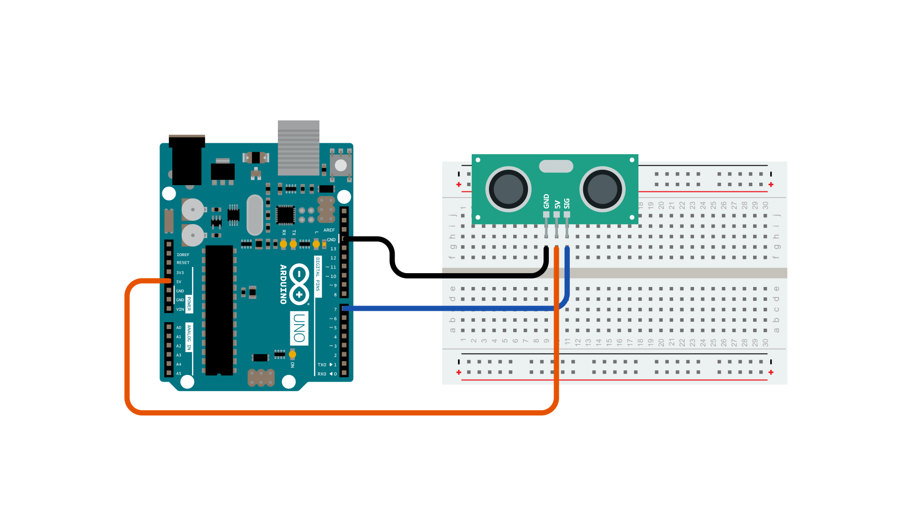
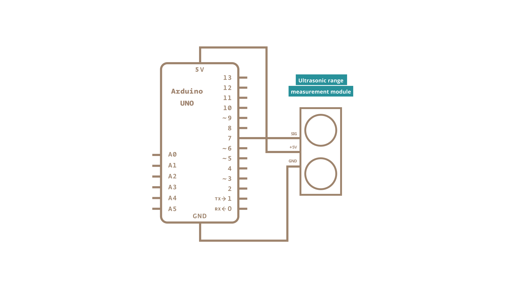

The [**SEN136B5B**](http://wiki.seeed.cc/Ultra_Sonic_range_measurement_module/) is an ultrasonic range finder from Seeedstudio.  It detects the distance of the closest object in front of the sensor (from 3 cm up to 400 cm).  It works by sending out a burst of ultrasound and listening for the echo when it bounces off of an object. It *pings* the obstacles with ultrasound. The Arduino board sends a short pulse to trigger the detection, then listens for a pulse on the same pin using the [**pulseIn()**](https://www.arduino.cc/reference/en/language/functions/advanced-io/pulsein/) function.  The duration of this second pulse is equal to the time taken by the ultrasound to travel to the object and back to the sensor.  Using the speed of sound, this time can be converted to distance.

### Hardware Required

- [Arduino Board](https://store.arduino.cc/collections/boards-modules)
- [Ultrasonic Range Finder](http://wiki.seeed.cc/Ultra_Sonic_range_measurement_module/)
- hook-up wires

### Circuit

The 5V pin of the SEN136B5B is connected to the 5V pin on the board, the GND pin is connected to the GND pin, and the SIG (signal) pin is connected to digital pin 7 on the board.

### Schematic

#### Code

<iframe src='https://create.arduino.cc/example/builtin/06.Sensors%5CPing/Ping/preview?embed&snippet' style='height:510px;width:100%;margin:10px 0' frameborder='0'></iframe>

### Code For TRIG and ECHO PIN Range Finder

<iframe src=https://create.arduino.cc/editor/hunzalaqamar/6a03e92f-a53e-4327-94da-8840eefdd98d/preview?embed style="height:510px;width:100%;margin:10px 0" frameborder=0></iframe>

### Learn more

You can find more basic tutorials in the [built-in examples](/built-in-examples) section.

You can also explore the [language reference](https://www.arduino.cc/reference/en/), a detailed collection of the Arduino programming language.

*Last revision 2015/07/29 by SM*
