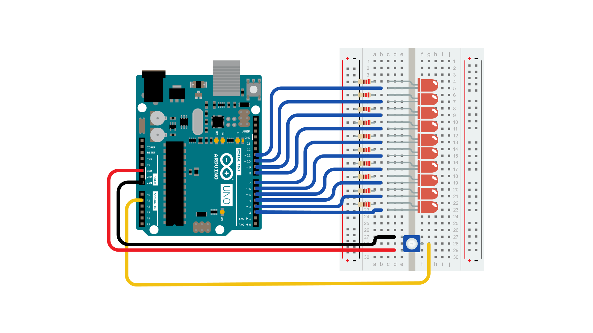
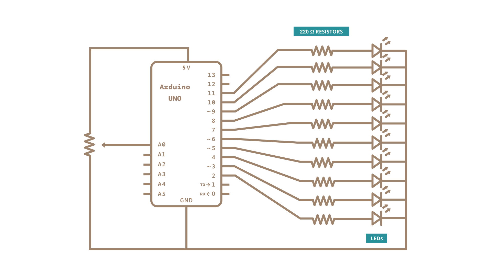

The bar graph - a series of LEDs in a line, such as you see on an audio display - is a common hardware display for analog sensors.  It's made up of a series of LEDs in a row, an analog input like a potentiometer, and a little code in between.  You can  buy multi-LED bar graph displays fairly cheaply, like [this one](https://www.digikey.com/en/products/detail/everlight-electronics-co-ltd/MV54164/2675674).  This tutorial demonstrates how to control a series of LEDs in a row, but can be applied to any series of digital outputs.

This tutorial borrows from the [**For Loop and Arrays**](https://www.arduino.cc/en/Tutorial/Loop) tutorial as well as the [**Analog Input**](/built-in-examples/analog/AnalogInput) tutorial.

### Hardware Required

- [Arduino Board](https://store.arduino.cc/collections/boards-modules)

- LED bar graph display or 10 LEDs
- Potentiometer

- 10 220 ohm resistors

- hook-up wires

- breadboard

### Circuit

### Schematic

### Code

The sketch works like this:  first you read the input.  You map the input value to the output range, in this case ten LEDs.  Then you set up a [for loop](https://www.arduino.cc/en/Tutorial/Loop) to iterate over the outputs.  If the output's number in the series is lower than the mapped input range, you turn it on.  If not, you turn it off.

<iframe src='https://create.arduino.cc/example/builtin/07.Display%5CbarGraph/barGraph/preview?embed&snippet' style='height:510px;width:100%;margin:10px 0' frameborder='0'></iframe>

### Learn more

You can find more basic tutorials in the [built-in examples](/built-in-examples) section.

You can also explore the [language reference](https://www.arduino.cc/reference/en/), a detailed collection of the Arduino programming language.

*Last revision 2015/07/28 by SM*