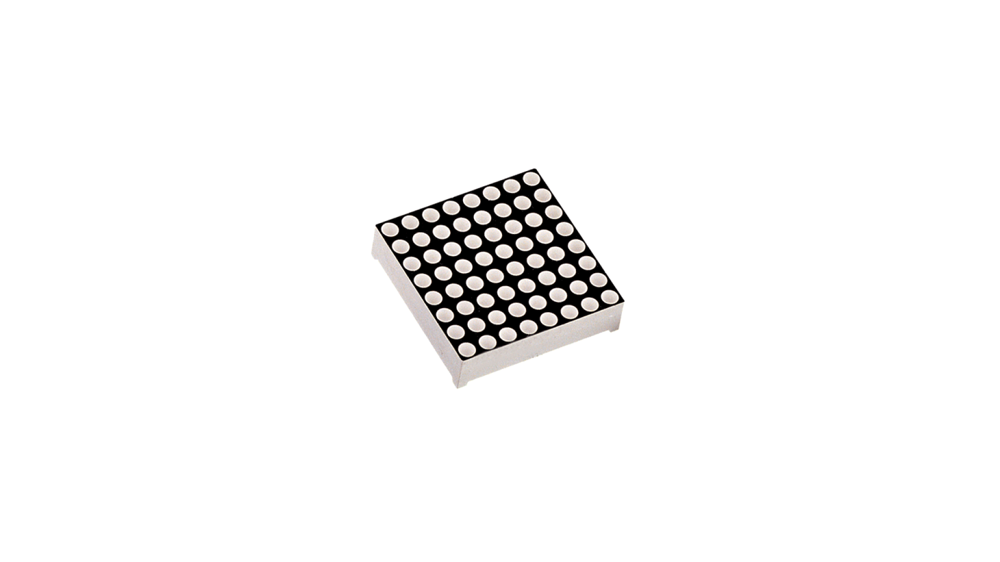
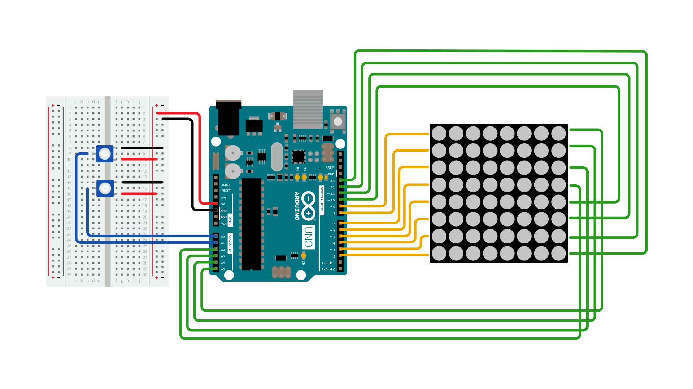
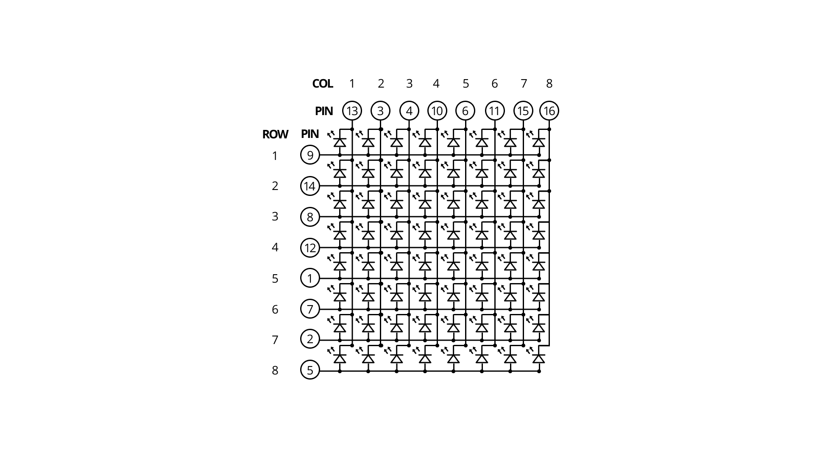

LED displays are often packaged as matrixes of LEDs arranged in rows of common anodes and columns of common cathodes, or the reverse.  Here's a [typical example](http://sigma.octopart.com/140413/datasheet/Lumex-LDM-24488NI.pdf), and its schematic:

These can be very useful displays. To control a matrix, you connect both its rows and columns to your microcontroller. The columns are connected to the LEDs cathodes (see Figure 1), so a column needs to be LOW for any of the LEDs in that column to turn on.  The rows are connected to the LEDs anodes, so the row needs to be HIGH for an individual LED to turn on. If the row and the column are both high or both low, no voltage flows through the LED and it doesn't turn on.

To control an individual LED, you set its column LOW and its row HIGH.  To control multiple LEDs in a row, you set the row HIGH, then take the column high, then set the columns LOW or HIGH as appropriate; a LOW column will turn the corresponding LED ON, and a HIGH column will turn it off.

**Tip** - Pins set to OUTPUT by use of the PinMode command are set to LOW if not otherwise stated

Although there are pre-made LED matrices, you can also make your own matrix from 64 LEDs, using the schematic as shown above.

It doesn't matter which pins of the microcontroller you connect the rows and columns to, because you can assign things in software. Connected the pins in a way that makes wiring easiest. A typical layout is shown below.

Here's a matrix of the pin connections, based on the diagram above:

| **Matrix pin no.** | **Row** | **Column** | **Arduino pin number** |
| ------------------ | ------- | ---------- | ---------------------- |
| 1                  | 5       | -          | 13                     |
| 2                  | 7       | -          | 12                     |
| 3                  | -       | 2          | 11                     |
| 4                  | -       | 3          | 10                     |
| 5                  | 8       | -          | 16 (analog pin 2)      |
| 6                  | -       | 5          | 17 (analog pin 3)      |
| 7                  | 6       | -          | 18 (analog pin 4)      |
| 8                  | 3       | -          | 19 (analog pin 5)      |
| 9                  | 1       | -          | 2                      |
| 10                 | -       | 4          | 3                      |
| 11                 | -       | 6          | 4                      |
| 12                 | 4       | -          | 5                      |
| 13                 | -       | 1          | 6                      |
| 14                 | 2       | -          | 7                      |
| 15                 | -       | 7          | 8                      |
| 16                 | -       | 8          | 9                      |

### Hardware Required

- [Arduino Board](https://store.arduino.cc/collections/boards-modules)
- 8 x 8 LED Matrix
- 2x 10k ohm potentiometers
- hook-up wires
- breadboard
- 8x 1k ohm resistors

### Circuit

The 16 pins of the matrix are hooked up to 16 pins of the Arduino board.  Four of the analog pins are used as digital inputs 16 through 19. The order of the pins is assigned in two arrays in the code.

Two potentiometers, connected to analog pins 0 and 1,  control the movement of a lit LED in the matrix.

To keep your LED matrix from burning, add 8 10kΩ resistors to the wires connected in yellow in the image below.

### Schematic

### Code

<iframe src='https://create.arduino.cc/example/builtin/07.Display%5CRowColumnScanning/RowColumnScanning/preview?embed&snippet' style='height:510px;width:100%;margin:10px 0' frameborder='0'></iframe>

### Learn more

You can find more basic tutorials in the [built-in examples](/built-in-examples) section.

You can also explore the [language reference](https://www.arduino.cc/reference/en/), a detailed collection of the Arduino programming language.
