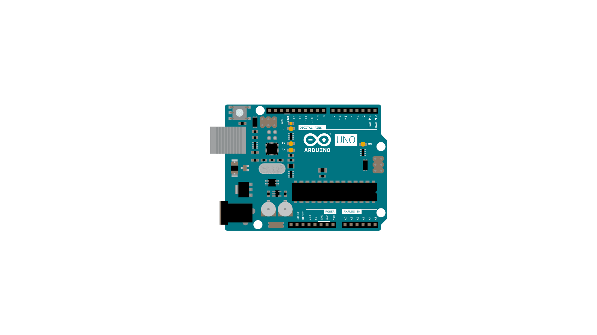

You can get the length of [Strings](https://www.arduino.cc/en/Reference/StringObject) using the `length()` command.  This example shows you how to use this command to reply to an input from the Arduino Software (IDE) serial monitor. If the input string is too long, the sketch will send a specific message to the user

## Hardware Required

- [Arduino Board](https://store.arduino.cc/collections/boards-modules)

## Circuit

There is no circuit for this example, though your board must be connected to your computer via USB and the serial monitor window of the Arduino Software (IDE) should be open.




## Code

`length()` returns the length of a String.  There are many occasions when you need this. For example,if you wanted to make sure a String was less than 140 characters, to fit it in a text message, you could do this:

```arduino

/*

  String length()

  Examples of how to use length() in a String.

  Open the Serial Monitor and start sending characters to see the results.

  created 1 Aug 2010

  by Tom Igoe

  This example code is in the public domain.

  https://www.arduino.cc/en/Tutorial/StringLengthTrim

*/

String txtMsg = "";                         // a string for incoming text
unsigned int lastStringLength = txtMsg.length();     // previous length of the String

void setup() {

  // Open serial communications and wait for port to open:

  Serial.begin(9600);

  while (!Serial) {

    ; // wait for serial port to connect. Needed for native USB port only

  }

  // send an intro:

  Serial.println("\n\nString  length():");

  Serial.println();
}

void loop() {

  // add any incoming characters to the String:

  while (Serial.available() > 0) {

    char inChar = Serial.read();

    txtMsg += inChar;

  }

  // print the message and a notice if it's changed:

  if (txtMsg.length() != lastStringLength) {

    Serial.println(txtMsg);

    Serial.println(txtMsg.length());

    // if the String's longer than 140 characters, complain:

    if (txtMsg.length() < 140) {

      Serial.println("That's a perfectly acceptable text message");

    } else {

      Serial.println("That's too long for a text message.");

    }

    // note the length for next time through the loop:

    lastStringLength = txtMsg.length();

  }
}
```


*Last revision 2015/08/27 by SM*