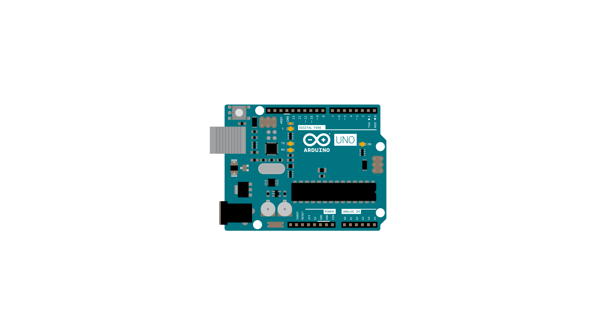

The [**String**](https://www.arduino.cc/en/Reference/StringObject) function `substring()` is closely related to `charAt()`,  `startsWith()` and `endsWith()`. It allows you to look for an instance of a particular substring within a given String.

### Hardware Required

- [Arduino Board](https://store.arduino.cc/collections/boards-modules)

### Circuit

There is no circuit for this example, though your board must be connected to your computer via USB and the serial monitor window of the Arduino Software (IDE) should be open.




### Code

`substring()` with only one parameter looks for a given substring from the position given to the end of the string.  It expects that the substring extends all the way to the end of the String.  For example:

```arduino
String stringOne = "Content-Type: text/html";
// substring(index) looks for the substring from the index position to the end:
if (stringOne.substring(19) == "html") {
}
```

is true, while

```arduino
String stringOne = "Content-Type: text/html";
// substring(index) looks for the substring from the index position to the end:
if (stringOne.substring(19) == "htm") {
}
```

is not true, because there's an `l` after the `htm` in the String.

`substring()` with two parameters looks for a given substring from the first parameter to the second.  For example:

```arduino
String stringOne = "Content-Type: text/html";
// you can also look for a substring in the middle of a string:
if (stringOne.substring(14,18) == "text") {
}
```

This looks for the word `text` from positions 14 through 18 of the String.

**Caution:**
make sure your index values are within the String's length or you'll get unpredictable results. This kind of error can be particularly hard to find with the second instance of `substring()` if the starting position is less than the String's length, but the ending position isn't.

<iframe src='https://create.arduino.cc/example/builtin/08.Strings%5CStringSubstring/StringSubstring/preview?embed&snippet' style='height:510px;width:100%;margin:10px 0' frameborder='0'></iframe>

### Learn more

You can find more basic tutorials in the [built-in examples](/built-in-examples) section.

You can also explore the [language reference](https://www.arduino.cc/reference/en/), a detailed collection of the Arduino programming language.

*Last revision 2015/08/11 by SM*