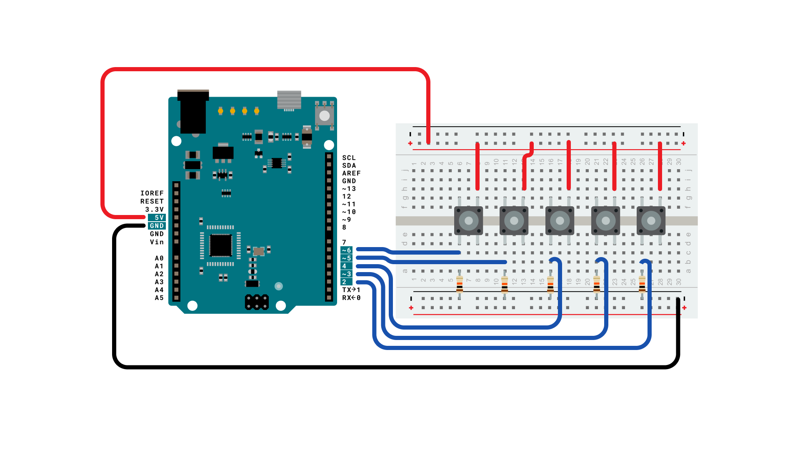
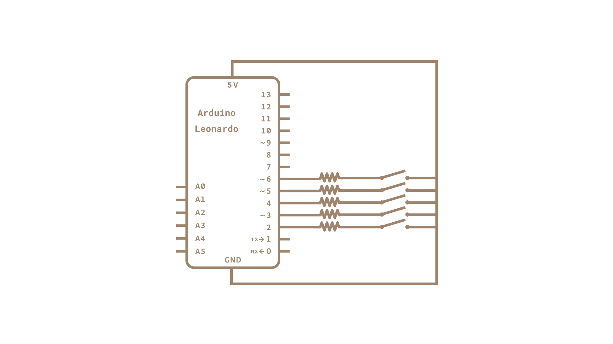

Using the Mouse library, you can controls a computer's onscreen cursor with an Arduino Leonardo, Micro, or Due.  This particular example uses five pushbuttons to move the onscreen cursor. Four of the buttons are directional (up, down, left, right) and one is for a left mouse click

Cursor movement from the Arduino is always relative. Every time an input is read, the cursor's position is updated relative to it's current position.

Whenever one of the directional buttons is pressed, the Arduino will move the mouse, mapping a HIGH input to a range of 5 in the appropriate direction.

The fifth button is for controlling a left click from a mouse. When pressed, the board sends a press to the computer. When the button is released, the computer will recognize the event.

**NB:  When you use the `Mouse.move()` command, the Arduino takes over your computer's cursor! To insure you don't lose control of your computer while running a sketch with this function, make sure to set up a controller before you call Mouse.move(). This sketch only updates the cursor position when a button is pressed.**

### Hardware Required

- [Arduino Leonardo, Micro or Due board](https://store.arduino.cc/collections/boards-modules)

- 5x momentary pushbuttons

- 5x 10k ohm resistors

- hook-up wires

- breadboard

### Circuit

Connect your board to your computer with a micro-USB cable. The buttons are connected to digital inputs from 2 to 6. Make sure you use 10k ohm pulldown resistors.




### Schematic 



### Code

```arduino

/*

  ButtonMouseControl

  For Leonardo and Due boards only.

  Controls the mouse from five pushbuttons on an Arduino Leonardo, Micro or Due.

  Hardware:

  - five pushbuttons attached to D2, D3, D4, D5, D6

  The mouse movement is always relative. This sketch reads four pushbuttons,

  and uses them to set the movement of the mouse.

  WARNING: When you use the Mouse.move() command, the Arduino takes over your

  mouse! Make sure you have control before you use the mouse commands.

  created 15 Mar 2012

  modified 27 Mar 2012

  by Tom Igoe

  This example code is in the public domain.

  https://www.arduino.cc/en/Tutorial/ButtonMouseControl

*/

#include "Mouse.h"

// set pin numbers for the five buttons:

const int upButton = 2;

const int downButton = 3;

const int leftButton = 4;

const int rightButton = 5;

const int mouseButton = 6;

int range = 5;              // output range of X or Y movement; affects movement speed
int responseDelay = 10;     // response delay of the mouse, in ms

void setup() {

  // initialize the buttons' inputs:

  pinMode(upButton, INPUT);

  pinMode(downButton, INPUT);

  pinMode(leftButton, INPUT);

  pinMode(rightButton, INPUT);

  pinMode(mouseButton, INPUT);

  // initialize mouse control:

  Mouse.begin();
}

void loop() {

  // read the buttons:

  int upState = digitalRead(upButton);

  int downState = digitalRead(downButton);

  int rightState = digitalRead(rightButton);

  int leftState = digitalRead(leftButton);

  int clickState = digitalRead(mouseButton);

  // calculate the movement distance based on the button states:

  int  xDistance = (leftState - rightState) * range;

  int  yDistance = (upState - downState) * range;

  // if X or Y is non-zero, move:

  if ((xDistance != 0) || (yDistance != 0)) {

    Mouse.move(xDistance, yDistance, 0);

  }

  // if the mouse button is pressed:

  if (clickState == HIGH) {

    // if the mouse is not pressed, press it:

    if (!Mouse.isPressed(MOUSE_LEFT)) {

      Mouse.press(MOUSE_LEFT);

    }

  }

  // else the mouse button is not pressed:

  else {

    // if the mouse is pressed, release it:

    if (Mouse.isPressed(MOUSE_LEFT)) {

      Mouse.release(MOUSE_LEFT);

    }

  }

  // a delay so the mouse doesn't move too fast:

  delay(responseDelay);
}
```

### Learn more

You can find more basic tutorials in the [built-in examples](/built-in-examples) section.

You can also explore the [language reference](https://www.arduino.cc/reference/en/), a detailed collection of the Arduino programming language.

*Last revision 2015/07/28 by SM*