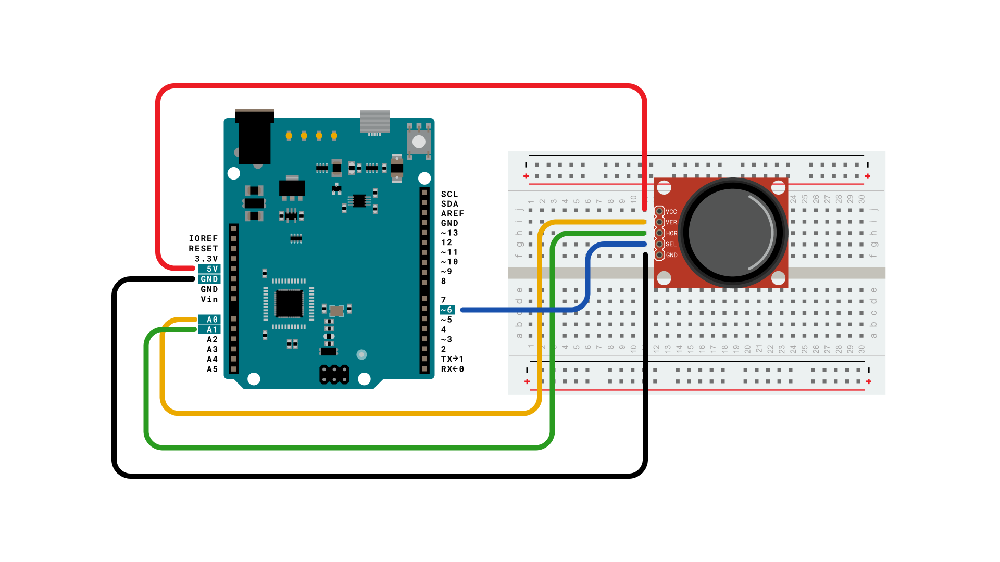
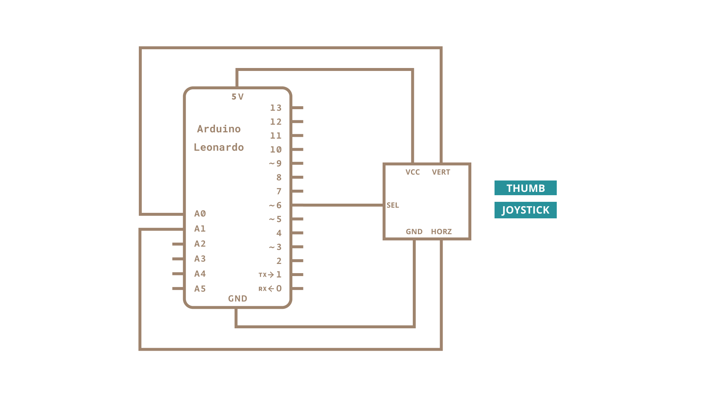

Using the Mouse library, you can control a computer's onscreen cursor with an Arduino Leonardo, Micro, or Due. This particular example uses a pushbutton to turn on and off mouse control with a joystick.

Cursor movement from the Arduino is always relative. So every time the analog input is read, the cursor's position is updated relative to its current position.

Two analog inputs ranging from 0 to 1023 are translated to ranges of -12 to 12. The sketch assumes that the joystick resting values are around the middle of the range, but that they vary within a threshold.

The pushbutton allows you to toggle mouse control on and off. As an option you may connect a status LED to pin 5 that lights upwhen the Arduino is controlling the mouse. A second pushbutton may be connected with another 10k ohm pulldown (to GND) resistor to D3 to act as the left click of the mouse.

***Note: If you want to add the LED or the extra pushbutton, please follow the guidelines for the [LED circuit](../basics/Blink) and the [button circuit](../digital/Button).*** 

***Note: When you use the `Mouse.move()` command, the Arduino takes over your computer's cursor! To insure you don't lose control of your computer while running a sketch with this function, make sure to set up a controller before you call `Mouse.move()`. This sketch includes a pushbutton to toggle the mouse control state, so you can turn on and off mouse control.***

### Hardware Required

- [Arduino Leonardo, Micro, or Due board](https://store.arduino.cc/collections/boards-modules)
- 2 axis joystick
- momentary pushbutton (possibly integrated in the joystick)
- LED
- 220 ohm resistor
- 10k ohm resistor (if needed as pulldown)

### Circuit

Connect your Leonardo board to your computer with a micro-USB cable. The pushbutton is connected to pin 6. If you're using a part like the Joystick shield pictured below, you may not need a pulldown resistor. The x-axis on the joystick is connected to analog in 0, the y-axis is on analog in 1.

### Schematic

### Code

<iframe src='https://create.arduino.cc/example/builtin/09.USB%5CMouse%5CJoystickMouseControl/JoystickMouseControl/preview?embed&snippet' style='height:510px;width:100%;margin:10px 0' frameborder='0'></iframe>

### Learn more

You can find more basic tutorials in the [built-in examples](/built-in-examples) section.

You can also explore the [language reference](https://www.arduino.cc/reference/en/), a detailed collection of the Arduino programming language.
