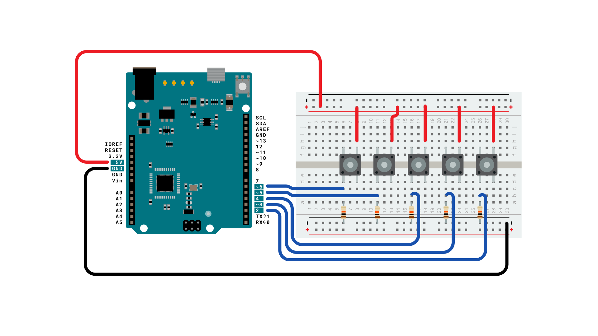
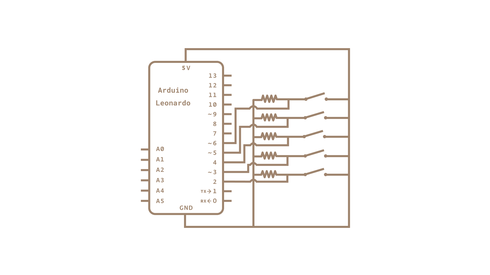

This example illustrates the use of the Mouse and Keyboard libraries together. Five momentary switches act as directional buttons for your cursor. When a button is pressed, the cursor on your screen will move, and a keypress, corresponding to the letter associated with the direction, will be sent to the computer. Once you have the Leonardo, Micro or Due programmed and wired up, open up your favorite text editor to see the results.

**NB:  When you use the Mouse and Keyboard library functions, the Arduino takes over your computer's cursor! To ensure you don't lose control of your computer while running a sketch with this function, make sure to set up a controller before you call Mouse.move().**

### Hardware Required

- [Arduino Leonardo, Micro or Arduino Due board](https://store.arduino.cc/collections/boards-modules)

- 5 pushbuttons

- 5 10k ohm resistors

- hook-up wires

- breadboard

### Software Required

- Any text editor

### Circuit

Attach one end of the the pushbuttons to pins 2, 3, 4, 5, and 6 on the board. Attach the other end to +5V. Use the resistors as pull-downs, providing a reference to ground for the switches. Attach them from the pin connecting to the board to ground.

Once you've programmed your board, unplug the USB cable and open a text editor. Connect your board to your computer and press the buttons to write in the document as you move the cursor.

### Schematic

click the images to enlarge

### Code

<iframe src='https://create.arduino.cc/example/builtin/09.USB%5CKeyboardAndMouseControl/KeyboardAndMouseControl/preview?embed&snippet' style='height:510px;width:100%;margin:10px 0' frameborder='0'></iframe>

### Learn more

You can find more basic tutorials in the [built-in examples](/built-in-examples) section.

You can also explore the [language reference](https://www.arduino.cc/reference/en/), a detailed collection of the Arduino programming language.

*Last revision 2015/07/29 by SM*
