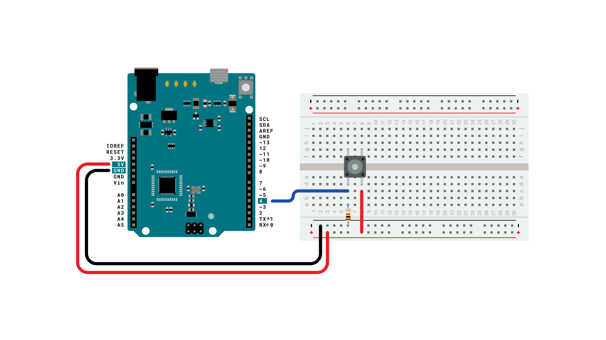
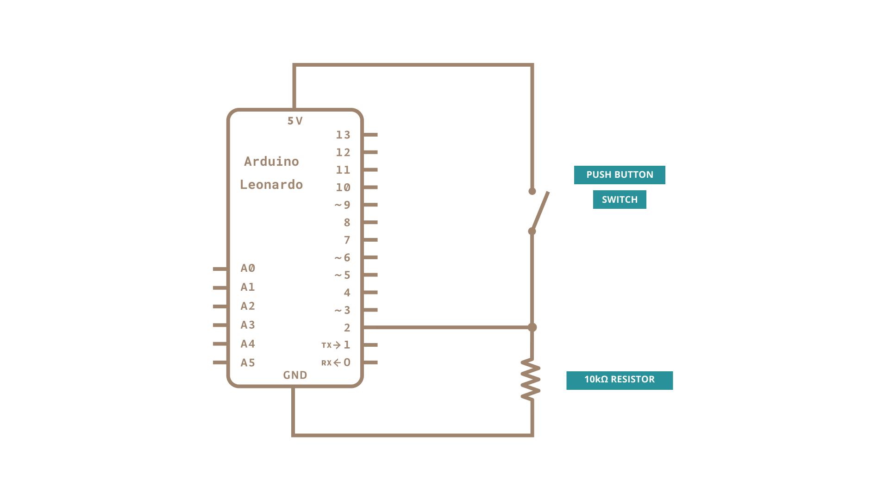

When the button is pressed in this example, a text string is sent to the computer as keyboard input. The string reports the number of times the button has been pressed. Once you have the Leonardo programmed and wired up, open up your favourite text editor to see the results.

**NB:  When you use the Keyboard.print() command, the Arduino takes over your computer's keyboard! To insure you don't lose control of your computer while running a sketch with this function, make sure to set up a reliable control system before you call Keyboard.print(). This sketch includes a pushbutton to toggle the keyboard, so that it only runs after the button is pressed.**

### Hardware Required

- [Arduino Leonardo, Micro, or Due board](https://store.arduino.cc/collections/boards-modules)

- momentary pushbutton

- 10k ohm resistor

### Software Required

- Any text editor

### Circuit

Attach one pin of the pushbutton to pin 4 on the Arduino. Attach the other pin to 5V. Use the resistor as a pull-down, providing a reference to ground, by attaching it from pin 4 to ground.

Once you've programmed your board, unplug the USB cable, open a text editor and put the text cursor at in the typing area. Connect the board to your computer through USB again and press the button to write in the document.

### Schematic 

### Code

<iframe src='https://create.arduino.cc/example/builtin/09.USB%5CKeyboard%5CKeyboardMessage/KeyboardMessage/preview?embed&snippet' style='height:510px;width:100%;margin:10px 0' frameborder='0'></iframe>

### Learn more

You can find more basic tutorials in the [built-in examples](/built-in-examples) section.

You can also explore the [language reference](https://www.arduino.cc/reference/en/), a detailed collection of the Arduino programming language.

*Last revision 2015/07/29 by SM*