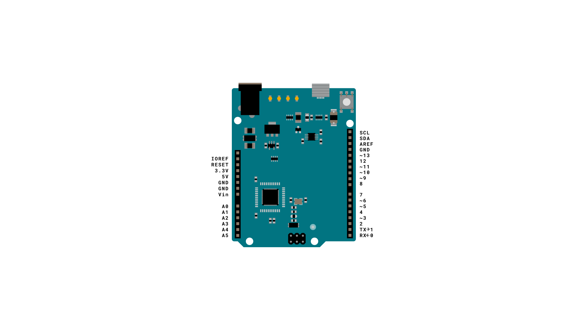

This example listens for a byte coming from the serial port. When received, the board sends a keystroke back to the computer. The sent keystroke is one higher than what is received, so if you send an "a" from the serial monitor, you'll receive a "b" from the board connected to the computer. A "1" will return a "2" and so on.

**NB:  Your Leonardo, Micro or Due board will initiate a second keyboard device on your host computer, it will not take over your existing keyboard. Both your original host keyboard and the 'send a keystroke' keyboard will be active and will work. This sketch is designed to only send a Keyboard command after the board has received a byte over the serial port.**

### Hardware Required

- [Arduino Leonardo, Micro, or Due board](https://store.arduino.cc/collections/boards-modules)

### Circuit

Connect your  board to your computer with a micro-USB cable.

Once programmed, open your serial monitor and send a byte. The board will reply with a keystroke that is one number higher.




### Code

```arduino

/*

  Keyboard test

  For the Arduino Leonardo, Micro or Due

  Reads a byte from the serial port, sends a keystroke back.

  The sent keystroke is one higher than what's received, e.g. if you send a,

  you get b, send A you get B, and so forth.

  The circuit:

  - none

  created 21 Oct 2011

  modified 27 Mar 2012

  by Tom Igoe

  This example code is in the public domain.

  https://www.arduino.cc/en/Tutorial/KeyboardSerial

*/

#include "Keyboard.h"

void setup() {

  // open the serial port:

  Serial.begin(9600);

  // initialize control over the keyboard:

  Keyboard.begin();
}

void loop() {

  // check for incoming serial data:

  if (Serial.available() > 0) {

    // read incoming serial data:

    char inChar = Serial.read();

    // Type the next ASCII value from what you received:

    Keyboard.write(inChar + 1);

  }
}
```

### Learn more

You can find more basic tutorials in the [built-in examples](/built-in-examples) section.

You can also explore the [language reference](https://www.arduino.cc/reference/en/), a detailed collection of the Arduino programming language.

*Last revision 2015/08/11 by SM*
